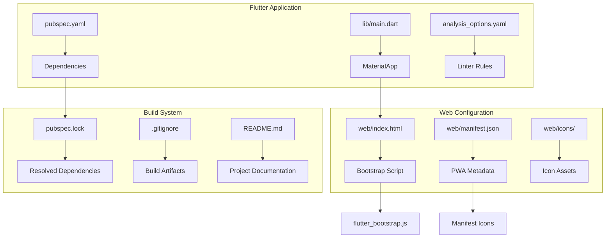
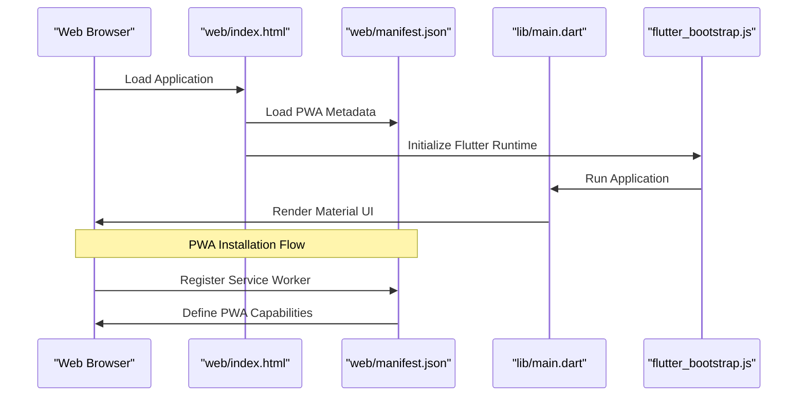
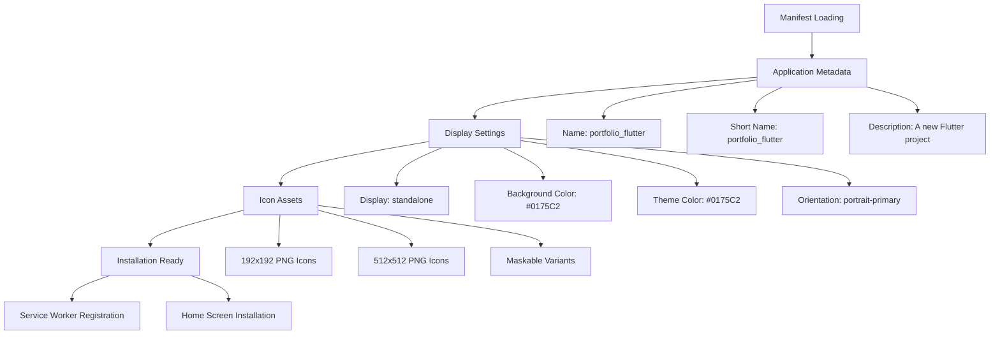
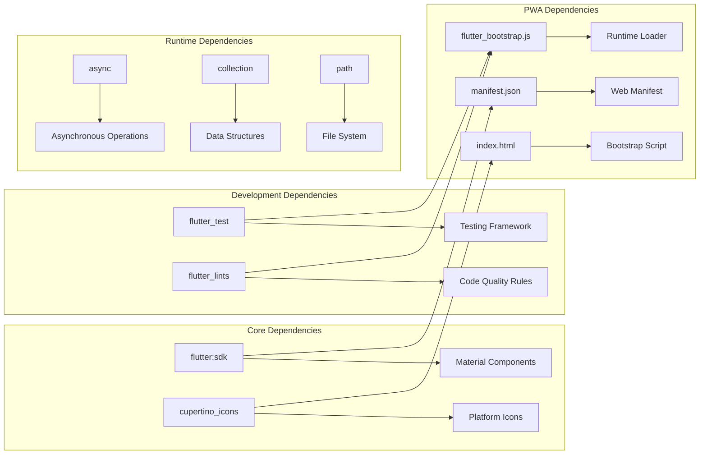

# Configuration

<cite>
**Referenced Files in This Document**
- [pubspec.yaml](file://portfolio_flutter/pubspec.yaml)
- [manifest.json](file://portfolio_flutter/web/manifest.json)
- [index.html](file://portfolio_flutter/web/index.html)
- [main.dart](file://portfolio_flutter/lib/main.dart)
- [analysis_options.yaml](file://portfolio_flutter/analysis_options.yaml)
- [.gitignore](file://portfolio_flutter/.gitignore)
- [README.md](file://portfolio_flutter/README.md)
- [pubspec.lock](file://portfolio_flutter/pubspec.lock)
- [index.html](file://index.html)
</cite>

## Table of Contents
1. [Introduction](#introduction)
2. [Project Structure](#project-structure)
3. [Core Components](#core-components)
4. [Architecture Overview](#architecture-overview)
5. [Detailed Component Analysis](#detailed-component-analysis)
6. [Dependency Analysis](#dependency-analysis)
7. [Performance Considerations](#performance-considerations)
8. [Troubleshooting Guide](#troubleshooting-guide)
9. [Conclusion](#conclusion)

## Introduction
This document provides comprehensive configuration documentation for a Flutter web application with Progressive Web App (PWA) capabilities. The project demonstrates modern Flutter web setup with Material Design integration, PWA manifest configuration, custom font integration, and production-ready build configurations. The documentation covers all essential configuration files and their roles in delivering a robust web application experience.

## Project Structure
The Flutter project follows the standard Flutter structure with specialized web configuration for PWA deployment. The configuration is organized across multiple files that control dependencies, web assets, PWA metadata, and build processes.

**Diagram sources**
- [pubspec.yaml:1-90](file://portfolio_flutter/pubspec.yaml#L1-L90)
- [index.html:1-39](file://portfolio_flutter/web/index.html#L1-L39)
- [manifest.json:1-36](file://portfolio_flutter/web/manifest.json#L1-L36)

**Section sources**
- [pubspec.yaml:1-90](file://portfolio_flutter/pubspec.yaml#L1-L90)
- [index.html:1-39](file://portfolio_flutter/web/index.html#L1-L39)
- [manifest.json:1-36](file://portfolio_flutter/web/manifest.json#L1-L36)

## Core Components

### Flutter SDK and Environment Configuration
The project specifies a modern Flutter SDK version with Dart language support. The environment configuration establishes the minimum Flutter version requirement and Dart SDK compatibility.

**Section sources**
- [pubspec.yaml:21-22](file://portfolio_flutter/pubspec.yaml#L21-L22)
- [pubspec.lock:211-214](file://portfolio_flutter/pubspec.lock#L211-L214)

### Dependencies Management
The project maintains a clean dependency structure with essential Flutter packages and development tools. The dependency configuration balances functionality with minimal overhead.

**Section sources**
- [pubspec.yaml:30-47](file://portfolio_flutter/pubspec.yaml#L30-L47)

### Asset and Font Configuration
The Flutter assets and fonts section provides the foundation for media management and typography customization. The configuration supports resolution-aware images and custom font integration from local assets.

**Section sources**
- [pubspec.yaml:60-90](file://portfolio_flutter/pubspec.yaml#L60-L90)

### Linting and Code Quality
The analysis options integrate Flutter's recommended linting rules to maintain code quality and consistency across the development team.

**Section sources**
- [analysis_options.yaml:8-10](file://portfolio_flutter/analysis_options.yaml#L8-L10)

## Architecture Overview

The Flutter web application architecture integrates seamlessly with PWA technologies through coordinated configuration files:

**Diagram sources**
- [index.html:32-36](file://portfolio_flutter/web/index.html#L32-L36)
- [manifest.json:1-36](file://portfolio_flutter/web/manifest.json#L1-L36)
- [main.dart:1-5](file://portfolio_flutter/lib/main.dart#L1-L5)

## Detailed Component Analysis

### PWA Manifest Configuration
The Progressive Web App manifest defines critical metadata for installation and runtime behavior. The manifest configuration includes comprehensive icon sets for different screen densities and maskable icons for adaptive theming.

**Diagram sources**
- [manifest.json:1-36](file://portfolio_flutter/web/manifest.json#L1-L36)

**Section sources**
- [manifest.json:1-36](file://portfolio_flutter/web/manifest.json#L1-L36)

### Web Bootstrap Process
The web bootstrap mechanism coordinates the initialization sequence between HTML markup and Flutter runtime. The configuration supports dynamic base href resolution and asynchronous script loading.

**Section sources**
- [index.html:17](file://portfolio_flutter/web/index.html#L17)
- [index.html:36](file://portfolio_flutter/web/index.html#L36)

### Material Design Integration
The application demonstrates Material Design principles through ThemeData configuration with dynamic color theming and responsive UI components.

**Section sources**
- [main.dart:13-35](file://portfolio_flutter/lib/main.dart#L13-L35)

### Development Tools Configuration
The project includes comprehensive development tooling with Flutter lints integration and analysis options for maintaining code quality standards.

**Section sources**
- [analysis_options.yaml:12-25](file://portfolio_flutter/analysis_options.yaml#L12-L25)

## Dependency Analysis

The dependency graph reveals the relationships between core components and their impact on application functionality:

**Diagram sources**
- [pubspec.yaml:30-47](file://portfolio_flutter/pubspec.yaml#L30-L47)
- [pubspec.lock:44-72](file://portfolio_flutter/pubspec.lock#L44-L72)

**Section sources**
- [pubspec.yaml:30-47](file://portfolio_flutter/pubspec.yaml#L30-L47)
- [pubspec.lock:44-72](file://portfolio_flutter/pubspec.lock#L44-L72)

## Performance Considerations

### Build Optimization Strategies
The project configuration supports efficient build processes through strategic dependency management and asset optimization. The Flutter SDK version ensures compatibility with modern web standards while maintaining performance characteristics.

### Asset Loading Efficiency
The PWA manifest configuration optimizes asset delivery through multiple icon resolutions and adaptive theming support. The bootstrap script loading mechanism enables asynchronous initialization for improved perceived performance.

### Development Workflow Optimization
The linting configuration and testing framework integration streamline the development process while maintaining code quality standards across the development lifecycle.

## Troubleshooting Guide

### Common Configuration Issues
- **Version Compatibility**: Ensure Flutter SDK version meets minimum requirements specified in pubspec.yaml
- **Asset Path Resolution**: Verify asset paths in pubspec.yaml match actual file locations
- **PWA Manifest Validation**: Test manifest configuration using browser developer tools
- **Bootstrap Script Loading**: Confirm flutter_bootstrap.js availability in build output

### Build Process Troubleshooting
- **Dependency Resolution**: Run `flutter pub get` to refresh dependencies
- **Lock File Consistency**: Verify pubspec.lock matches pubspec.yaml expectations
- **Web Target Verification**: Confirm web platform support with `flutter devices`

**Section sources**
- [.gitignore:26-35](file://portfolio_flutter/.gitignore#L26-L35)
- [README.md:5-16](file://portfolio_flutter/README.md#L5-L16)

## Conclusion

This Flutter web configuration demonstrates a comprehensive approach to Progressive Web App development with modern Flutter practices. The configuration provides a solid foundation for web deployment while maintaining flexibility for customization and extension. The integration of Material Design, PWA capabilities, and development tooling creates a production-ready foundation for web applications.

The modular structure allows for easy adaptation to different deployment scenarios, environment-specific configurations, and scaling requirements. The documented configuration serves as both a reference implementation and a starting point for custom Flutter web applications requiring PWA functionality.