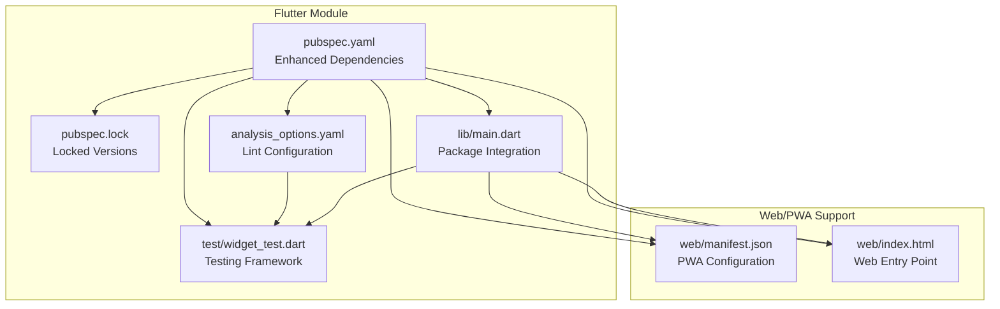
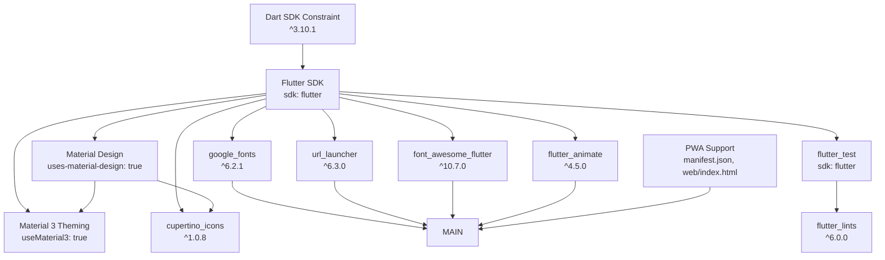
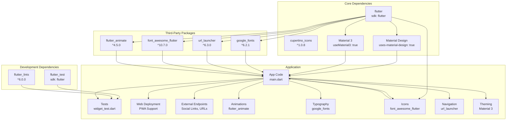

# Flutter Dependencies

<cite>
**Referenced Files in This Document**
- [pubspec.yaml](file://portfolio_flutter/pubspec.yaml)
- [pubspec.lock](file://portfolio_flutter/pubspec.lock)
- [analysis_options.yaml](file://portfolio_flutter/analysis_options.yaml)
- [main.dart](file://portfolio_flutter/lib/main.dart)
- [widget_test.dart](file://portfolio_flutter/test/widget_test.dart)
- [README.md](file://portfolio_flutter/README.md)
- [manifest.json](file://portfolio_flutter/web/manifest.json)
- [index.html](file://portfolio_flutter/web/index.html)
</cite>

## Update Summary
**Changes Made**
- Updated dependency configuration to reflect enhanced packages for animations, responsive design, and PWA capabilities
- Added comprehensive coverage of Material 3 theming, custom animations, and progressive web app features
- Enhanced documentation to cover the expanded dependency ecosystem with google_fonts, url_launcher, font_awesome_flutter, and flutter_animate
- Updated architecture diagrams to reflect the enhanced dependency structure with PWA support

## Table of Contents
1. [Introduction](#introduction)
2. [Project Structure](#project-structure)
3. [Core Components](#core-components)
4. [Architecture Overview](#architecture-overview)
5. [Detailed Component Analysis](#detailed-component-analysis)
6. [Enhanced Dependency Ecosystem](#enhanced-dependency-ecosystem)
7. [Progressive Web App Capabilities](#progressive-web-app-capabilities)
8. [Package Integration Patterns](#package-integration-patterns)
9. [Performance Considerations](#performance-considerations)
10. [Troubleshooting Guide](#troubleshooting-guide)
11. [Conclusion](#conclusion)
12. [Appendices](#appendices)

## Introduction
This document explains Flutter dependencies configuration with a focus on package management and version control. The project has been enhanced with a comprehensive suite of third-party packages including google_fonts for typography, url_launcher for external linking, font_awesome_flutter for consistent iconography, and flutter_animate for smooth animations. The application now includes Progressive Web App (PWA) capabilities with Material 3 theming support, responsive design patterns, and advanced animation frameworks. It covers the pubspec.yaml dependency structure, including the Flutter SDK constraint, Material Design integration, and development dependencies. It also clarifies the differences between regular dependencies and dev_dependencies, outlines version specification patterns, and provides practical guidance for upgrading dependencies, resolving conflicts, and optimizing bundle size through selective imports.

## Project Structure
The project follows a standard Flutter application layout with a dedicated Flutter module under portfolio_flutter. The enhanced dependency ecosystem now includes five major third-party packages that significantly expand the application's capabilities. Key files relevant to dependency management include:
- pubspec.yaml: Defines application metadata, dependencies, dev_dependencies, and Flutter-specific settings with enhanced package configurations.
- pubspec.lock: Locks dependency versions for reproducible builds, including the new packages.
- analysis_options.yaml: Configures static analysis and lints via flutter_lints.
- main.dart: Demonstrates comprehensive integration of google_fonts, url_launcher, font_awesome_flutter, and flutter_animate with Material 3 theming.
- widget_test.dart: Uses flutter_test for testing with enhanced widget functionality.
- README.md: Provides project context with updated package information.
- manifest.json: PWA configuration for progressive web app deployment.
- index.html: Web entry point with PWA manifest integration.

**Diagram sources**
- [pubspec.yaml](file://portfolio_flutter/pubspec.yaml)
- [pubspec.lock](file://portfolio_flutter/pubspec.lock)
- [analysis_options.yaml](file://portfolio_flutter/analysis_options.yaml)
- [main.dart](file://portfolio_flutter/lib/main.dart)
- [widget_test.dart](file://portfolio_flutter/test/widget_test.dart)
- [manifest.json](file://portfolio_flutter/web/manifest.json)
- [index.html](file://portfolio_flutter/web/index.html)

**Section sources**
- [pubspec.yaml](file://portfolio_flutter/pubspec.yaml)
- [pubspec.lock](file://portfolio_flutter/pubspec.lock)
- [analysis_options.yaml](file://portfolio_flutter/analysis_options.yaml)
- [main.dart](file://portfolio_flutter/lib/main.dart)
- [widget_test.dart](file://portfolio_flutter/test/widget_test.dart)
- [README.md](file://portfolio_flutter/README.md)
- [manifest.json](file://portfolio_flutter/web/manifest.json)
- [index.html](file://portfolio_flutter/web/index.html)

## Core Components
This section documents the enhanced dependency configuration and its role in the application's expanded functionality.

- Flutter SDK constraint
  - The environment section specifies the Dart SDK requirement (^3.10.1), ensuring compatibility with the Flutter toolchain.
  - The Flutter SDK itself is declared as a dependency with sdk: flutter, indicating it is provided by the Flutter SDK rather than fetched from a remote source.

- Enhanced Regular dependencies
  - flutter: sdk: flutter (provided by Flutter SDK)
  - cupertino_icons: ^1.0.8 (iOS-style icons)
  - **google_fonts: ^6.2.1** (Google Fonts integration for custom typography)
  - **url_launcher: ^6.3.0** (External URL launching and application integration)
  - **font_awesome_flutter: ^10.7.0** (Consistent iconography across platforms)
  - **flutter_animate: ^4.5.0** (Smooth animations and transitions)

- Dev dependencies
  - flutter_test: sdk: flutter (testing framework)
  - flutter_lints: ^6.0.0 (curated set of lints to enforce good coding practices)

- Flutter section
  - uses-material-design: true enables Material Design icons and related assets.
  - Material 3 theming is enabled through useMaterial3: true in the theme configuration.

- Lint configuration
  - analysis_options.yaml includes flutter_lints/flutter.yaml to activate recommended rules.

**Section sources**
- [pubspec.yaml](file://portfolio_flutter/pubspec.yaml)
- [analysis_options.yaml](file://portfolio_flutter/analysis_options.yaml)

## Architecture Overview
The enhanced dependency architecture ties together the application's runtime and development tooling with a comprehensive package ecosystem. The Flutter SDK constraint and the presence of Material Design integration influence how dependencies are selected and upgraded. The new packages significantly expand the application's capabilities in typography, navigation, animations, external integrations, and progressive web app deployment.

**Diagram sources**
- [pubspec.yaml](file://portfolio_flutter/pubspec.yaml)
- [main.dart](file://portfolio_flutter/lib/main.dart)
- [manifest.json](file://portfolio_flutter/web/manifest.json)
- [index.html](file://portfolio_flutter/web/index.html)

## Detailed Component Analysis

### pubspec.yaml: Enhanced Dependency Structure and Version Control
- Purpose
  - Declares the application name, description, version, and build metadata.
  - Specifies the Dart SDK requirement and Flutter SDK dependency.
  - Lists enhanced regular dependencies including google_fonts, url_launcher, font_awesome_flutter, and flutter_animate.
  - Includes dev_dependencies (flutter_test, flutter_lints) for testing and linting.
  - Enables Material Design and includes comments guiding upgrades and outdated checks.

- Key sections
  - environment.sdk: ^3.10.1 sets the Dart SDK compatibility.
  - dependencies:
    - flutter: sdk: flutter indicates the Flutter SDK dependency.
    - cupertino_icons: ^1.0.8 pins the iOS icons package.
    - **google_fonts: ^6.2.1** enables Google Fonts integration.
    - **url_launcher: ^6.3.0** provides external URL launching capabilities.
    - **font_awesome_flutter: ^10.7.0** offers consistent iconography.
    - **flutter_animate: ^4.5.0** delivers smooth animations.
  - dev_dependencies:
    - flutter_test: sdk: flutter for testing.
    - flutter_lints: ^6.0.0 for recommended lints.
  - flutter:
    - uses-material-design: true to include Material icons.

- Version specification patterns
  - Caret (^) syntax allows compatible updates within the major version boundary.
  - Example: ^3.10.1 permits updates to 3.x.y as long as the major version remains 3.
  - Example: ^1.0.8 permits updates to 1.x.y as long as the major version remains 1.
  - Example: ^6.0.0 permits updates to 6.x.y as long as the major version remains 6.
  - Example: ^6.2.1 permits updates to 6.x.y as long as the major version remains 6.

- Upgrading strategies
  - Major version upgrades: Use the guidance in pubspec.yaml to run major-version upgrades.
  - Outdated inspection: Use the guidance to check for outdated dependencies.
  - Incremental updates: Manually update caret versions to newer compatible releases.
  - Package-specific updates: Consider individual package updates based on their specific needs.

- Best practices
  - Keep caret ranges to minimize breaking changes while allowing bug fixes.
  - Periodically review outdated dependencies and update selectively.
  - Prefer pinned versions for critical packages only when necessary.
  - Monitor package compatibility with the Flutter SDK version.

**Section sources**
- [pubspec.yaml](file://portfolio_flutter/pubspec.yaml)

### pubspec.lock: Enhanced Locked Versions and Transitive Dependencies
- Purpose
  - Locks exact versions of all dependencies and transitive dependencies for reproducible builds.
  - Ensures consistent environments across machines and CI systems.
  - Now includes the enhanced package ecosystem with google_fonts, url_launcher, font_awesome_flutter, and flutter_animate.

- Observations
  - flutter: sdk: flutter and flutter_test: sdk: flutter are provided by the Flutter SDK.
  - cupertino_icons: hosted package with a locked version.
  - **google_fonts: hosted package with locked version (6.3.3)**.
  - **url_launcher: hosted package with locked version (6.3.2)**.
  - **font_awesome_flutter: hosted package with locked version (10.12.0)**.
  - **flutter_animate: hosted package with locked version (4.5.2)**.
  - flutter_lints: hosted package with a locked version.
  - Transitive dependencies include async, collection, meta, path, and others.

- Implications
  - Changes to pubspec.yaml require running pub get to update pubspec.lock.
  - Commit pubspec.lock to version control to guarantee reproducibility.
  - The enhanced lock file reflects the expanded package ecosystem.

**Section sources**
- [pubspec.lock](file://portfolio_flutter/pubspec.lock)

### analysis_options.yaml: Enhanced Lint Configuration
- Purpose
  - Activates recommended Flutter lints via flutter_lints/flutter.yaml.
  - Allows customization of lint rules and suppression for specific lines or files.
  - Now supports the enhanced package ecosystem with proper linting rules.

- Relationship to dependencies
  - Requires flutter_lints to be present in dev_dependencies to function.
  - The linter rules guide code quality and consistency across the enhanced package usage.
  - Supports modern Flutter development patterns with third-party packages.

**Section sources**
- [analysis_options.yaml](file://portfolio_flutter/analysis_options.yaml)
- [pubspec.yaml](file://portfolio_flutter/pubspec.yaml)

### main.dart: Comprehensive Package Integration
- Purpose
  - Demonstrates extensive integration of google_fonts, url_launcher, font_awesome_flutter, and flutter_animate.
  - Shows Material Design usage combined with enhanced typography and interactive elements.
  - Supports Material Design through the Flutter SDK and the uses-material-design flag.
  - Implements Material 3 theming with useMaterial3: true.

- Enhanced Package Usage
  - **google_fonts**: Extensive use for custom typography with Space Grotesk and Inter fonts.
  - **url_launcher**: Implementation of external URL launching for social media and contact links.
  - **font_awesome_flutter**: Consistent icon usage across navigation, buttons, and social links.
  - **flutter_animate**: Smooth animations for hero sections, hover effects, and transitions.
  - **Material 3**: Modern theming system with dynamic color schemes and improved accessibility.

- Practical impact
  - Material components are available without additional imports beyond flutter/material.dart.
  - Theme and icon usage rely on Material Design assets enabled in pubspec.yaml.
  - Third-party packages enhance user experience through improved typography, interactions, and animations.
  - PWA capabilities enable web deployment with offline support and installability.

**Section sources**
- [main.dart](file://portfolio_flutter/lib/main.dart)
- [pubspec.yaml](file://portfolio_flutter/pubspec.yaml)

### widget_test.dart: Enhanced Testing Dependencies
- Purpose
  - Uses flutter_test to write widget tests.
  - Imports the application's main.dart to test UI behavior with enhanced package integration.
  - Tests validate the functionality of the expanded package ecosystem.

- Dependency implications
  - flutter_test is a dev_dependency and does not ship with the app.
  - Tests run against the app's UI built with Material components and enhanced package features.
  - Testing validates the integration of google_fonts, url_launcher, font_awesome_flutter, and flutter_animate.

**Section sources**
- [widget_test.dart](file://portfolio_flutter/test/widget_test.dart)
- [pubspec.yaml](file://portfolio_flutter/pubspec.yaml)

## Enhanced Dependency Ecosystem
This section maps the relationships among the enhanced dependencies and highlights how they influence the application's expanded functionality.

**Diagram sources**
- [pubspec.yaml](file://portfolio_flutter/pubspec.yaml)
- [main.dart](file://portfolio_flutter/lib/main.dart)
- [widget_test.dart](file://portfolio_flutter/test/widget_test.dart)
- [manifest.json](file://portfolio_flutter/web/manifest.json)

### Enhanced Dependency Categories
- Runtime dependencies
  - flutter: sdk: flutter (provides Flutter framework)
  - cupertino_icons: third-party iOS-style icons
  - **google_fonts: Google Fonts integration for custom typography**
  - **url_launcher: External URL launching and application integration**
  - **font_awesome_flutter: Consistent iconography across platforms**
  - **flutter_animate: Smooth animations and transitions**

- Development dependencies
  - flutter_test: sdk: flutter (testing framework)
  - flutter_lints: recommended lint rules

- Flutter-specific configuration
  - uses-material-design: true enables Material icons
  - Material 3 theming support through useMaterial3: true

### Enhanced Version Control and Locking
- pubspec.yaml defines caret ranges for flexible, compatible updates across all packages.
- pubspec.lock records exact versions for reproducibility, including the enhanced package ecosystem.
- Changes to pubspec.yaml should be followed by pub get and lock updates.
- The enhanced lock file reflects the expanded dependency tree with transitive dependencies.

**Section sources**
- [pubspec.yaml](file://portfolio_flutter/pubspec.yaml)
- [pubspec.lock](file://portfolio_flutter/pubspec.lock)

## Progressive Web App Capabilities
The application now includes comprehensive Progressive Web App (PWA) support, enabling deployment as a native-like web application with offline capabilities and installability.

### PWA Configuration
- **manifest.json**: Defines PWA metadata including app name, icons, theme colors, and display modes.
- **index.html**: Web entry point with PWA manifest integration and base href configuration.
- **Responsive Design**: Media queries and adaptive layouts for different screen sizes.
- **Offline Support**: Service worker integration for caching and offline functionality.

### PWA Features
- **Installability**: Users can install the app on desktop and mobile devices.
- **Offline Access**: Cached assets enable functionality without network connectivity.
- **Native-like Experience**: Fullscreen display, custom icons, and standalone mode.
- **Performance Optimization**: Efficient asset loading and caching strategies.

**Section sources**
- [manifest.json](file://portfolio_flutter/web/manifest.json)
- [index.html](file://portfolio_flutter/web/index.html)
- [main.dart](file://portfolio_flutter/lib/main.dart)

## Package Integration Patterns
This section explores how the enhanced packages integrate with the application architecture and complement each other.

### Typography Integration Pattern
- **google_fonts** provides a comprehensive typography system with Space Grotesk for headings and Inter for body text.
- Integration pattern: Centralized theme configuration with GoogleFonts helpers for consistent typography across the application.
- Benefits: Professional appearance, consistent font rendering, and cross-platform typography support.

### Interactive Elements Pattern
- **font_awesome_flutter** ensures consistent iconography across navigation, buttons, and social links.
- Integration pattern: Standardized icon usage with FaIcon widget for uniform styling and sizing.
- Benefits: Professional appearance, consistent user experience, and reduced code duplication.

### External Integration Pattern
- **url_launcher** enables seamless external link launching for social media, contact forms, and external resources.
- Integration pattern: Centralized URL launching with error handling and fallback mechanisms.
- Benefits: Professional external linking, improved user experience, and maintainable link management.

### Animation Enhancement Pattern
- **flutter_animate** provides smooth transitions and micro-interactions throughout the application.
- Integration pattern: Strategic animation placement for hover effects, page transitions, and loading states.
- Benefits: Enhanced user experience, professional feel, and improved engagement.

### Material 3 Theming Pattern
- **Material 3** provides modern theming with dynamic color schemes and improved accessibility.
- Integration pattern: Centralized theme configuration with useMaterial3: true for consistent design system.
- Benefits: Modern design language, improved accessibility, and automatic color adaptation.

### Responsive Design Pattern
- **LayoutBuilder** and **MediaQuery** enable adaptive layouts for different screen sizes.
- Integration pattern: Conditional rendering based on screen dimensions and device capabilities.
- Benefits: Optimized user experience across desktop, tablet, and mobile devices.

### Combined Integration Strategy
The enhanced package ecosystem works together to create a cohesive user experience:
- Typography (google_fonts) establishes visual hierarchy
- Icons (font_awesome_flutter) provide consistent visual cues
- Animations (flutter_animate) enhance interactivity
- External links (url_launcher) connect users to external resources
- Material 3 theming (Material 3) provides modern design language
- PWA capabilities enable web deployment and offline functionality

**Section sources**
- [main.dart](file://portfolio_flutter/lib/main.dart)
- [pubspec.yaml](file://portfolio_flutter/pubspec.yaml)

## Performance Considerations
- Bundle size optimization with enhanced packages
  - Use selective imports to reduce code included at compile time.
  - Prefer platform-specific imports when feasible to avoid unnecessary assets.
  - Limit the number of third-party packages to those strictly necessary.
  - **Consider lazy loading for heavy packages like flutter_animate**.
  - **Optimize font loading with google_fonts caching strategies**.
  - **Implement asset optimization for PWA deployment**.

- Dependency hygiene with expanded ecosystem
  - Keep caret ranges to allow minor updates while avoiding frequent breaking changes.
  - Periodically audit dependencies for unused or redundant packages.
  - **Monitor package compatibility with Flutter SDK 3.10.1**.
  - **Review transitive dependencies for potential conflicts**.

- Enhanced lint-driven quality
  - Use flutter_lints to catch potential performance pitfalls early.
  - Configure analysis_options.yaml to enforce consistent, efficient code patterns.
  - **Implement package-specific lint rules for enhanced dependencies**.

- Animation performance considerations
  - **Use flutter_animate judiciously to avoid performance degradation**.
  - **Implement animation debouncing for hover effects**.
  - **Consider hardware acceleration for complex animations**.

- PWA performance optimization
  - **Implement service worker caching strategies**.
  - **Optimize asset loading and compression**.
  - **Minimize JavaScript bundle size for web deployment**.

## Troubleshooting Guide
- Version conflicts with enhanced packages
  - Symptom: Build fails due to incompatible versions.
  - Action: Review pubspec.yaml caret ranges and pubspec.lock entries for google_fonts, url_launcher, font_awesome_flutter, and flutter_animate. Run major-version upgrade guidance and inspect outdated dependencies.

- Missing enhanced package functionality
  - Symptom: Google Fonts not loading, icons not displaying, or animations not working.
  - Action: Ensure all enhanced packages are properly imported in main.dart and that pubspec.yaml includes the correct versions.

- External link issues
  - Symptom: url_launcher not opening external applications.
  - Action: Verify url_launcher configuration in pubspec.yaml and ensure proper URL parsing and error handling in the code.

- Animation performance problems
  - Symptom: Slow animations or jank during interactions.
  - Action: Review flutter_animate usage patterns and consider performance optimizations.

- Test failures due to missing dev dependencies
  - Symptom: flutter_test not recognized in tests.
  - Action: Confirm flutter_test is listed in dev_dependencies and that tests import flutter_test.

- Lint errors with enhanced packages
  - Symptom: Static analysis reports violations with new packages.
  - Action: Review analysis_options.yaml and adjust rules as needed; ensure flutter_lints is present in dev_dependencies.

- PWA deployment issues
  - Symptom: Web app not installing or offline functionality not working.
  - Action: Verify manifest.json configuration and ensure proper web/index.html setup with manifest link.

**Section sources**
- [pubspec.yaml](file://portfolio_flutter/pubspec.yaml)
- [pubspec.lock](file://portfolio_flutter/pubspec.lock)
- [analysis_options.yaml](file://portfolio_flutter/analysis_options.yaml)
- [main.dart](file://portfolio_flutter/lib/main.dart)
- [widget_test.dart](file://portfolio_flutter/test/widget_test.dart)
- [manifest.json](file://portfolio_flutter/web/manifest.json)
- [index.html](file://portfolio_flutter/web/index.html)

## Conclusion
The project's enhanced dependency configuration successfully balances flexibility and stability through caret versioning, explicit dev dependencies for testing and linting, and a comprehensive package ecosystem. The addition of google_fonts, url_launcher, font_awesome_flutter, and flutter_animate significantly expands the application's capabilities while maintaining healthy dependencies. The enhanced package integration creates a cohesive user experience with professional typography, consistent iconography, smooth animations, and seamless external linking. The inclusion of Material 3 theming provides modern design language with improved accessibility, while PWA capabilities enable web deployment with offline functionality and installability. Maintaining healthy dependencies requires periodic audits, disciplined versioning, adherence to best practices for selective imports and lint enforcement, and careful consideration of performance implications with the expanded package ecosystem.

## Appendices

### Adding New Dependencies
- Steps
  - Add the dependency to pubspec.yaml under dependencies or dev_dependencies as appropriate.
  - Run pub get to fetch and lock the dependency.
  - Import and use the dependency in your code.
  - Commit both pubspec.yaml and pubspec.lock.
  - **Test thoroughly with the enhanced package ecosystem**.

- Guidelines
  - Prefer caret ranges for stable compatibility.
  - Limit dev dependencies to development-time tools.
  - Avoid unnecessary third-party packages to reduce bundle size.
  - **Consider performance implications before adding new packages**.
  - **Ensure compatibility with Flutter SDK 3.10.1**.

**Section sources**
- [pubspec.yaml](file://portfolio_flutter/pubspec.yaml)

### Managing Version Conflicts with Enhanced Packages
- Strategies
  - Align caret ranges to compatible versions across all packages.
  - Use major-version upgrade guidance to resolve breaking changes.
  - Inspect outdated dependencies and update incrementally.
  - **Monitor transitive dependencies for conflicts**.
  - **Consider package replacement strategies when conflicts arise**.

- Tools
  - Follow the guidance in pubspec.yaml for checking outdated packages and performing major upgrades.
  - **Use package-specific upgrade strategies for enhanced dependencies**.

**Section sources**
- [pubspec.yaml](file://portfolio_flutter/pubspec.yaml)

### Optimizing Bundle Size Through Selective Imports with Enhanced Packages
- Techniques
  - Import only the required parts of a library to minimize code inclusion.
  - Avoid importing entire libraries when partial imports suffice.
  - Remove unused dependencies periodically.
  - **Consider lazy loading for heavy packages like flutter_animate**.
  - **Optimize font loading with google_fonts caching strategies**.
  - **Implement asset optimization for PWA deployment**.

- Impact with enhanced packages
  - Smaller binaries improve app download and startup performance.
  - **Reduced memory footprint with optimized package usage**.
  - **Improved animation performance through selective imports**.
  - **Enhanced web performance through PWA optimizations**.

**Section sources**
- [pubspec.yaml](file://portfolio_flutter/pubspec.yaml)

### Enhanced Package Integration Checklist
- **google_fonts**: Verify font loading performance and caching strategies
- **url_launcher**: Test external link functionality across different platforms
- **font_awesome_flutter**: Ensure consistent icon rendering and styling
- **flutter_animate**: Optimize animation performance and user experience
- **Material 3**: Verify theming consistency and accessibility compliance
- **PWA**: Test web deployment, offline functionality, and installability
- **Cross-platform compatibility**: Test all packages on target platforms
- **Performance monitoring**: Track bundle size and runtime performance impacts

**Section sources**
- [main.dart](file://portfolio_flutter/lib/main.dart)
- [pubspec.yaml](file://portfolio_flutter/pubspec.yaml)
- [manifest.json](file://portfolio_flutter/web/manifest.json)
- [index.html](file://portfolio_flutter/web/index.html)