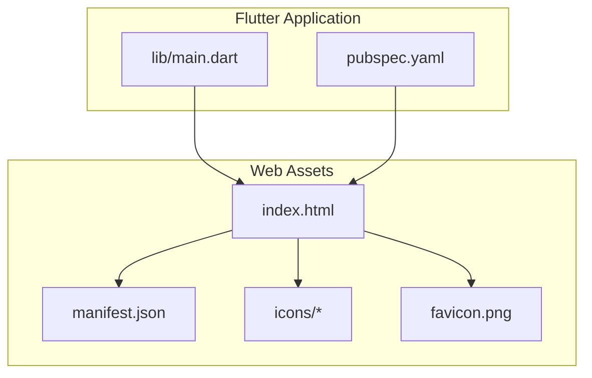
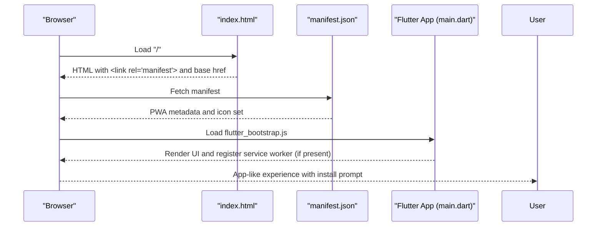
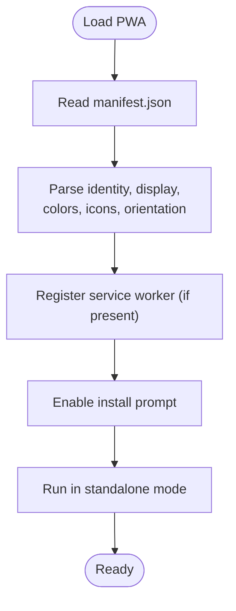
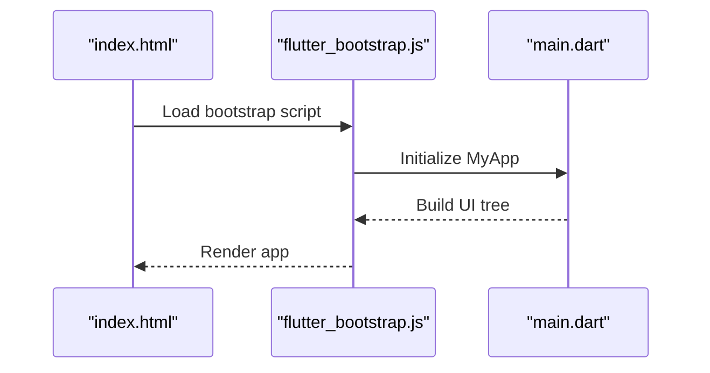
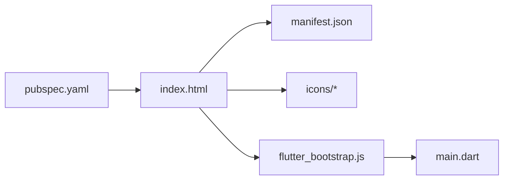

# Progressive Web App Configuration

<cite>
**Referenced Files in This Document**
- [manifest.json](file://portfolio_flutter/web/manifest.json)
- [index.html](file://portfolio_flutter/web/index.html)
- [pubspec.yaml](file://portfolio_flutter/pubspec.yaml)
- [main.dart](file://portfolio_flutter/lib/main.dart)
- [README.md](file://portfolio_flutter/README.md)
</cite>

## Table of Contents
1. [Introduction](#introduction)
2. [Project Structure](#project-structure)
3. [Core Components](#core-components)
4. [Architecture Overview](#architecture-overview)
5. [Detailed Component Analysis](#detailed-component-analysis)
6. [Dependency Analysis](#dependency-analysis)
7. [Performance Considerations](#performance-considerations)
8. [Troubleshooting Guide](#troubleshooting-guide)
9. [Conclusion](#conclusion)

## Introduction
This document explains how the project is configured for web deployment as a Progressive Web App (PWA). It focuses on the manifest.json structure, HTML integration, and Flutter-specific considerations that enable offline readiness, install prompts, and native app-like behavior on the web. It also covers icon sizing requirements, splash screen configuration, and guidance for customizing PWA metadata across deployment scenarios.

## Project Structure
The PWA configuration centers around three key areas:
- Web entry point and manifest linkage
- Manifest definition for app identity, icons, and behavior
- Flutter application bootstrap for web



**Diagram sources**
- [index.html:1-39](file://portfolio_flutter/web/index.html#L1-L39)
- [manifest.json:1-36](file://portfolio_flutter/web/manifest.json#L1-L36)
- [main.dart:1-123](file://portfolio_flutter/lib/main.dart#L1-L123)
- [pubspec.yaml:1-94](file://portfolio_flutter/pubspec.yaml#L1-L94)

**Section sources**
- [index.html:1-39](file://portfolio_flutter/web/index.html#L1-L39)
- [manifest.json:1-36](file://portfolio_flutter/web/manifest.json#L1-L36)
- [main.dart:1-123](file://portfolio_flutter/lib/main.dart#L1-L123)
- [pubspec.yaml:1-94](file://portfolio_flutter/pubspec.yaml#L1-L94)

## Core Components
- Manifest configuration: Defines app name, short name, description, display mode, theme/background colors, orientation, icon set, and maskable icons.
- HTML integration: Links the manifest, sets base href for routing, and includes iOS meta tags and icons for broader compatibility.
- Flutter bootstrap: Initializes the app via a script tag in index.html, enabling PWA features when served as a web app.

Key PWA-relevant manifest fields:
- name and short_name: Human-readable app identifiers.
- description: A concise description for install prompts and indexing.
- start_url: Entry point for navigation.
- display: standalone for app-like behavior.
- background_color and theme_color: Used for splash screen and browser UI theming.
- orientation: Locks orientation to portrait-primary.
- prefer_related_applications: Disables native app installation prompts.
- icons: Provides fixed-size PNG icons and maskable variants for adaptive icons.

**Section sources**
- [manifest.json:1-36](file://portfolio_flutter/web/manifest.json#L1-L36)
- [index.html:17-33](file://portfolio_flutter/web/index.html#L17-L33)

## Architecture Overview
The PWA lifecycle begins when a browser loads index.html, which references manifest.json and the Flutter bootstrap script. The manifest informs the browser about app identity, appearance, and behavior, while Flutter’s web renderer builds the UI.



**Diagram sources**
- [index.html:17-33](file://portfolio_flutter/web/index.html#L17-L33)
- [manifest.json:1-36](file://portfolio_flutter/web/manifest.json#L1-36)
- [main.dart:1-123](file://portfolio_flutter/lib/main.dart#L1-L123)

## Detailed Component Analysis

### Manifest.json Structure and Behavior
The manifest defines:
- Identity: name, short_name, description
- Navigation: start_url, display, orientation
- Theming: background_color, theme_color
- Installability: prefer_related_applications
- Icons: fixed sizes and maskable variants

Recommended icon sizes and purposes:
- 192x192 and 512x512 PNG icons for baseline support
- Maskable variants for adaptive icons on certain platforms



**Diagram sources**
- [manifest.json:1-36](file://portfolio_flutter/web/manifest.json#L1-L36)

**Section sources**
- [manifest.json:1-36](file://portfolio_flutter/web/manifest.json#L1-L36)

### HTML Integration and Base Href
index.html:
- Sets base href for routing in SPA contexts
- Links manifest.json for PWA metadata
- Includes iOS meta tags and apple touch icon for broader compatibility
- Loads the Flutter bootstrap script to render the app

```mermaid
flowchart TD
A["index.html"] --> B["<base href>"]
A --> C["<link rel=\"manifest\">"]
A --> D["iOS meta tags and apple icon"]
A --> E["<script src=\"flutter_bootstrap.js\">"]
B --> F["Routing in SPA"]
C --> G["PWA metadata"]
D --> H["iOS installability"]
E --> I["Bootstrap Flutter app"]
```

**Diagram sources**
- [index.html:17-33](file://portfolio_flutter/web/index.html#L17-L33)

**Section sources**
- [index.html:17-33](file://portfolio_flutter/web/index.html#L17-L33)

### Flutter Application Bootstrap
main.dart initializes the app and renders the UI. While the provided code does not include explicit service worker registration, Flutter’s web build typically registers a service worker during production builds to enable offline caching and install prompts.



**Diagram sources**
- [index.html:36-36](file://portfolio_flutter/web/index.html#L36-L36)
- [main.dart:1-123](file://portfolio_flutter/lib/main.dart#L1-L123)

**Section sources**
- [main.dart:1-123](file://portfolio_flutter/lib/main.dart#L1-L123)
- [index.html:36-36](file://portfolio_flutter/web/index.html#L36-L36)

### Icon Sizing and Splash Screen Configuration
- Fixed icons: 192x192 and 512x512 PNG images are referenced for general use.
- Maskable icons: Provide safe area insets for platform-specific icon masks.
- Splash screen: Controlled by background_color and theme_color in the manifest; ensure these match your brand.

Guidance:
- Keep PNG format for broad compatibility.
- Provide at least 192x192 and 512x512 icons.
- Add maskable variants for modern platforms.

**Section sources**
- [manifest.json:11-33](file://portfolio_flutter/web/manifest.json#L11-L33)

### Service Worker Integration
- The project does not include a custom service worker file in the provided context.
- Flutter web builds commonly generate a service worker for caching and offline behavior. Verify that your production build includes a registered service worker to enable offline capability and install prompts.

[No sources needed since this section provides general guidance]

### PWA Features Enabled by Configuration
- Install prompts: Enabled by linking manifest.json and ensuring a suitable icon set.
- Native app-like behavior: Achieved via standalone display mode and appropriate orientation locking.
- Offline capability: Typically requires a registered service worker; confirm presence in production builds.

**Section sources**
- [index.html:33-33](file://portfolio_flutter/web/index.html#L33-L33)
- [manifest.json:5-10](file://portfolio_flutter/web/manifest.json#L5-L10)

### Customizing PWA Metadata for Different Deployment Scenarios
- Name and short_name: Reflect branding and platform constraints (some OSes limit short_name length).
- Description: Include keywords relevant to your deployment domain.
- Orientation: Adjust to landscape or natural depending on UX needs.
- Colors: Align background_color and theme_color with your app’s theme.
- Icons: Provide multiple sizes and maskable variants for adaptive icons.

**Section sources**
- [manifest.json:2-8](file://portfolio_flutter/web/manifest.json#L2-L8)
- [manifest.json:11-33](file://portfolio_flutter/web/manifest.json#L11-L33)

## Dependency Analysis
The PWA relies on coordinated assets and configuration:
- index.html depends on manifest.json and icons for installability and branding.
- Flutter bootstrap depends on index.html to load the app.
- pubspec.yaml influences build outputs and web packaging.



**Diagram sources**
- [index.html:17-33](file://portfolio_flutter/web/index.html#L17-L33)
- [manifest.json:1-36](file://portfolio_flutter/web/manifest.json#L1-L36)
- [main.dart:1-123](file://portfolio_flutter/lib/main.dart#L1-L123)
- [pubspec.yaml:57-94](file://portfolio_flutter/pubspec.yaml#L57-L94)

**Section sources**
- [index.html:17-33](file://portfolio_flutter/web/index.html#L17-L33)
- [manifest.json:1-36](file://portfolio_flutter/web/manifest.json#L1-L36)
- [main.dart:1-123](file://portfolio_flutter/lib/main.dart#L1-L123)
- [pubspec.yaml:57-94](file://portfolio_flutter/pubspec.yaml#L57-L94)

## Performance Considerations
- Minimize initial payload: Keep icons appropriately sized and avoid unnecessary assets.
- Leverage caching: Ensure a service worker is registered in production builds to cache assets and enable offline loading.
- Optimize boot time: Use lazy loading and efficient asset delivery strategies.

[No sources needed since this section provides general guidance]

## Troubleshooting Guide
Common issues and checks:
- Manifest not applied: Verify index.html links manifest.json and that the manifest path is correct.
- Icons missing: Confirm icon files exist at the paths referenced in manifest.json.
- Install prompt not appearing: Ensure manifest includes sufficient icon sizes and that the site is served over HTTPS in production.
- Orientation problems: Review orientation field and ensure it aligns with intended UX.
- Base href issues: Confirm base href is set correctly for non-root deployments.

**Section sources**
- [index.html:17-33](file://portfolio_flutter/web/index.html#L17-L33)
- [manifest.json:11-33](file://portfolio_flutter/web/manifest.json#L11-L33)

## Conclusion
The project’s web deployment is configured with a manifest.json that establishes app identity, installability, and visual theming. Combined with index.html’s manifest link and Flutter’s web bootstrap, this foundation supports native app-like behavior and install prompts. For full offline capability and robust caching, ensure a service worker is generated and registered in production builds. Customize manifest fields and icons per deployment scenario to optimize user experience across platforms.