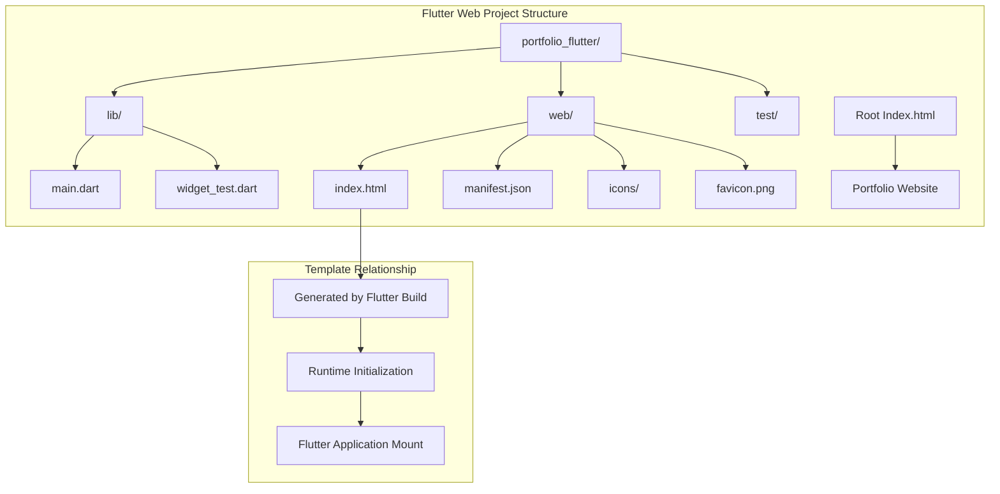
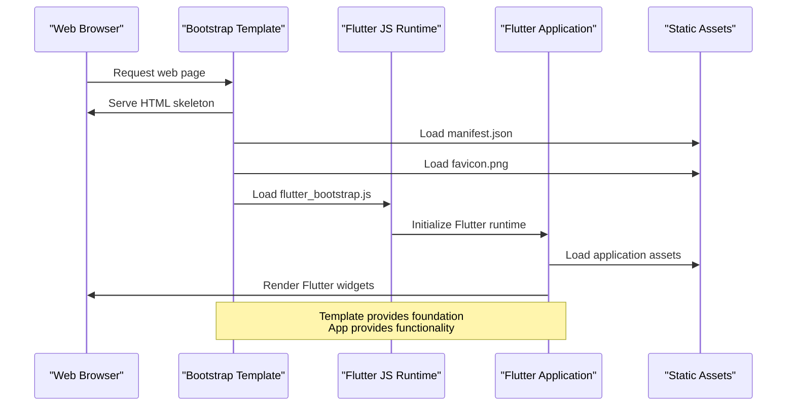
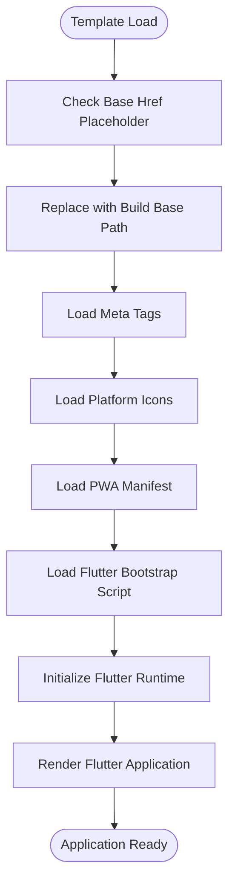
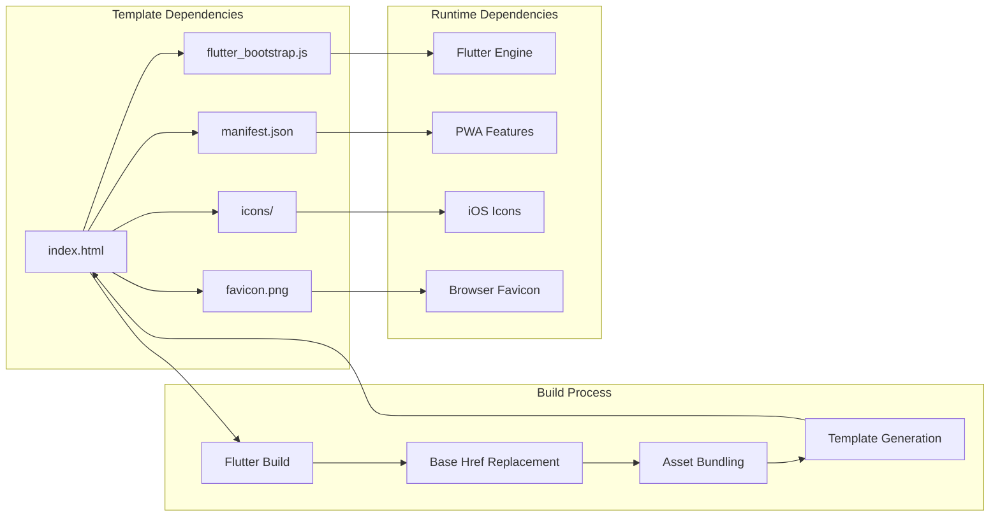

# Web Bootstrap Template

<cite>
**Referenced Files in This Document**
- [index.html](file://portfolio_flutter/web/index.html)
- [manifest.json](file://portfolio_flutter/web/manifest.json)
- [main.dart](file://portfolio_flutter/lib/main.dart)
- [pubspec.yaml](file://portfolio_flutter/pubspec.yaml)
- [index.html](file://index.html)
</cite>

## Table of Contents
1. [Introduction](#introduction)
2. [Project Structure](#project-structure)
3. [Core Components](#core-components)
4. [Architecture Overview](#architecture-overview)
5. [Detailed Component Analysis](#detailed-component-analysis)
6. [Dependency Analysis](#dependency-analysis)
7. [Performance Considerations](#performance-considerations)
8. [Customization Guide](#customization-guide)
9. [SEO Optimization](#seo-optimization)
10. [Deployment Considerations](#deployment-considerations)
11. [Troubleshooting Guide](#troubleshooting-guide)
12. [Conclusion](#conclusion)

## Introduction

The Flutter web bootstrap template serves as the foundational HTML structure that initializes and renders Flutter applications in web browsers. This template acts as the bridge between traditional web infrastructure and Flutter's declarative UI framework, establishing the essential HTML structure, meta configurations, and script loading mechanisms required for seamless Flutter web deployment.

Unlike traditional static HTML templates, Flutter's web bootstrap template is dynamically generated during the build process and provides the minimal HTML skeleton that Flutter's JavaScript runtime uses to mount the application. The template coordinates with Flutter's web rendering engine, manages asset loading, and establishes the foundation for Progressive Web App (PWA) capabilities.

## Project Structure

The Flutter web bootstrap template follows a specific directory structure that separates web-specific assets from the core Flutter application code:

**Diagram sources**
- [index.html](file://portfolio_flutter/web/index.html)
- [manifest.json](file://portfolio_flutter/web/manifest.json)
- [main.dart](file://portfolio_flutter/lib/main.dart)

The web directory contains all web-specific assets including the bootstrap template, PWA manifest, and icon resources. The root index.html serves as a separate portfolio website implementation.

**Section sources**
- [index.html](file://portfolio_flutter/web/index.html)
- [manifest.json](file://portfolio_flutter/web/manifest.json)

## Core Components

### HTML Template Foundation

The Flutter web bootstrap template establishes the fundamental HTML structure required for Flutter web applications:

**Base Configuration**: The template includes a dynamic base href placeholder (`$FLUTTER_BASE_HREF`) that gets replaced during the Flutter build process, enabling deployment to non-root paths.

**Meta Tag Infrastructure**: Essential meta tags handle character encoding, browser compatibility, viewport configuration, and description content for SEO and accessibility.

**Platform-Specific Optimizations**: iOS-specific meta tags and Apple touch icons ensure optimal presentation on mobile Safari browsers.

**PWA Integration**: Manifest link and favicon configuration establish Progressive Web App capabilities including installability and custom branding.

**Script Loading**: Asynchronous loading of the Flutter bootstrap script ensures non-blocking initialization of the Flutter application runtime.

### Asset Management System

The template coordinates with Flutter's asset pipeline to manage static resources:

- **Icon Assets**: Apple touch icons for iOS devices
- **Favicon Resources**: Cross-browser favicon support
- **Manifest Configuration**: PWA manifest defining app appearance and behavior
- **Dynamic Base Path**: Runtime base href replacement for deployment flexibility

**Section sources**
- [index.html](file://portfolio_flutter/web/index.html)
- [manifest.json](file://portfolio_flutter/web/manifest.json)

## Architecture Overview

The Flutter web bootstrap template operates as a critical middleware component in the web application architecture:

**Diagram sources**
- [index.html](file://portfolio_flutter/web/index.html)
- [main.dart](file://portfolio_flutter/lib/main.dart)

The template's role is to provide the minimal HTML structure and resource loading foundation that allows Flutter's JavaScript runtime to initialize and render the application's widget tree. This separation ensures clean architecture where the template handles infrastructure concerns while the Flutter application focuses on business logic and UI rendering.

## Detailed Component Analysis

### Template Structure Analysis

The Flutter web bootstrap template demonstrates several key architectural patterns:

**Minimal HTML Skeleton**: The template maintains a lean structure with essential elements only, deferring all content rendering to Flutter's widget system.

**Dynamic Base Path Handling**: The `$FLUTTER_BASE_HREF` placeholder enables flexible deployment scenarios without manual template modification.

**Progressive Enhancement**: The template supports graceful degradation, allowing the Flutter application to handle missing resources gracefully.

**Security Considerations**: Proper meta tag configuration including XSS protection and content security policies.

**Diagram sources**
- [index.html](file://portfolio_flutter/web/index.html)

### PWA Manifest Configuration

The manifest.json file establishes Progressive Web App capabilities:

**Display Modes**: Standalone display mode for app-like behavior
**Theme Configuration**: Consistent color scheme across platforms
**Icon Variants**: Multiple resolutions for different device densities
**Orientation Control**: Portrait-primary orientation for mobile optimization

**Section sources**
- [manifest.json](file://portfolio_flutter/web/manifest.json)

### Flutter Application Integration

The template seamlessly integrates with the Flutter application through several mechanisms:

**Entry Point Coordination**: The template's body element serves as the mounting point for Flutter's widget tree.
**Asset Resolution**: The template's base href configuration ensures proper asset loading regardless of deployment path.
**Runtime Communication**: The asynchronous script loading allows the Flutter runtime to initialize independently of the template.

**Section sources**
- [index.html](file://portfolio_flutter/web/index.html)
- [main.dart](file://portfolio_flutter/lib/main.dart)

## Dependency Analysis

The Flutter web bootstrap template has specific dependencies and relationships:

**Diagram sources**
- [index.html](file://portfolio_flutter/web/index.html)
- [manifest.json](file://portfolio_flutter/web/manifest.json)

The template depends on the Flutter build system for proper asset bundling and base href configuration. Runtime dependencies include the Flutter JavaScript engine and platform-specific features like PWA capabilities.

**Section sources**
- [pubspec.yaml](file://portfolio_flutter/pubspec.yaml)
- [index.html](file://portfolio_flutter/web/index.html)

## Performance Considerations

### Initial Load Optimization

The template structure supports several performance optimization strategies:

**Asynchronous Script Loading**: The `async` attribute on the Flutter bootstrap script prevents blocking of the main thread during initial page load.

**Minimal Template Size**: Keeping the template lean reduces initial payload and improves perceived performance.

**Asset Preloading**: Strategic preloading of critical assets through meta tags and link elements.

**CDN Integration**: Leveraging CDN delivery for static assets to improve global performance.

### Resource Loading Strategies

**Critical Rendering Path**: Ensuring the template loads essential resources first, followed by the Flutter application runtime.

**Lazy Loading**: Implementing lazy loading for non-critical assets to improve initial load times.

**Compression**: Enabling gzip compression for HTML, CSS, and JavaScript resources.

**Caching**: Configuring appropriate cache headers for static assets to reduce server requests.

## Customization Guide

### Template Modification Guidelines

When customizing the Flutter web bootstrap template, follow these best practices:

**Preserve Essential Elements**: Never remove the base href placeholder, Flutter bootstrap script, or manifest link without understanding the implications.

**Maintain Compatibility**: Ensure any modifications remain compatible with Flutter's build process and runtime expectations.

**Test Thoroughly**: Always test template changes across different browsers and deployment scenarios.

### Branding Customization Options

**Meta Tag Updates**: Modify description, author, and social media meta tags for improved SEO and social sharing.

**Icon Customization**: Replace default icons with brand-specific assets while maintaining required sizes and formats.

**Theme Color Configuration**: Update theme colors in the manifest to match brand guidelines.

**Title Customization**: Modify the title tag to reflect the specific application name and context.

### Deployment Path Configuration

**Base Path Handling**: The `$FLUTTER_BASE_HREF` placeholder automatically handles deployment to subdirectories without manual template editing.

**Build-Time Configuration**: Use Flutter's build arguments to configure base paths for different deployment environments.

**Environment-Specific Settings**: Implement different configurations for development, staging, and production environments.

**Section sources**
- [index.html](file://portfolio_flutter/web/index.html)

## SEO Optimization

### Meta Tag Implementation

The template includes several SEO-friendly meta tags:

**Character Encoding**: UTF-8 encoding ensures proper international character support and accessibility.

**Browser Compatibility**: X-UA-Compatible meta tag ensures consistent rendering across different Internet Explorer versions.

**Description Content**: Comprehensive description meta tag provides search engines with content context.

**Viewport Configuration**: Responsive viewport settings enable proper mobile rendering and SEO compliance.

### Progressive Web App Benefits

**Installability**: PWA manifest enables app installation, improving user engagement and retention metrics.

**Offline Capability**: Service worker registration through manifest enables offline functionality.

**Performance Metrics**: PWA features contribute to improved Core Web Vitals scores.

**Section sources**
- [index.html](file://portfolio_flutter/web/index.html)
- [manifest.json](file://portfolio_flutter/web/manifest.json)

## Deployment Considerations

### Build Process Integration

The Flutter web bootstrap template integrates with the build system through several mechanisms:

**Base Href Replacement**: The `$FLUTTER_BASE_HREF` placeholder is automatically replaced during the build process based on deployment configuration.

**Asset Bundling**: Static assets are bundled and optimized during the build process for production deployment.

**Code Splitting**: Flutter's build system optimizes asset loading through intelligent code splitting and lazy loading.

**Environment Configuration**: Different deployment environments can be configured through build arguments and environment variables.

### Production Optimization

**Minification**: Build process automatically minifies JavaScript and CSS assets for production.

**Compression**: Gzip compression is applied to reduce transfer sizes.

**Caching Strategy**: Optimal caching headers are configured for different asset types.

**CDN Integration**: Assets can be served through CDNs for improved global performance.

**Section sources**
- [index.html](file://portfolio_flutter/web/index.html)
- [pubspec.yaml](file://portfolio_flutter/pubspec.yaml)

## Troubleshooting Guide

### Common Issues and Solutions

**Base Path Problems**: Ensure the `$FLUTTER_BASE_HREF` placeholder is correctly replaced during build. Verify deployment path configuration and test in different environments.

**Asset Loading Failures**: Check that all referenced assets (icons, manifest, favicon) are properly included in the build output and accessible at runtime.

**PWA Functionality Issues**: Verify manifest.json validity and ensure all required icon sizes are available. Test PWA features using browser developer tools.

**Script Loading Problems**: Confirm that the Flutter bootstrap script is loading correctly and not blocked by Content Security Policy settings.

### Diagnostic Steps

**Console Inspection**: Use browser developer tools to inspect network requests and console errors during template loading.

**Network Analysis**: Monitor asset loading progress and identify any failed resource requests.

**Runtime Verification**: Check that the Flutter application initializes correctly after template loading.

**Performance Monitoring**: Analyze loading performance and identify optimization opportunities.

**Section sources**
- [index.html](file://portfolio_flutter/web/index.html)

## Conclusion

The Flutter web bootstrap template represents a sophisticated solution for bridging traditional web infrastructure with Flutter's modern application framework. Its carefully designed structure provides the foundation for seamless Flutter web deployment while maintaining compatibility with web standards and Progressive Web App capabilities.

The template's strength lies in its balance between minimalism and functionality, providing essential infrastructure without interfering with Flutter's declarative UI approach. Through strategic use of meta tags, PWA configuration, and optimized asset loading, the template ensures reliable performance across diverse deployment scenarios.

Understanding the template's architecture and customization options enables developers to create robust, SEO-friendly Flutter web applications that deliver exceptional user experiences while maintaining clean separation of concerns between infrastructure and application logic.