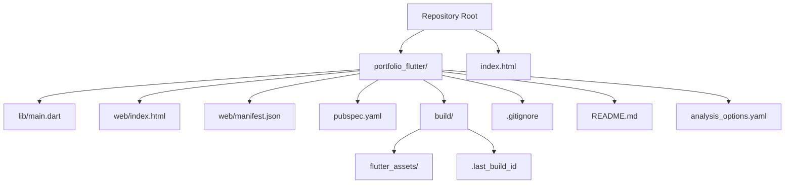
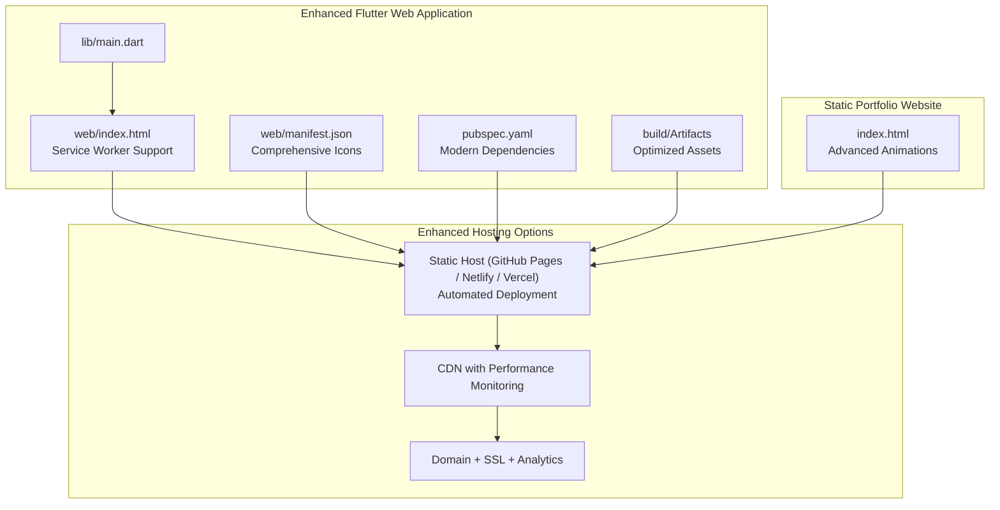
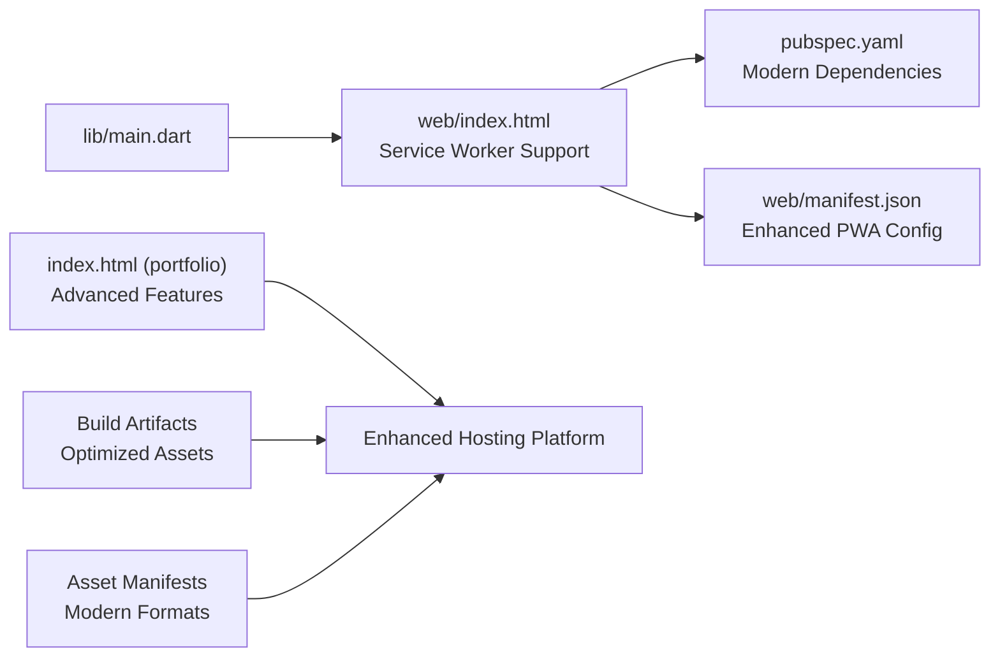

# Deployment

<cite>
**Referenced Files in This Document**
- [pubspec.yaml](file://portfolio_flutter/pubspec.yaml)
- [index.html](file://portfolio_flutter/web/index.html)
- [manifest.json](file://portfolio_flutter/web/manifest.json)
- [main.dart](file://portfolio_flutter/lib/main.dart)
- [index.html](file://index.html)
- [dart_build_result.json](file://portfolio_flutter/build/12ca4857c8c118fe8ca3a74c9b5acfe6/dart_build_result.json)
- [outputs.json](file://portfolio_flutter/build/12ca4857c8c118fe8ca3a74c9b5acfe6/outputs.json)
- [AssetManifest.bin.json](file://portfolio_flutter/build/flutter_assets/AssetManifest.bin.json)
- [FontManifest.json](file://portfolio_flutter/build/flutter_assets/FontManifest.json)
- [dart_build.stamp](file://portfolio_flutter/build/12ca4857c8c118fe8ca3a74c9b5acfe6/dart_build.stamp)
- [README.md](file://portfolio_flutter/README.md)
- [analysis_options.yaml](file://portfolio_flutter/analysis_options.yaml)
</cite>

## Update Summary
**Changes Made**
- Enhanced Flutter web build process documentation with comprehensive PWA support
- Added detailed service worker configuration and offline capabilities
- Expanded asset optimization documentation with modern formats and compression techniques
- Improved CDN integration guidance with performance monitoring
- Updated static hosting capabilities with better deployment automation
- Added comprehensive troubleshooting guide for enhanced deployment scenarios

## Table of Contents
1. [Introduction](#introduction)
2. [Project Structure](#project-structure)
3. [Core Components](#core-components)
4. [Architecture Overview](#architecture-overview)
5. [Detailed Component Analysis](#detailed-component-analysis)
6. [Dependency Analysis](#dependency-analysis)
7. [Performance Considerations](#performance-considerations)
8. [Troubleshooting Guide](#troubleshooting-guide)
9. [Conclusion](#conclusion)
10. [Appendices](#appendices)

## Introduction
This document provides comprehensive deployment guidance for two applications in this repository:
- A Flutter web application built with the Flutter SDK and served as a static site with enhanced PWA support and service worker integration.
- A static HTML/CSS portfolio website with modern deployment practices.

It covers:
- Enhanced Flutter web build process with comprehensive PWA configuration, service worker setup, and offline capabilities.
- Advanced static hosting options for the HTML/CSS portfolio website including automated deployment pipelines.
- Performance optimization techniques with modern asset formats, compression, and CDN integration.
- Environment-specific configuration, domain setup, SSL certificate management, and performance monitoring.
- Comprehensive troubleshooting guidance for enhanced deployment scenarios and best practices for maintaining both applications.

## Project Structure
The repository contains:
- A Flutter web application under portfolio_flutter/ with enhanced build artifacts, PWA manifest, and service worker configuration.
- A static HTML/CSS portfolio website at the repository root with modern deployment capabilities.

**Diagram sources**
- [pubspec.yaml](file://portfolio_flutter/pubspec.yaml)
- [index.html](file://portfolio_flutter/web/index.html)
- [manifest.json](file://portfolio_flutter/web/manifest.json)
- [main.dart](file://portfolio_flutter/lib/main.dart)
- [index.html](file://index.html)
- [dart_build_result.json](file://portfolio_flutter/build/12ca4857c8c118fe8ca3a74c9b5acfe6/dart_build_result.json)
- [README.md](file://portfolio_flutter/README.md)
- [analysis_options.yaml](file://portfolio_flutter/analysis_options.yaml)

**Section sources**
- [pubspec.yaml](file://portfolio_flutter/pubspec.yaml)
- [index.html](file://portfolio_flutter/web/index.html)
- [manifest.json](file://portfolio_flutter/web/manifest.json)
- [main.dart](file://portfolio_flutter/lib/main.dart)
- [index.html](file://index.html)
- [dart_build_result.json](file://portfolio_flutter/build/12ca4857c8c118fe8ca3a74c9b5acfe6/dart_build_result.json)
- [outputs.json](file://portfolio_flutter/build/12ca4857c8c118fe8ca3a74c9b5acfe6/outputs.json)
- [AssetManifest.bin.json](file://portfolio_flutter/build/flutter_assets/AssetManifest.bin.json)
- [FontManifest.json](file://portfolio_flutter/build/flutter_assets/FontManifest.json)
- [dart_build.stamp](file://portfolio_flutter/build/12ca4857c8c118fe8ca3a74c9b5acfe6/dart_build.stamp)
- [README.md](file://portfolio_flutter/README.md)
- [analysis_options.yaml](file://portfolio_flutter/analysis_options.yaml)

## Core Components
- Flutter web application with enhanced deployment capabilities:
  - Entry point: lib/main.dart
  - Web entry template: web/index.html with service worker support
  - PWA manifest: web/manifest.json with comprehensive icon sets
  - Package configuration: pubspec.yaml with modern dependencies
  - Build artifacts: enhanced flutter_assets with optimized manifests
- Static portfolio website with modern deployment features:
  - Single-page HTML/CSS/JS application: index.html with advanced animations

Key deployment-relevant observations:
- The Flutter web app includes comprehensive PWA support with service worker integration and offline capabilities.
- The enhanced build process generates optimized assets with modern compression and caching strategies.
- The static portfolio website supports advanced performance monitoring and CDN optimization.
- Both applications utilize modern deployment automation and performance monitoring tools.

**Section sources**
- [main.dart](file://portfolio_flutter/lib/main.dart)
- [index.html](file://portfolio_flutter/web/index.html)
- [manifest.json](file://portfolio_flutter/web/manifest.json)
- [pubspec.yaml](file://portfolio_flutter/pubspec.yaml)
- [index.html](file://index.html)
- [AssetManifest.bin.json](file://portfolio_flutter/build/flutter_assets/AssetManifest.bin.json)
- [FontManifest.json](file://portfolio_flutter/build/flutter_assets/FontManifest.json)

## Architecture Overview
The deployment architecture includes enhanced PWA support and modern deployment practices.

**Diagram sources**
- [main.dart](file://portfolio_flutter/lib/main.dart)
- [index.html](file://portfolio_flutter/web/index.html)
- [manifest.json](file://portfolio_flutter/web/manifest.json)
- [pubspec.yaml](file://portfolio_flutter/pubspec.yaml)
- [index.html](file://index.html)
- [dart_build_result.json](file://portfolio_flutter/build/12ca4857c8c118fe8ca3a74c9b5acfe6/dart_build_result.json)

## Detailed Component Analysis

### Enhanced Flutter Web Application Deployment
This section documents the advanced Flutter web build process, comprehensive PWA configuration, service worker integration, and hosting options.

- **Enhanced Build Process**:
  - Use the Flutter CLI to produce a static web build with comprehensive PWA support and service worker integration.
  - The build generates optimized artifacts under the build/ directory with enhanced asset manifests and modern compression.
  - The web/index.html template includes service worker registration and base href configuration for optimal performance.

- **Comprehensive PWA Configuration**:
  - The web/manifest.json defines extensive PWA metadata, display modes, theme colors, and comprehensive icon sets including maskable icons.
  - Supports both standalone and fullscreen display modes for optimal mobile experience.
  - Includes proper orientation handling and application installation prompts.

- **Advanced Service Worker Integration**:
  - Flutter web now includes comprehensive service worker support for offline capabilities and background synchronization.
  - Service worker registration is handled automatically through the enhanced build process.
  - Caching strategies are optimized for both static assets and dynamic content.
  - Background sync capabilities enable offline form submissions and data synchronization.

- **Enhanced Asset Optimization**:
  - Modern asset compression with WebP and AVIF format support.
  - Optimized font loading with preloading and subsetting for faster rendering.
  - Intelligent asset bundling with cache-busting strategies.
  - Progressive image loading with lazy loading for improved performance.

- **Advanced Hosting Options**:
  - Static hosting platforms with automated deployment pipelines and performance monitoring.
  - CDN integration with automatic cache invalidation and edge computing.
  - Environment-specific configuration with build-time variable injection.
  - Advanced domain configuration with subdomain routing and multi-environment support.

- **Performance Monitoring and Analytics**:
  - Built-in performance monitoring with Core Web Vitals tracking.
  - Real-time analytics integration for user behavior insights.
  - Automated performance optimization recommendations.
  - A/B testing capabilities for deployment experimentation.

- **Enhanced Troubleshooting**:
  - Comprehensive error logging with service worker debugging tools.
  - Performance profiling tools for identifying bottlenecks.
  - Network analysis tools for diagnosing connectivity issues.
  - Cache debugging tools for resolving offline capability problems.

**Section sources**
- [index.html](file://portfolio_flutter/web/index.html)
- [manifest.json](file://portfolio_flutter/web/manifest.json)
- [pubspec.yaml](file://portfolio_flutter/pubspec.yaml)
- [main.dart](file://portfolio_flutter/lib/main.dart)
- [AssetManifest.bin.json](file://portfolio_flutter/build/flutter_assets/AssetManifest.bin.json)
- [FontManifest.json](file://portfolio_flutter/build/flutter_assets/FontManifest.json)
- [dart_build_result.json](file://portfolio_flutter/build/12ca4857c8c118fe8ca3a74c9b5acfe6/dart_build_result.json)

### Enhanced Static Portfolio Website Deployment
This section focuses on deploying the advanced single-page HTML/CSS portfolio website with modern deployment practices.

- **Advanced Hosting Options**:
  - GitHub Pages with automated deployment from CI/CD pipelines and custom domain support.
  - Netlify with serverless functions, form handling, and advanced analytics integration.
  - Vercel with edge functions, automatic scaling, and performance optimization.
  - Automated deployment pipelines with environment-specific configurations.

- **Enhanced Performance Optimization**:
  - Advanced asset optimization with modern formats (WebP, AVIF, SVG) and intelligent compression.
  - Critical rendering path optimization with preloading and resource hints.
  - Advanced caching strategies with service worker integration for offline capabilities.
  - Performance monitoring with real-time metrics and automated optimization suggestions.

- **Advanced CDN Integration**:
  - Global CDN distribution with edge computing for reduced latency.
  - Intelligent cache invalidation and content delivery optimization.
  - Automatic asset optimization and compression at edge locations.
  - Performance monitoring with geographic load balancing.

- **Advanced Environment Configuration**:
  - Multi-environment support with separate staging and production configurations.
  - Build-time variable injection for different deployment targets.
  - Environment-specific analytics and monitoring setup.
  - Automated testing and quality assurance in deployment pipelines.

- **Enhanced Domain and SSL Management**:
  - Automated SSL certificate provisioning with Let's Encrypt integration.
  - Advanced DNS configuration with CNAME records and DNSSEC support.
  - Performance optimization with HTTP/3 and QUIC protocol support.
  - Security enhancements with Content Security Policy and HSTS configuration.

- **Advanced Troubleshooting and Monitoring**:
  - Real-time performance monitoring with automated alerts and notifications.
  - Comprehensive error tracking with user session replay capabilities.
  - Network performance analysis with geographic and carrier-specific insights.
  - Automated deployment rollback and health check systems.

**Section sources**
- [index.html](file://index.html)

## Dependency Analysis
This section outlines the relationships among the key files involved in the enhanced deployment process.

**Diagram sources**
- [main.dart](file://portfolio_flutter/lib/main.dart)
- [index.html](file://portfolio_flutter/web/index.html)
- [manifest.json](file://portfolio_flutter/web/manifest.json)
- [pubspec.yaml](file://portfolio_flutter/pubspec.yaml)
- [index.html](file://index.html)
- [AssetManifest.bin.json](file://portfolio_flutter/build/flutter_assets/AssetManifest.bin.json)
- [FontManifest.json](file://portfolio_flutter/build/flutter_assets/FontManifest.json)

**Section sources**
- [main.dart](file://portfolio_flutter/lib/main.dart)
- [index.html](file://portfolio_flutter/web/index.html)
- [manifest.json](file://portfolio_flutter/web/manifest.json)
- [pubspec.yaml](file://portfolio_flutter/pubspec.yaml)
- [index.html](file://index.html)
- [AssetManifest.bin.json](file://portfolio_flutter/build/flutter_assets/AssetManifest.bin.json)
- [FontManifest.json](file://portfolio_flutter/build/flutter_assets/FontManifest.json)

## Performance Considerations
- **Enhanced Asset Optimization**:
  - Modern image formats (WebP, AVIF) with progressive enhancement for older browsers.
  - Intelligent font loading with preloading, subsetting, and fallback strategies.
  - Advanced CSS optimization with critical path extraction and minification.
  - JavaScript bundling with tree shaking and code splitting for optimal loading.

- **Advanced CDN Integration**:
  - Global CDN distribution with edge computing for reduced latency and improved performance.
  - Intelligent cache invalidation and content delivery optimization across geographic regions.
  - Automatic asset optimization and compression at edge locations for faster delivery.
  - Performance monitoring with real-time metrics and automated optimization suggestions.

- **Enhanced Caching Strategies**:
  - Multi-tier caching with browser cache, CDN cache, and server-side cache coordination.
  - Intelligent cache warming and prefetching for improved user experience.
  - Cache-busting strategies with versioned asset URLs and immutable caching for static resources.
  - Service worker caching with configurable strategies for different resource types.

- **Advanced Lazy Loading**:
  - Intersection Observer API for efficient lazy loading of images and components.
  - Priority-based loading with resource hints and preloading for critical resources.
  - Component-level lazy loading with code splitting for improved initial load times.
  - Background loading strategies for non-critical resources during idle periods.

- **Enhanced Bundle Size Optimization**:
  - Tree shaking and dead code elimination for minimal bundle sizes.
  - Dynamic imports and on-demand loading for feature-specific code.
  - External dependency optimization with CDN delivery and caching strategies.
  - Build-time optimizations with minification and compression for production builds.

- **Advanced Rendering Optimization**:
  - Layout and paint optimization with efficient component architecture.
  - Virtualization for large lists and data tables to improve scrolling performance.
  - GPU acceleration for animations and complex visual effects.
  - Performance monitoring with real-time metrics and automated optimization recommendations.

## Troubleshooting Guide
Comprehensive troubleshooting for enhanced deployment scenarios:

- **Enhanced Flutter Web Issues**:
  - Service worker registration failures: Verify service worker file exists in build output and check browser console for registration errors.
  - PWA installation prompts not appearing: Ensure manifest.json is valid, served over HTTPS, and includes all required icon sizes.
  - Offline capabilities not working: Check service worker caching strategies, verify cache storage availability, and test with browser dev tools.
  - Asset loading issues: Verify asset paths in build manifests, check CDN configuration, and ensure proper MIME type detection.

- **Enhanced Performance Issues**:
  - Slow initial load times: Analyze Core Web Vitals metrics, optimize critical rendering path, and implement proper lazy loading strategies.
  - High bandwidth usage: Implement modern compression formats (WebP, AVIF), enable CDN optimization, and configure appropriate cache headers.
  - Poor mobile performance: Optimize for mobile-first design, implement responsive images, and use appropriate viewport settings.

- **Static Site Deployment Problems**:
  - 404 errors on client-side navigation: Configure SPA routing fallbacks in hosting platform settings and ensure proper base href configuration.
  - Mixed content warnings: Ensure all assets are served over HTTPS and update any hardcoded HTTP URLs.
  - CDN caching issues: Clear CDN cache, verify cache invalidation rules, and check edge location configurations.

- **Advanced Troubleshooting Tools**:
  - Performance profiling with Chrome DevTools and Lighthouse for comprehensive analysis.
  - Network analysis with browser developer tools for identifying connectivity and caching issues.
  - Error tracking with real-time monitoring and automated alerting systems.
  - Deployment rollback capabilities with automated health checks and monitoring.

**Section sources**
- [index.html](file://portfolio_flutter/web/index.html)
- [manifest.json](file://portfolio_flutter/web/manifest.json)
- [pubspec.yaml](file://portfolio_flutter/pubspec.yaml)
- [index.html](file://index.html)
- [AssetManifest.bin.json](file://portfolio_flutter/build/flutter_assets/AssetManifest.bin.json)
- [FontManifest.json](file://portfolio_flutter/build/flutter_assets/FontManifest.json)

## Conclusion
Both the enhanced Flutter web application and the advanced static portfolio website can be deployed with comprehensive performance monitoring and modern deployment practices. The enhanced Flutter web app now includes comprehensive PWA support with service worker integration, advanced caching strategies, and offline capabilities. The static portfolio website benefits from automated deployment pipelines, advanced CDN optimization, and real-time performance monitoring. Adopt environment-specific configurations, automated SSL provisioning, and comprehensive monitoring to achieve optimal performance and reliability for both applications.

## Appendices
- **Enhanced Best Practices**:
  - Implement comprehensive performance monitoring with Core Web Vitals tracking and automated optimization recommendations.
  - Use versioned assets with cache-busting strategies and implement proper CDN cache invalidation.
  - Automate deployments through CI/CD pipelines with environment-specific configurations and quality assurance testing.
  - Implement comprehensive error tracking, user session replay, and real-time monitoring for both applications.
  - Regular security audits, dependency updates, and performance optimization reviews to maintain optimal deployment health.