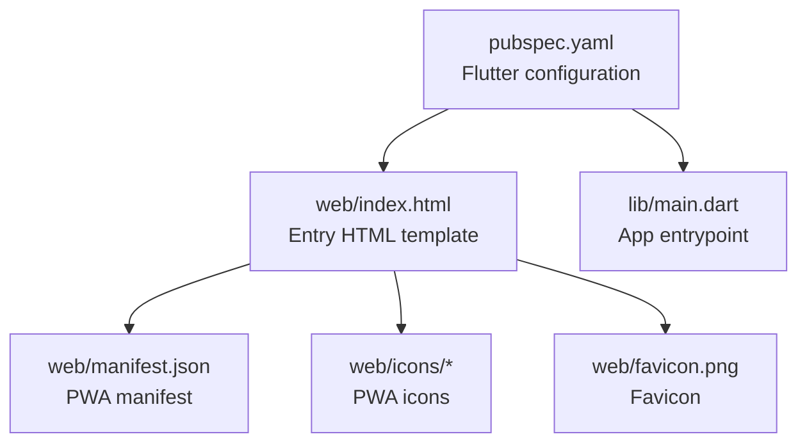
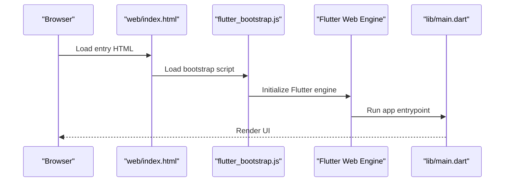
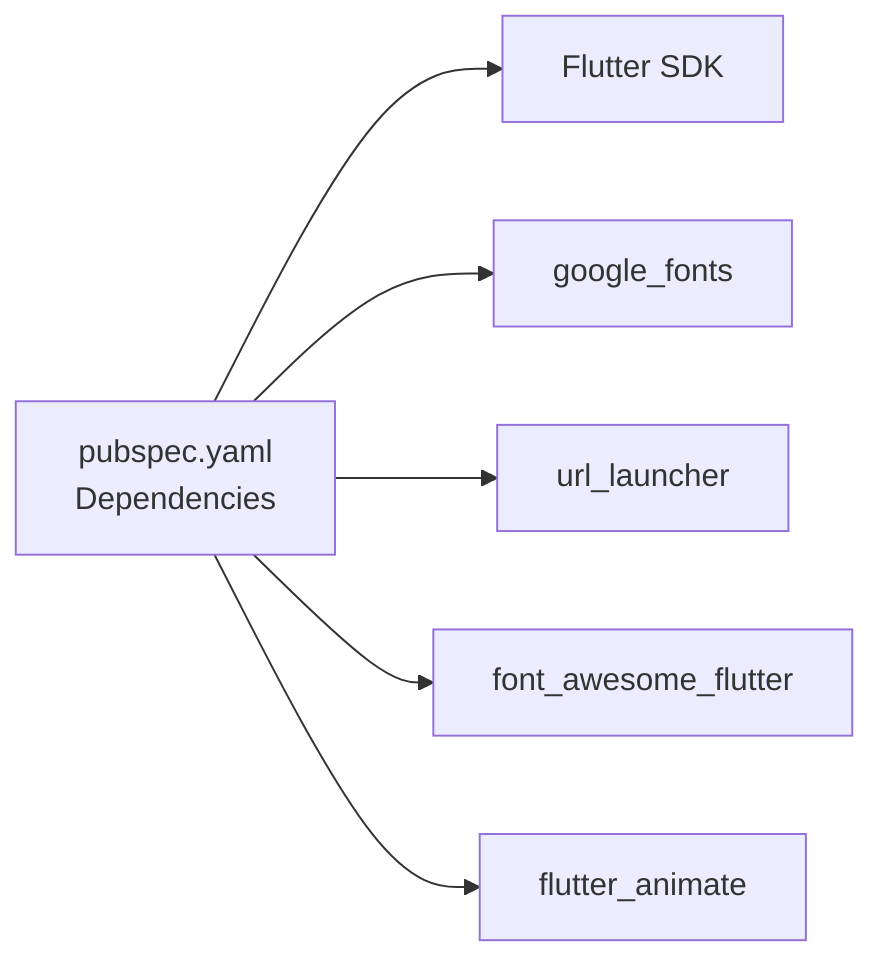

# Flutter Web Deployment

<cite>
**Referenced Files in This Document**
- [pubspec.yaml](file://portfolio_flutter/pubspec.yaml)
- [index.html](file://portfolio_flutter/web/index.html)
- [manifest.json](file://portfolio_flutter/web/manifest.json)
- [main.dart](file://portfolio_flutter/lib/main.dart)
- [README.md](file://portfolio_flutter/README.md)
- [analysis_options.yaml](file://portfolio_flutter/analysis_options.yaml)
- [widget_test.dart](file://portfolio_flutter/test/widget_test.dart)
</cite>

## Table of Contents
1. [Introduction](#introduction)
2. [Project Structure](#project-structure)
3. [Core Components](#core-components)
4. [Architecture Overview](#architecture-overview)
5. [Detailed Component Analysis](#detailed-component-analysis)
6. [Dependency Analysis](#dependency-analysis)
7. [Performance Considerations](#performance-considerations)
8. [Troubleshooting Guide](#troubleshooting-guide)
9. [Conclusion](#conclusion)
10. [Appendices](#appendices)

## Introduction
This document provides a complete guide to deploying Flutter applications to the web. It covers the Flutter build pipeline for web, Progressive Web App (PWA) configuration, hosting options, performance optimization, environment-specific configuration, and troubleshooting common deployment issues. The goal is to help you reliably build, optimize, and ship Flutter web apps across platforms and environments.

## Project Structure
The repository includes a minimal Flutter web application with essential web assets and configuration files. The most relevant files for web deployment are under the web directory and the Flutter configuration in pubspec.yaml.

**Diagram sources**
- [pubspec.yaml:57-94](file://portfolio_flutter/pubspec.yaml#L57-L94)
- [index.html:1-39](file://portfolio_flutter/web/index.html#L1-L39)
- [manifest.json:1-36](file://portfolio_flutter/web/manifest.json#L1-L36)
- [main.dart:1-123](file://portfolio_flutter/lib/main.dart#L1-L123)

**Section sources**
- [pubspec.yaml:57-94](file://portfolio_flutter/pubspec.yaml#L57-L94)
- [index.html:1-39](file://portfolio_flutter/web/index.html#L1-L39)
- [manifest.json:1-36](file://portfolio_flutter/web/manifest.json#L1-L36)
- [main.dart:1-123](file://portfolio_flutter/lib/main.dart#L1-L123)

## Core Components
- Flutter build for web: The Flutter toolchain generates a web build with an HTML entry, JavaScript bootstrap script, and static assets. The build output is placed in a build/web directory by default.
- PWA configuration: The PWA manifest and icons define installability, appearance, and behavior on supported browsers and devices.
- App entrypoint: The main.dart file initializes the Flutter app and sets up the application shell.

Key deployment-relevant observations from the repository:
- The web/index.html template includes a base href placeholder intended to be replaced by the --base-href flag during build.
- The manifest.json defines PWA metadata and icon assets.
- The pubspec.yaml includes Flutter dependencies and the Flutter section for assets and fonts.

**Section sources**
- [pubspec.yaml:57-94](file://portfolio_flutter/pubspec.yaml#L57-L94)
- [index.html:14-17](file://portfolio_flutter/web/index.html#L14-L17)
- [manifest.json:1-36](file://portfolio_flutter/web/manifest.json#L1-L36)
- [main.dart:1-123](file://portfolio_flutter/lib/main.dart#L1-L123)

## Architecture Overview
The Flutter web runtime loads the generated HTML entry, initializes the Flutter engine via a bootstrap script, and renders the Flutter app. Static assets (including the PWA manifest and icons) are served alongside the app.

**Diagram sources**
- [index.html:36-36](file://portfolio_flutter/web/index.html#L36-L36)
- [main.dart:3-5](file://portfolio_flutter/lib/main.dart#L3-L5)

## Detailed Component Analysis

### Flutter Build Pipeline for Web
- Command: flutter build web
- Purpose: Generates a production-ready web build with optimized assets and a service worker for offline caching.
- Output: build/web directory containing the static site and assets.
- Base href: The --base-href flag replaces the $FLUTTER_BASE_HREF placeholder in index.html to support subdirectory hosting.

Build-time flags commonly used for optimization:
- --release: Builds an optimized release bundle.
- --base-href: Sets the base path for the app when hosted under a subdirectory.
- --web-renderer: Selects rendering backend (default canvaskit or html).
- --mode: Controls debug vs profile vs release behavior.

Output directory structure (typical):
- build/web/index.html
- build/web/flutter_bootstrap.js
- build/web/assets/*
- build/web/icons/*
- build/web/manifest.json
- build/web/VERSION
- build/web/CNAME (optional)
- build/web/robots.txt (optional)

Note: The repository’s index.html template explicitly documents the base href placeholder and its replacement by --base-href.

**Section sources**
- [index.html:4-17](file://portfolio_flutter/web/index.html#L4-L17)

### Progressive Web App Configuration
- Manifest: The manifest.json file defines app metadata, display mode, theme colors, orientation, and icon assets.
- Icons: Icons are referenced from the web/icons directory and include standard and maskable variants.
- Registration: The HTML entry links to the manifest via a manifest link tag.

Important manifest fields present in the repository:
- name and short_name
- start_url
- display
- background_color and theme_color
- icons array with multiple sizes and purposes

Service worker behavior:
- Flutter generates a service worker for offline caching and app shell delivery in release builds.
- Ensure the manifest is valid and icons are accessible for installability.

**Section sources**
- [manifest.json:1-36](file://portfolio_flutter/web/manifest.json#L1-L36)
- [index.html:33-33](file://portfolio_flutter/web/index.html#L33-L33)

### App Entrypoint and Routing
- The main.dart file initializes the app and sets up the root widget.
- For navigation and routing, use Flutter’s routing APIs. Ensure routes are configured to work with the browser history and base href when applicable.

Routing considerations:
- When hosting under a subdirectory, configure routing to respect the base path.
- Test deep linking and refresh behavior to confirm the service worker handles navigation correctly.

**Section sources**
- [main.dart:3-36](file://portfolio_flutter/lib/main.dart#L3-L36)

### Asset Management and Fonts
- Assets and fonts are declared in pubspec.yaml under the Flutter section. Ensure assets referenced by the app are included so they are bundled and served correctly.
- For performance, minimize asset sizes and leverage compression where supported by the host.

**Section sources**
- [pubspec.yaml:64-93](file://portfolio_flutter/pubspec.yaml#L64-L93)

### Testing and Linting
- Tests: The repository includes a basic widget test verifying UI behavior.
- Linting: analysis_options.yaml applies Flutter lints to enforce code quality.

**Section sources**
- [widget_test.dart:13-30](file://portfolio_flutter/test/widget_test.dart#L13-L30)
- [analysis_options.yaml:8-29](file://portfolio_flutter/analysis_options.yaml#L8-L29)

## Dependency Analysis
The Flutter web app depends on Flutter SDK and third-party packages declared in pubspec.yaml. These dependencies influence build size and runtime behavior.

**Diagram sources**
- [pubspec.yaml:30-41](file://portfolio_flutter/pubspec.yaml#L30-L41)

**Section sources**
- [pubspec.yaml:30-41](file://portfolio_flutter/pubspec.yaml#L30-L41)

## Performance Considerations
- Code splitting and lazy loading: Use dynamic imports to defer heavy features until needed. This reduces initial bundle size and improves load times.
- Asset optimization: Compress images, remove unused assets, and leverage modern formats where supported. Ensure icons referenced by the manifest are appropriately sized.
- Rendering backend: Choose the appropriate web renderer (--web-renderer) based on target devices and performance goals.
- Minification and tree shaking: Rely on release builds to strip debug code and unused code paths.
- CDN integration: Serve static assets via a CDN to reduce latency and improve reliability. Ensure cache headers are configured appropriately.
- Base href and routing: Correctly set --base-href for subdirectory deployments to prevent broken asset and route resolution.

[No sources needed since this section provides general guidance]

## Troubleshooting Guide
Common deployment issues and resolutions:

- Routing problems after deployment
  - Symptom: Navigation fails or blank page appears after refresh.
  - Cause: Incorrect base href or missing service worker handling.
  - Resolution: Set --base-href during build for subdirectory hosting and verify the service worker precaches routes.

- Asset loading failures
  - Symptom: Images or fonts do not load.
  - Cause: Incorrect asset paths or missing assets in pubspec.yaml.
  - Resolution: Confirm asset declarations and verify that assets are present in the build output.

- PWA installation or icon issues
  - Symptom: App does not appear installable or icons are missing.
  - Cause: Invalid manifest or missing icon files.
  - Resolution: Validate manifest.json and ensure all referenced icons exist and are accessible.

- Subdirectory hosting
  - Symptom: Assets or routes resolve incorrectly under a subpath.
  - Cause: Missing or incorrect base href.
  - Resolution: Pass --base-href during build and ensure index.html contains the base href placeholder.

- Service worker not registering
  - Symptom: Offline mode not working.
  - Cause: Misconfigured manifest or service worker generation.
  - Resolution: Ensure manifest is valid and the service worker is generated in release builds.

**Section sources**
- [index.html:4-17](file://portfolio_flutter/web/index.html#L4-L17)
- [manifest.json:1-36](file://portfolio_flutter/web/manifest.json#L1-L36)

## Conclusion
Deploying Flutter web apps involves building with the correct flags, configuring PWA assets, and ensuring proper hosting setup. By validating the manifest, optimizing assets, and using base href for subdirectory hosting, you can deliver a fast, installable, and reliable web experience. Use testing and linting to maintain code quality and catch issues early.

[No sources needed since this section summarizes without analyzing specific files]

## Appendices

### Appendix A: Build Commands and Flags
- flutter build web
  - Purpose: Produce a production-ready web build.
  - Flags:
    - --release
    - --base-href
    - --web-renderer
    - --mode

[No sources needed since this section provides general guidance]

### Appendix B: Hosting Options Overview
- Firebase Hosting: Configure hosting rules and rewrites for SPA routing. Use CDN acceleration and HTTPS.
- Netlify/Vercel: Utilize static export and SPA routing rules. Enable CDN and custom domains.
- Traditional web servers: Ensure index.html is served for all routes and that static assets are accessible.

[No sources needed since this section provides general guidance]

### Appendix C: Environment-Specific Configuration
- Environment variables: Use environment-specific configuration files or build-time constants for API endpoints and feature flags.
- Base href: Set per environment using CI/CD variables or build scripts.

[No sources needed since this section provides general guidance]