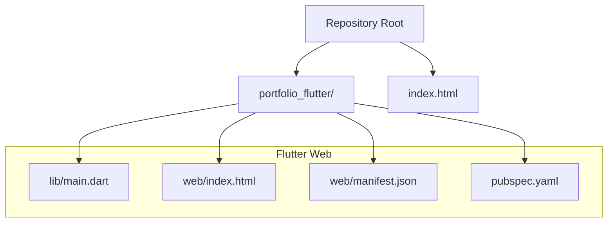
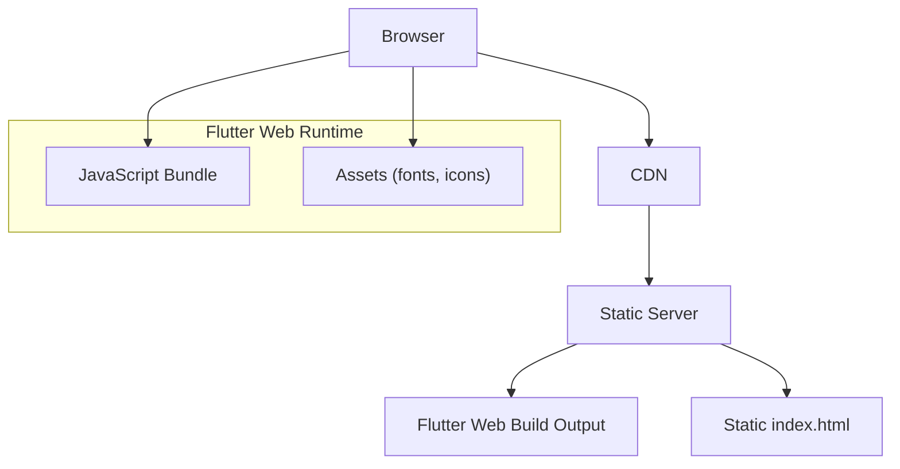
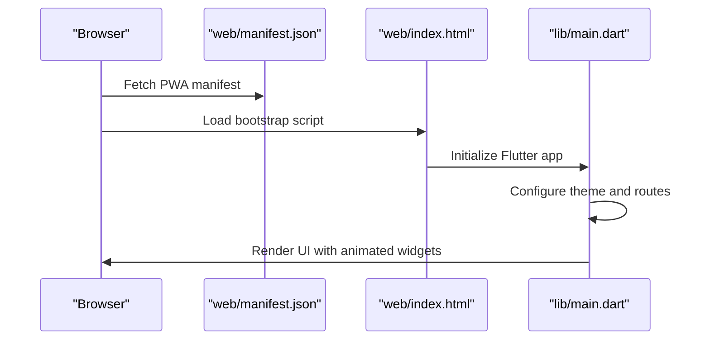
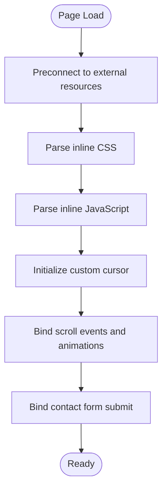
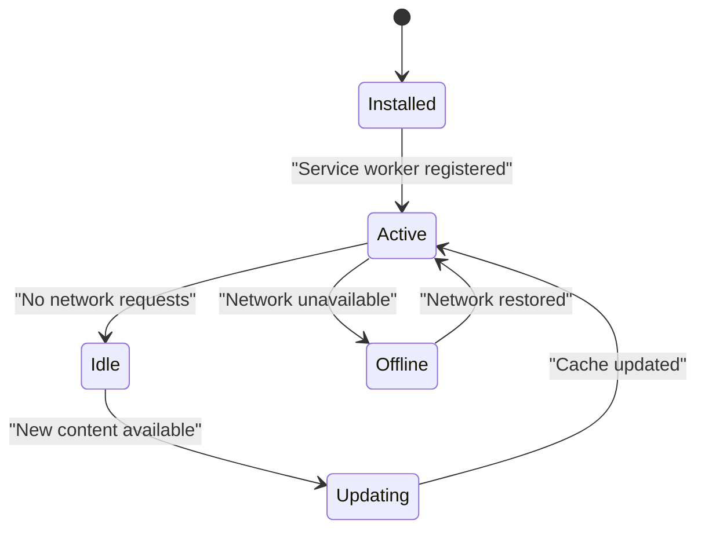
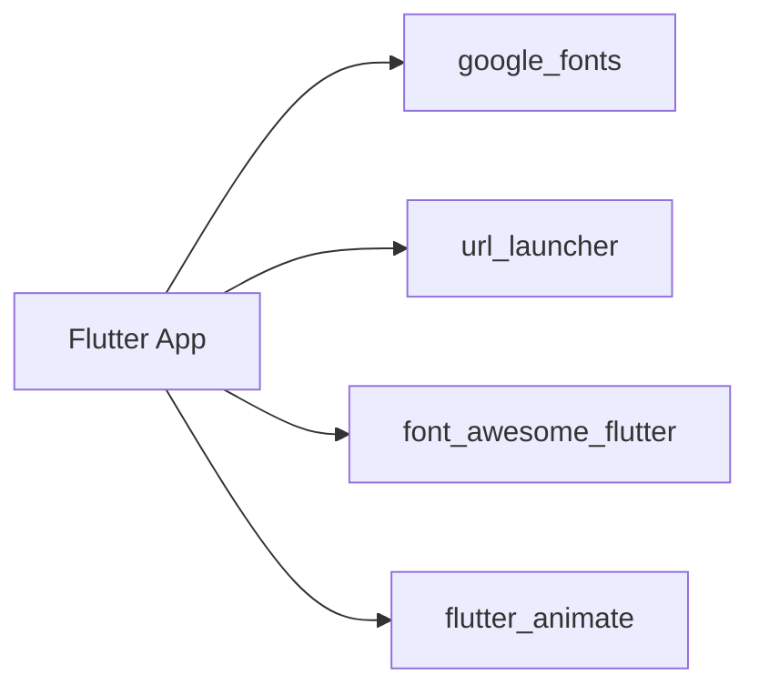

# Performance Optimization

<cite>
**Referenced Files in This Document**
- [pubspec.yaml](file://portfolio_flutter/pubspec.yaml)
- [main.dart](file://portfolio_flutter/lib/main.dart)
- [index.html](file://index.html)
- [web/index.html](file://portfolio_flutter/web/index.html)
- [web/manifest.json](file://portfolio_flutter/web/manifest.json)
- [analysis_options.yaml](file://portfolio_flutter/analysis_options.yaml)
</cite>

## Table of Contents
1. [Introduction](#introduction)
2. [Project Structure](#project-structure)
3. [Core Components](#core-components)
4. [Architecture Overview](#architecture-overview)
5. [Detailed Component Analysis](#detailed-component-analysis)
6. [Dependency Analysis](#dependency-analysis)
7. [Performance Considerations](#performance-considerations)
8. [Troubleshooting Guide](#troubleshooting-guide)
9. [Conclusion](#conclusion)
10. [Appendices](#appendices)

## Introduction
This document provides a comprehensive performance optimization guide tailored to both Flutter web and a static portfolio website. It covers asset optimization, caching strategies, CDN integration, browser caching headers, Progressive Web App (PWA) enhancements, Flutter-specific optimizations, static site improvements, and performance monitoring. The guidance is grounded in the current repository structure and configuration files.

## Project Structure
The repository contains:
- A Flutter web application under portfolio_flutter with a main entry point and web-specific assets.
- A static portfolio website in the repository root with a single HTML file implementing modern CSS and JavaScript.

**Diagram sources**
- [main.dart](file://portfolio_flutter/lib/main.dart)
- [web/index.html](file://portfolio_flutter/web/index.html)
- [web/manifest.json](file://portfolio_flutter/web/manifest.json)
- [pubspec.yaml](file://portfolio_flutter/pubspec.yaml)
- [index.html](file://index.html)

**Section sources**
- [pubspec.yaml](file://portfolio_flutter/pubspec.yaml)
- [main.dart](file://portfolio_flutter/lib/main.dart)
- [index.html](file://index.html)
- [web/index.html](file://portfolio_flutter/web/index.html)
- [web/manifest.json](file://portfolio_flutter/web/manifest.json)

## Core Components
- Flutter web application entry and rendering logic.
- Static HTML/CSS/JS portfolio with animations and scroll effects.
- Web manifest enabling PWA features.
- Package configuration for Flutter dependencies.

Key performance-relevant observations:
- The Flutter app uses animated widgets and Google Fonts via the web, which can increase initial load time if not optimized.
- The static site includes external resources (Google Fonts and Font Awesome) and inline CSS/JS, which can benefit from minification and preloading strategies.
- The web manifest supports PWA installation and background/theme colors, laying groundwork for service workers and offline caching.

**Section sources**
- [main.dart](file://portfolio_flutter/lib/main.dart)
- [index.html](file://index.html)
- [web/manifest.json](file://portfolio_flutter/web/manifest.json)
- [pubspec.yaml](file://portfolio_flutter/pubspec.yaml)

## Architecture Overview
The performance architecture integrates two delivery mechanisms:
- Flutter web builds a JavaScript bundle served via a web server with optional CDN and caching.
- Static portfolio is a single-page application delivered as HTML with embedded CSS/JS and external resources.

[No sources needed since this diagram shows conceptual workflow, not actual code structure]

## Detailed Component Analysis

### Flutter Web Application
The Flutter app initializes the UI with Material Theming, Google Fonts, and animated widgets. Performance considerations:
- Font loading: Google Fonts are loaded via the web; consider self-hosting or preloading to reduce render-blocking.
- Animations: Animated widgets and BackdropFilter can impact rendering performance on lower-end devices.
- Asset management: No explicit asset declarations in pubspec.yaml; ensure images and fonts are properly bundled.

**Diagram sources**
- [web/manifest.json](file://portfolio_flutter/web/manifest.json)
- [web/index.html](file://portfolio_flutter/web/index.html)
- [main.dart](file://portfolio_flutter/lib/main.dart)

**Section sources**
- [main.dart](file://portfolio_flutter/lib/main.dart)
- [web/index.html](file://portfolio_flutter/web/index.html)
- [web/manifest.json](file://portfolio_flutter/web/manifest.json)
- [pubspec.yaml](file://portfolio_flutter/pubspec.yaml)

### Static Portfolio Website
The static site implements:
- Preconnect hints for external fonts.
- Inline CSS with animations and responsive styles.
- JavaScript for custom cursor, scroll animations, and form submission.

**Diagram sources**
- [index.html](file://index.html)

**Section sources**
- [index.html](file://index.html)

### PWA and Offline Caching
The web manifest enables PWA features. To improve performance:
- Add a service worker to cache critical assets and enable offline caching.
- Implement cache-first or stale-while-revalidate strategies for static assets.
- Use Cache-Control and ETag headers for long-term caching.

[No sources needed since this diagram shows conceptual workflow, not actual code structure]

## Dependency Analysis
Flutter dependencies and their potential performance impact:
- google_fonts: Adds network requests for fonts; consider self-hosting or preloading.
- url_launcher: External link launching; minimal runtime cost.
- font_awesome_flutter: Adds icon fonts; consider SVG icons or subset fonts.
- flutter_animate: Adds animation capabilities; optimize animation complexity.

**Diagram sources**
- [pubspec.yaml](file://portfolio_flutter/pubspec.yaml)

**Section sources**
- [pubspec.yaml](file://portfolio_flutter/pubspec.yaml)

## Performance Considerations

### Asset Optimization
- Images
  - Compress images losslessly or lossily using tools like ImageOptim, Squoosh, or Sharp.
  - Serve modern formats (AVIF/WebP) with fallbacks.
  - Use responsive images with srcset and sizes attributes (where applicable).
- CSS
  - Minify CSS and remove unused styles.
  - Split critical CSS inline and defer non-critical CSS.
- JavaScript
  - Minify and bundle JS; enable tree shaking.
  - Defer non-critical scripts; split into smaller chunks.

### Caching Strategies
- Browser caching
  - Set Cache-Control: public, max-age=<value>, immutable for static assets.
  - Use ETags or Last-Modified for cache validation.
- CDN caching
  - Configure cache tiers: origin vs edge caches.
  - Use cache invalidation strategies for versioned assets.
- Service Worker caching
  - Implement a precache strategy for critical assets.
  - Use runtime caching with cache-first or stale-while-revalidate.

### CDN Integration
- Host static assets on a CDN with global edge locations.
- Enable automatic compression (gzip/deflate) and HTTP/2 push where supported.
- Use domain sharding judiciously; modern CDNs handle multiplexing efficiently.

### Browser Caching Headers
- Static assets: Cache-Control: public, max-age=31536000, immutable.
- HTML: Cache-Control: no-store or short max-age with revalidation.
- Fonts: Cache-Control: public, max-age=86400, must-revalidate; consider CORS for cross-origin fonts.

### Progressive Web App Performance
- Service Worker
  - Register a service worker for offline support.
  - Cache critical pages and assets; invalidate on version changes.
- Offline Strategy
  - Use a strategy like Stale-While-Revalidate for dynamic content.
  - Provide a clear offline page or fallback UI.
- Performance Metrics
  - Measure LCP, FID, CLS, and FCP; monitor in production.
  - Use Performance API and Core Web Vitals reporting.

### Flutter-Specific Optimizations
- Tree Shaking and Code Splitting
  - Use release builds with dart2js optimizations.
  - Split large features into separate libraries and lazy-load where appropriate.
- Build Optimization Flags
  - Use --release flag during flutter build web.
  - Consider --web-renderer canvaskit or html depending on target devices.
- Asset Bundling
  - Prefer self-hosted fonts and icons to reduce external dependencies.
  - Optimize images and compress assets in pubspec.yaml.

### Static Site Improvements
- Gzip Compression
  - Enable gzip or Brotli compression on the server.
- HTTP/2 Optimization
  - Use HTTP/2 or HTTP/3; enable server push for critical resources.
- Resource Hinting
  - Use preconnect for external domains (already present for fonts).
  - Add prefetch/preload for critical resources.
- Minification and Bundling
  - Minify CSS and JS; combine files where appropriate.
  - Use a bundler (e.g., esbuild, Parcel) for advanced optimizations.

### Monitoring and Benchmarking
- Tools
  - Lighthouse, WebPageTest, PageSpeed Insights.
  - Real User Monitoring (RUM) solutions like SpeedCurve or Retrace.
- Benchmarks
  - Track LCP, FID, CLS, TTFB, and INP.
  - Establish baselines and regression alerts.
- Continuous Improvement
  - Automate performance checks in CI/CD.
  - Regular audits and A/B testing of optimizations.

[No sources needed since this section provides general guidance]

## Troubleshooting Guide
Common performance issues and resolutions:
- Slow font loading
  - Symptoms: Flash of invisible text or FOIT.
  - Resolution: Preload fonts, use font-display swap, or self-host fonts.
- Heavy animations causing jank
  - Symptoms: Low FPS during scroll or hover.
  - Resolution: Reduce animation complexity, prefer transform/opacity, and throttle scroll handlers.
- Large JavaScript bundles
  - Symptoms: Long time to interactive.
  - Resolution: Enable tree shaking, code splitting, and minification.
- Missing cache headers
  - Symptoms: Repeated downloads of static assets.
  - Resolution: Configure Cache-Control and ETag headers on the server.
- PWA not caching offline
  - Symptoms: App fails to load offline.
  - Resolution: Implement a service worker with a robust caching strategy.

**Section sources**
- [pubspec.yaml](file://portfolio_flutter/pubspec.yaml)
- [main.dart](file://portfolio_flutter/lib/main.dart)
- [index.html](file://index.html)

## Conclusion
By combining asset optimization, strategic caching, CDN integration, and PWA enhancements—alongside Flutter-specific build optimizations and static site improvements—you can significantly improve performance for both Flutter web and static portfolio deployments. Continuously monitor performance metrics and iterate on optimizations to maintain a fast, reliable user experience.

[No sources needed since this section summarizes without analyzing specific files]

## Appendices

### Quick Checklist
- Fonts: Self-host or preload; subset where possible.
- Images: Compress and serve modern formats.
- CSS/JS: Minify and split critical paths.
- Caching: Set appropriate Cache-Control and ETag headers.
- CDN: Enable compression and HTTP/2; consider server push.
- PWA: Add service worker and define caching strategies.
- Monitoring: Integrate RUM and track Core Web Vitals.

[No sources needed since this section provides general guidance]