# Static Portfolio Hosting

<cite>
**Referenced Files in This Document**
- [index.html](file://index.html)
- [pubspec.yaml](file://portfolio_flutter/pubspec.yaml)
- [main.dart](file://portfolio_flutter/lib/main.dart)
- [web/index.html](file://portfolio_flutter/web/index.html)
- [web/manifest.json](file://portfolio_flutter/web/manifest.json)
- [README.md](file://portfolio_flutter/README.md)
- [analysis_options.yaml](file://portfolio_flutter/analysis_options.yaml)
</cite>

## Table of Contents
1. [Introduction](#introduction)
2. [Project Structure](#project-structure)
3. [Core Components](#core-components)
4. [Architecture Overview](#architecture-overview)
5. [Hosting Platform Options](#hosting-platform-options)
6. [Deployment Processes](#deployment-processes)
7. [Domain Configuration](#domain-configuration)
8. [Performance Optimization](#performance-optimization)
9. [Build Processes](#build-processes)
10. [Troubleshooting Guide](#troubleshooting-guide)
11. [Conclusion](#conclusion)

## Introduction

This document provides comprehensive static hosting documentation for HTML/CSS portfolio websites, focusing on deployment strategies across multiple hosting platforms. The portfolio consists of two primary components: a modern HTML/CSS portfolio website with advanced animations and interactive elements, and a Flutter web application that demonstrates cross-platform capabilities.

The portfolio showcases contemporary web development practices including custom animations, responsive design, and modern CSS techniques. Understanding the hosting requirements and optimization strategies is crucial for delivering an exceptional user experience across all devices and network conditions.

## Project Structure

The portfolio project follows a dual-architecture approach with both static HTML/CSS components and Flutter web application capabilities:

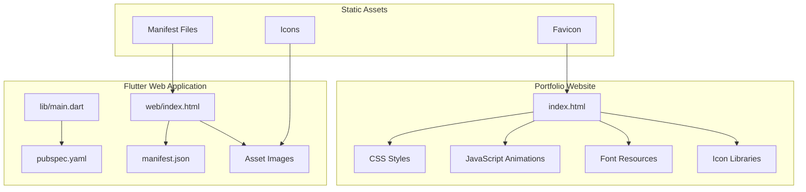

**Diagram sources**
- [index.html:1-1678](file://index.html#L1-L1678)
- [main.dart:1-123](file://portfolio_flutter/lib/main.dart#L1-L123)
- [pubspec.yaml:1-94](file://portfolio_flutter/pubspec.yaml#L1-L94)

**Section sources**
- [index.html:1-1678](file://index.html#L1-L1678)
- [main.dart:1-123](file://portfolio_flutter/lib/main.dart#L1-L123)
- [pubspec.yaml:1-94](file://portfolio_flutter/pubspec.yaml#L1-L94)

## Core Components

### HTML/CSS Portfolio Website

The main portfolio website is built with modern HTML5 and CSS3 techniques, featuring:

- **Custom CSS Variables**: Comprehensive theming system with dark mode support
- **Advanced Animations**: Smooth transitions, hover effects, and interactive elements
- **Responsive Design**: Mobile-first approach with adaptive layouts
- **Performance Optimizations**: Efficient CSS architecture and minimal JavaScript
- **Modern Font Loading**: Google Fonts integration with preconnect optimization

### Flutter Web Application

The Flutter component provides cross-platform capabilities:

- **Material Design Integration**: Modern UI components with Flutter's Material Design
- **State Management**: Provider-based architecture for reactive UI updates
- **Web-Specific Features**: Progressive Web App (PWA) capabilities
- **Asset Management**: Optimized resource loading and caching strategies

**Section sources**
- [index.html:11-1164](file://index.html#L11-L1164)
- [main.dart:7-36](file://portfolio_flutter/lib/main.dart#L7-L36)
- [web/index.html:1-39](file://portfolio_flutter/web/index.html#L1-L39)

## Architecture Overview

The portfolio employs a hybrid architecture combining static hosting with dynamic web application capabilities:

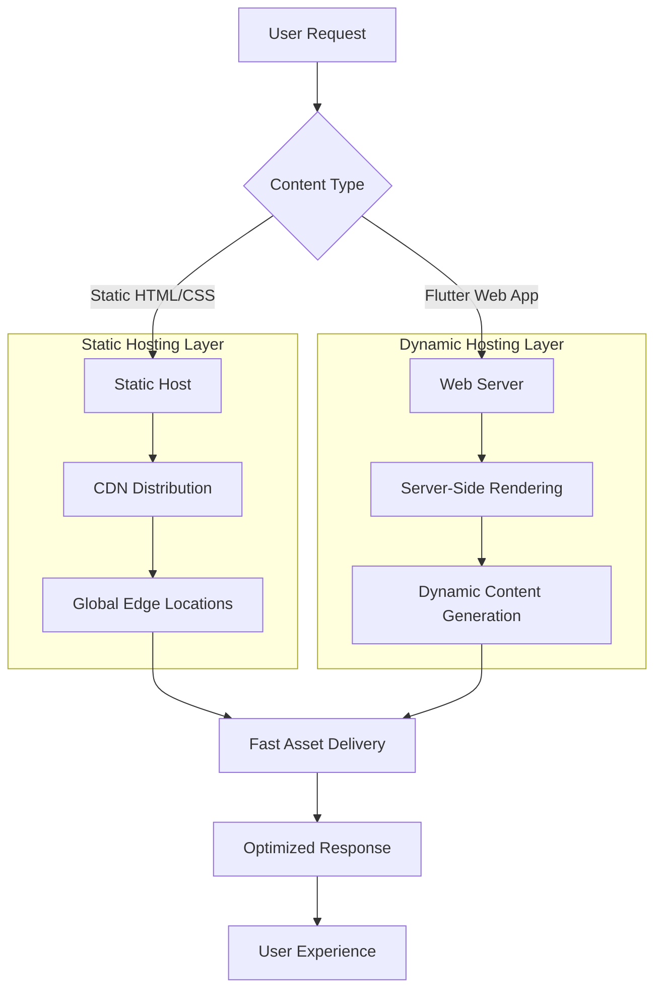

**Diagram sources**
- [index.html:1-1678](file://index.html#L1-L1678)
- [web/index.html:1-39](file://portfolio_flutter/web/index.html#L1-L39)

## Hosting Platform Options

### GitHub Pages

GitHub Pages provides free static hosting with seamless integration:

**Advantages:**
- Zero cost with GitHub account
- Automatic HTTPS with custom domains
- Git-based deployment pipeline
- Built-in CDN distribution
- Automatic Jekyll processing

**Limitations:**
- No server-side processing
- Limited customization options
- Basic analytics integration

### Netlify

Netlify offers modern static hosting with advanced features:

**Advantages:**
- Automated deployments from Git
- Custom domains with SSL certificates
- Global CDN with edge computing
- Form handling and serverless functions
- Automated testing and preview deployments

**Limitations:**
- Paid plans for advanced features
- Learning curve for advanced configurations

### Vercel

Vercel provides cutting-edge static hosting solutions:

**Advantages:**
- Edge network with global distribution
- Serverless functions integration
- Automatic scaling and performance optimization
- Advanced analytics and monitoring
- Git-based deployment with previews

**Limitations:**
- Limited free tier features
- Cost increases with usage

### AWS S3

Amazon S3 provides enterprise-grade static hosting:

**Advantages:**
- Enterprise-level reliability and scalability
- Integration with CloudFront CDN
- Advanced security and compliance features
- Cost-effective for high traffic volumes
- Full control over configuration

**Limitations:**
- Requires technical expertise
- Complex setup and configuration
- Ongoing operational overhead

### Traditional Web Hosts

Traditional hosting providers offer familiar deployment options:

**Advantages:**
- Familiar interface and tools
- Direct server control
- Established support channels
- Flexible configuration options

**Limitations:**
- Manual deployment processes
- Limited automation capabilities
- Higher maintenance requirements

## Deployment Processes

### Automated Deployment Pipelines

#### GitHub Actions Pipeline

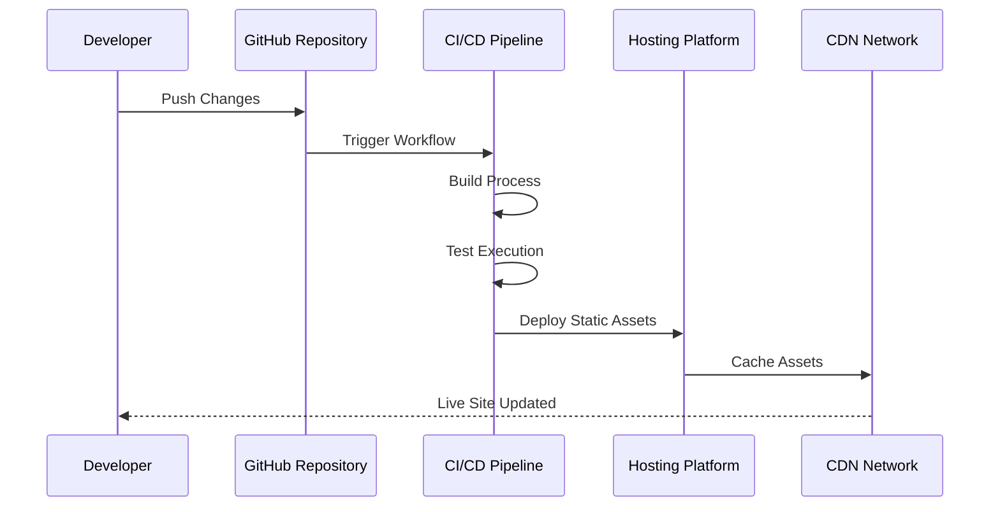

**Diagram sources**
- [index.html:1-1678](file://index.html#L1-L1678)

#### Netlify Deployment Workflow

1. **Repository Setup**: Connect GitHub repository to Netlify
2. **Build Configuration**: Configure build settings and environment variables
3. **Domain Configuration**: Set up custom domain and SSL certificates
4. **Preview Deployments**: Enable branch-based previews
5. **Automated Builds**: Configure automatic deployment on commits

#### Vercel Deployment Process

1. **Project Creation**: Import GitHub repository to Vercel
2. **Environment Configuration**: Set up build commands and output directories
3. **Domain Management**: Configure custom domains and DNS settings
4. **Preview Branches**: Enable automatic preview deployments
5. **Performance Optimization**: Leverage Vercel's edge network

### Manual Upload Methods

#### FTP/SFTP Deployment

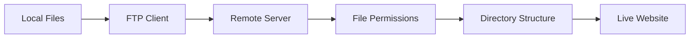

**Diagram sources**
- [index.html:1-1678](file://index.html#L1-L1678)

#### Direct Server Upload

1. **File Preparation**: Organize files in proper directory structure
2. **Connection Establishment**: Establish secure connection to server
3. **File Transfer**: Upload all static assets and HTML files
4. **Permission Setting**: Configure file permissions and ownership
5. **Verification**: Test website functionality and performance

## Domain Configuration

### DNS Configuration

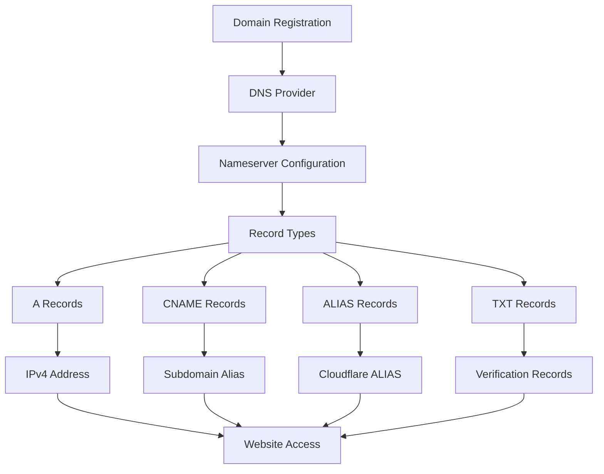

**Diagram sources**
- [web/index.html:1-39](file://portfolio_flutter/web/index.html#L1-L39)

### SSL Certificate Setup

#### Automated SSL with Cloudflare

1. **DNS Propagation**: Ensure domain records propagate globally
2. **SSL Toggle**: Enable SSL encryption in Cloudflare dashboard
3. **Certificate Management**: Configure certificate validation and renewal
4. **Mixed Content Fix**: Update asset URLs to HTTPS protocol

#### Manual SSL Configuration

1. **Certificate Acquisition**: Obtain SSL certificate from CA or Let's Encrypt
2. **Installation**: Install certificate on web server
3. **Configuration**: Configure virtual host for HTTPS
4. **Redirect Setup**: Implement HTTP to HTTPS redirects
5. **Security Headers**: Add security headers for enhanced protection

### Subdomain Management

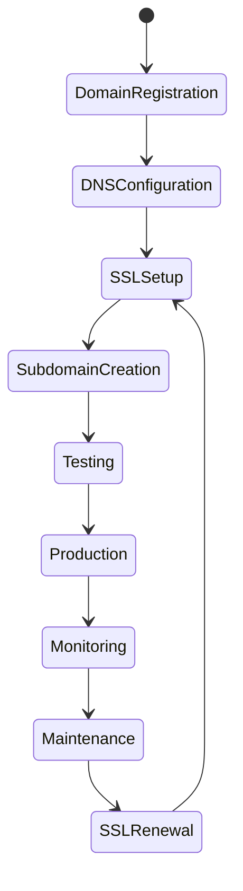

**Diagram sources**
- [web/manifest.json:1-36](file://portfolio_flutter/web/manifest.json#L1-L36)

## Performance Optimization

### Static Asset Optimization

#### Image Optimization Strategies

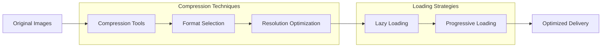

**Diagram sources**
- [index.html:7-10](file://index.html#L7-L10)

#### CSS Minification and Bundling

1. **Critical CSS Extraction**: Inline essential styles for above-the-fold content
2. **External CSS Optimization**: Minify and compress stylesheet files
3. **Resource Hints**: Implement preload and prefetch directives
4. **Font Optimization**: Use font-display swap for improved loading

#### JavaScript Optimization

1. **Code Splitting**: Separate vendor and application code
2. **Tree Shaking**: Remove unused code from bundles
3. **Async Loading**: Load non-critical scripts asynchronously
4. **Module Federation**: Share common dependencies across applications

### CDN Integration

#### Global Content Delivery

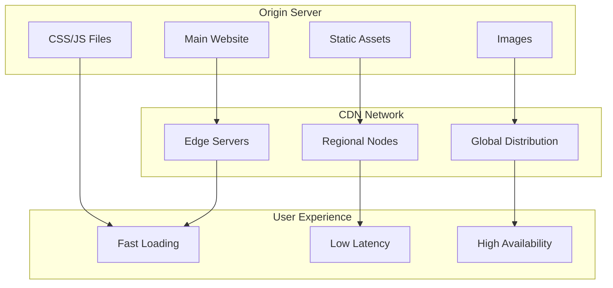

**Diagram sources**
- [index.html:1-1678](file://index.html#L1-L1678)

#### CDN Configuration Best Practices

1. **Cache Policies**: Define appropriate cache expiration headers
2. **Compression Settings**: Enable gzip and Brotli compression
3. **Image Optimization**: Configure automatic image resizing and format conversion
4. **Security Headers**: Implement proper security policies across CDN edges

### Browser Caching Strategies

#### Cache Control Implementation

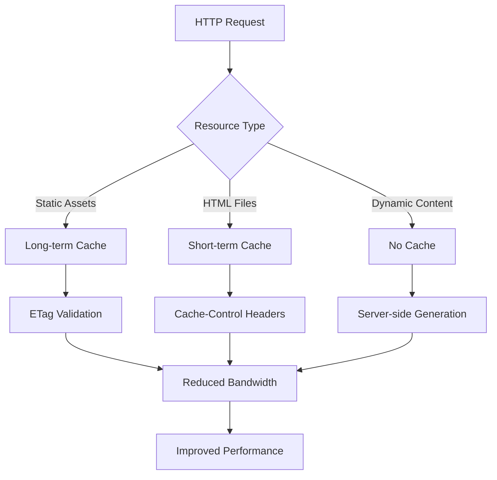

**Diagram sources**
- [web/index.html:1-39](file://portfolio_flutter/web/index.html#L1-L39)

## Build Processes

### Static Website Build Pipeline

#### Development Environment Setup

1. **Local Development**: Set up development server with live reloading
2. **Asset Compilation**: Process SCSS to CSS, optimize images
3. **Code Quality**: Run linters and formatters
4. **Testing**: Validate functionality across browsers

#### Production Build Process

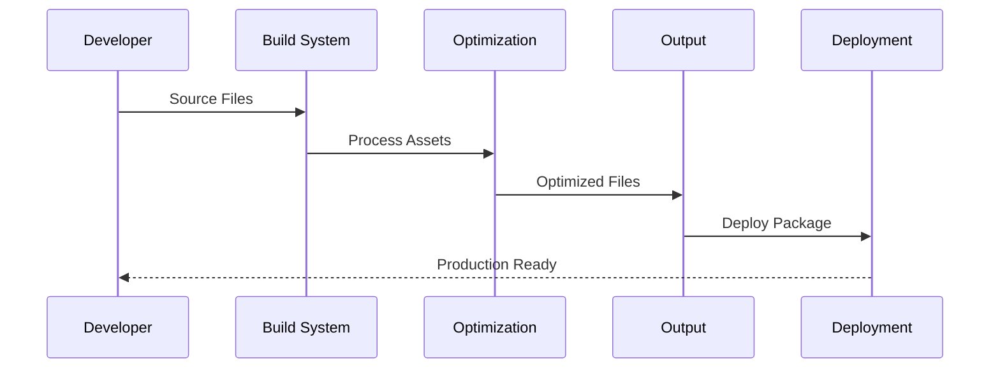

**Diagram sources**
- [pubspec.yaml:1-94](file://portfolio_flutter/pubspec.yaml#L1-L94)

#### Build Optimization Techniques

1. **Asset Bundling**: Combine and minify CSS/JS files
2. **Image Sprites**: Reduce HTTP requests through sprite sheets
3. **Font Optimization**: Subset fonts and implement font-display
4. **Critical Path Optimization**: Inline critical CSS for faster rendering

### Flutter Web Build Process

#### Flutter Build Commands

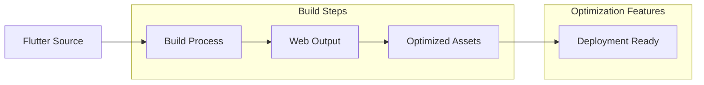

**Diagram sources**
- [main.dart:1-123](file://portfolio_flutter/lib/main.dart#L1-L123)

#### Build Configuration Options

1. **Base Href Configuration**: Set proper base path for hosted environments
2. **Asset Optimization**: Compress images and optimize web-specific assets
3. **Service Worker Generation**: Enable offline capabilities and caching
4. **PWA Manifest**: Configure progressive web app features

## Troubleshooting Guide

### Common Hosting Issues

#### CORS Problems

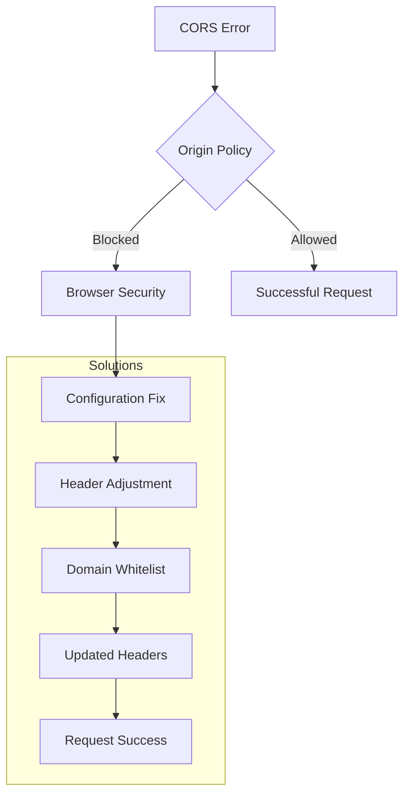

**Diagram sources**
- [index.html:1-1678](file://index.html#L1-L1678)

#### Asset Loading Issues

1. **404 Errors**: Verify file paths and directory structure
2. **Caching Problems**: Clear browser cache and CDN cache
3. **Cross-Origin Issues**: Configure proper CORS headers
4. **Path Resolution**: Check base href configuration

#### HTTPS Configuration Problems

1. **Mixed Content**: Update all asset URLs to HTTPS
2. **Certificate Issues**: Verify SSL certificate installation
3. **Redirect Loops**: Check redirect configuration
4. **HSTS Problems**: Configure HTTP Strict Transport Security

### Performance Troubleshooting

#### Slow Loading Issues

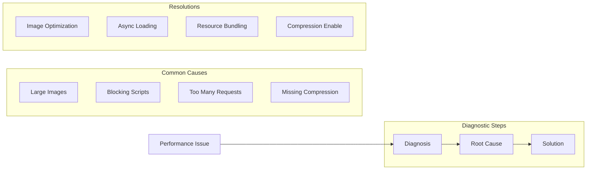

**Diagram sources**
- [index.html:11-1164](file://index.html#L11-L1164)

#### Mobile Performance Issues

1. **Touch Interaction Delays**: Implement proper touch event handling
2. **Animation Performance**: Use transform and opacity for GPU acceleration
3. **Memory Management**: Optimize JavaScript memory usage
4. **Battery Life**: Minimize background processing

### Deployment Troubleshooting

#### Build Failures

1. **Dependency Issues**: Check package.json and dependency versions
2. **Environment Variables**: Verify required environment configuration
3. **File Permissions**: Ensure proper file permissions for deployment
4. **Build Scripts**: Validate build script syntax and execution

#### CDN Issues

1. **Cache Invalidation**: Implement proper cache busting strategies
2. **Edge Server Problems**: Check CDN health and geographic coverage
3. **SSL/TLS Issues**: Verify certificate chain and configuration
4. **Geographic Performance**: Monitor latency across different regions

**Section sources**
- [index.html:1-1678](file://index.html#L1-L1678)
- [web/index.html:1-39](file://portfolio_flutter/web/index.html#L1-L39)
- [pubspec.yaml:1-94](file://portfolio_flutter/pubspec.yaml#L1-L94)

## Conclusion

The portfolio website demonstrates modern web development practices with a focus on performance, accessibility, and user experience. The dual-architecture approach combining static HTML/CSS with Flutter web capabilities provides flexibility for different hosting scenarios and deployment requirements.

Successful hosting requires careful consideration of platform capabilities, performance optimization strategies, and ongoing maintenance procedures. The troubleshooting guide provides practical solutions for common issues encountered during deployment and operation.

Key success factors include proper CDN configuration, comprehensive caching strategies, and continuous performance monitoring. The choice of hosting platform should align with specific requirements for scalability, security, and budget considerations.

By implementing the optimization techniques and deployment strategies outlined in this document, portfolio websites can achieve excellent performance metrics while maintaining flexibility for future enhancements and scaling requirements.