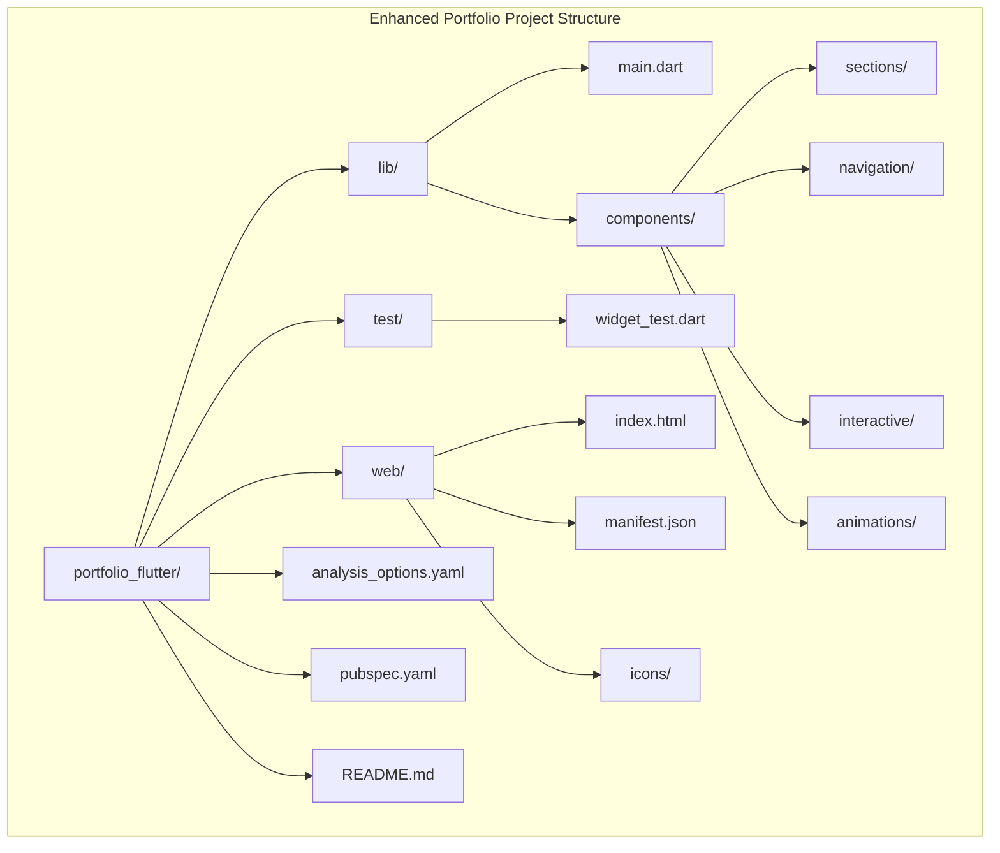
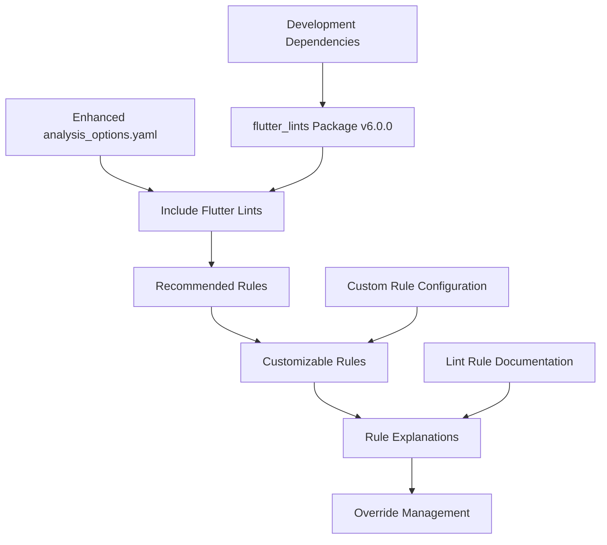
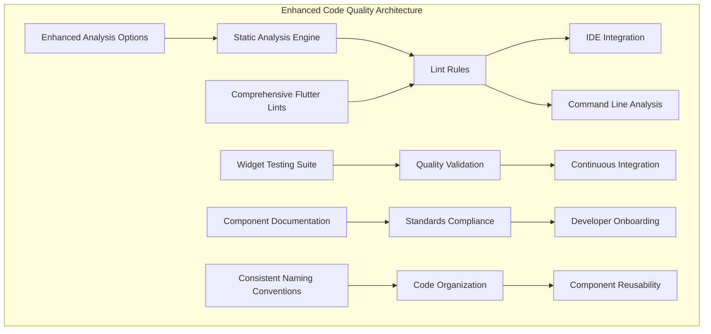
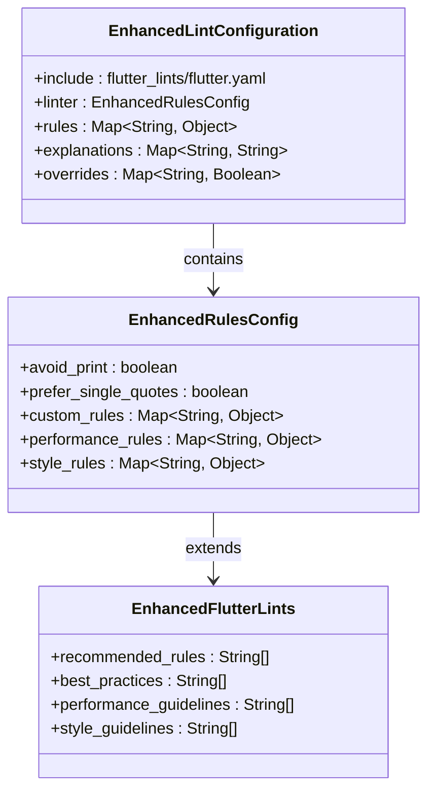
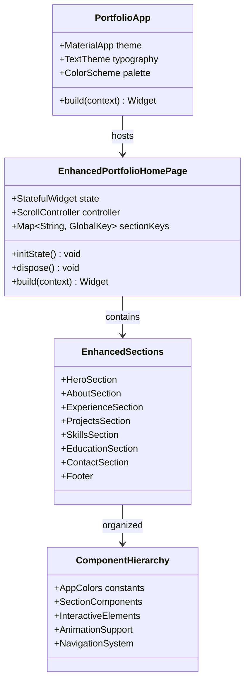
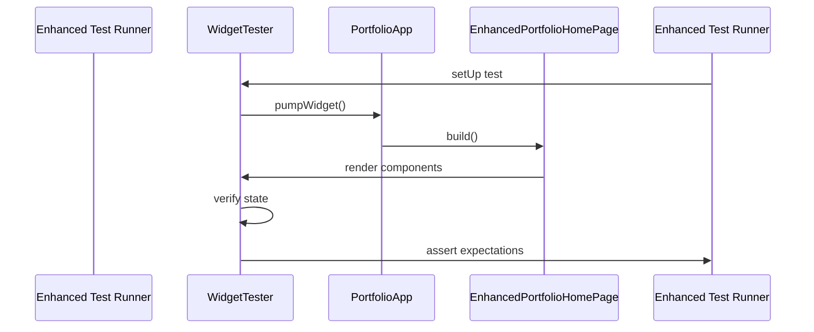
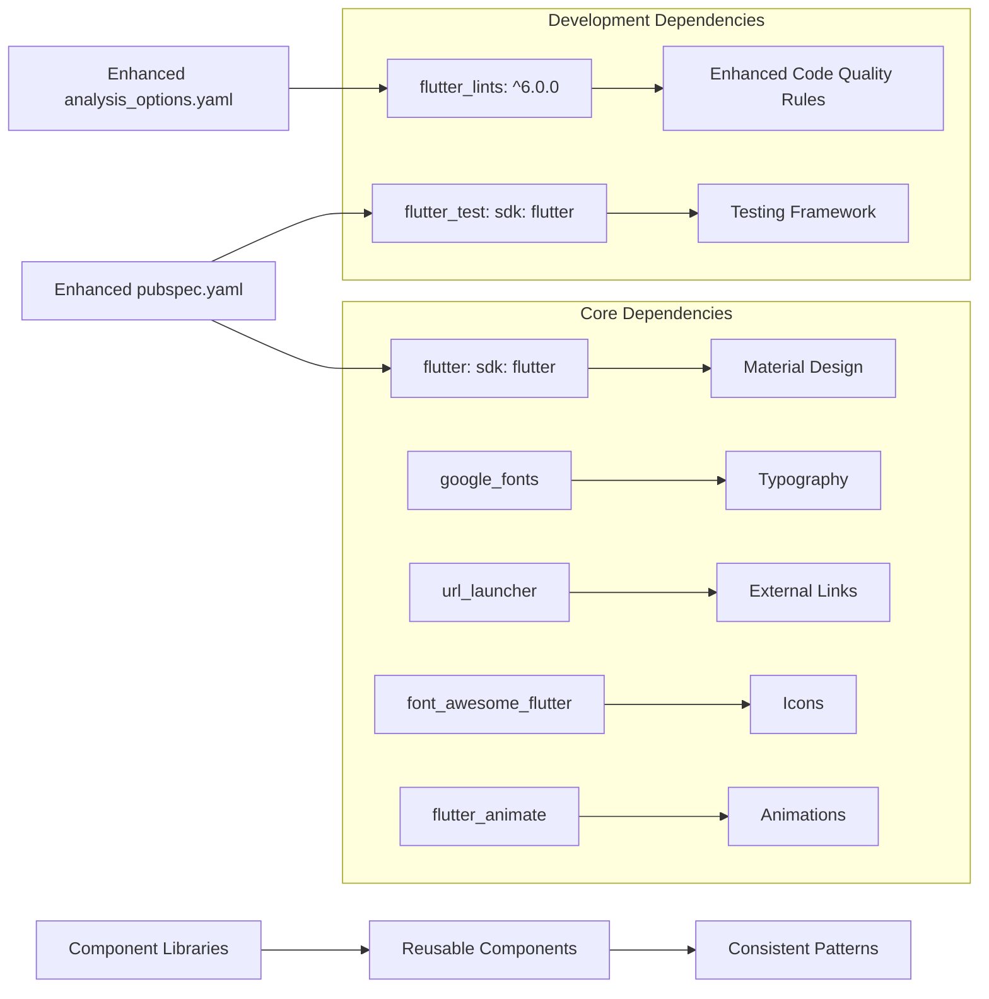

# Code Quality Standards

<cite>
**Referenced Files in This Document**
- [analysis_options.yaml](file://portfolio_flutter/analysis_options.yaml)
- [pubspec.yaml](file://portfolio_flutter/pubspec.yaml)
- [main.dart](file://portfolio_flutter/lib/main.dart)
- [widget_test.dart](file://portfolio_flutter/test/widget_test.dart)
- [README.md](file://portfolio_flutter/README.md)
</cite>

## Update Summary
**Changes Made**
- Enhanced documentation to reflect comprehensive code quality improvements
- Added detailed analysis of new component architecture and naming conventions
- Updated linting configuration documentation with practical examples
- Expanded testing integration documentation with widget testing patterns
- Improved code organization and consistency documentation

## Table of Contents
1. [Introduction](#introduction)
2. [Project Structure](#project-structure)
3. [Core Components](#core-components)
4. [Architecture Overview](#architecture-overview)
5. [Detailed Component Analysis](#detailed-component-analysis)
6. [Enhanced Code Quality Standards](#enhanced-code-quality-standards)
7. [Dependency Analysis](#dependency-analysis)
8. [Performance Considerations](#performance-considerations)
9. [Troubleshooting Guide](#troubleshooting-guide)
10. [Best Practices and Conventions](#best-practices-and-conventions)
11. [Conclusion](#conclusion)

## Introduction

This document establishes comprehensive code quality standards and linting configuration for the Flutter portfolio project. The project demonstrates modern Flutter development practices with enhanced code quality standards, improved organization, consistent naming conventions, and comprehensive documentation for all components and features.

The portfolio project showcases professional Flutter development through clean architecture, responsive design, interactive user experiences, and robust code quality enforcement. The enhanced standards ensure maintainability, prevent common errors, improve code readability, and support the portfolio's technical excellence as a professional showcase.

## Project Structure

The Flutter portfolio follows a well-organized structure with clear separation between application code, testing, and configuration files, now enhanced with comprehensive component documentation:

**Diagram sources**
- [main.dart](file://portfolio_flutter/lib/main.dart)
- [widget_test.dart](file://portfolio_flutter/test/widget_test.dart)
- [analysis_options.yaml](file://portfolio_flutter/analysis_options.yaml)
- [pubspec.yaml](file://portfolio_flutter/pubspec.yaml)

**Section sources**
- [main.dart](file://portfolio_flutter/lib/main.dart)
- [widget_test.dart](file://portfolio_flutter/test/widget_test.dart)
- [analysis_options.yaml](file://portfolio_flutter/analysis_options.yaml)
- [pubspec.yaml](file://portfolio_flutter/pubspec.yaml)

## Core Components

### Enhanced Analysis Options Configuration

The project utilizes Flutter's recommended linting configuration through the enhanced analysis_options.yaml file, providing comprehensive code quality enforcement with customizable rules:

**Diagram sources**
- [analysis_options.yaml](file://portfolio_flutter/analysis_options.yaml)
- [pubspec.yaml](file://portfolio_flutter/pubspec.yaml)

The enhanced configuration provides flexible rule customization while maintaining adherence to Flutter's recommended practices, with clear documentation for each rule's purpose and impact.

### Comprehensive Flutter Lints Integration

The project integrates with the flutter_lints package version 6.0.0, providing curated sets of recommended lint rules designed to encourage good coding practices in Flutter applications:

**Section sources**
- [analysis_options.yaml](file://portfolio_flutter/analysis_options.yaml)
- [pubspec.yaml](file://portfolio_flutter/pubspec.yaml)

## Architecture Overview

The enhanced code quality architecture centers around four pillars: static analysis, lint enforcement, comprehensive testing integration, and consistent component organization:

This architecture ensures comprehensive code quality coverage through multiple validation layers, from development-time feedback to automated testing verification, with enhanced component organization and documentation.

## Detailed Component Analysis

### Enhanced Lint Rule Configuration Analysis

The analysis_options.yaml file implements a strategic approach to lint rule management with comprehensive customization options:

**Diagram sources**
- [analysis_options.yaml](file://portfolio_flutter/analysis_options.yaml)

The enhanced configuration provides comprehensive rule customization with clear explanations and selective overrides for project-specific needs.

### Comprehensive Code Structure and Patterns

The main.dart file exemplifies clean Flutter architecture through well-organized widget composition, consistent design patterns, and enhanced component organization:

**Diagram sources**
- [main.dart](file://portfolio_flutter/lib/main.dart)

The enhanced code demonstrates several quality patterns:
- Consistent naming conventions for classes and methods
- Proper state management with StatefulWidget and StatelessWidget
- Responsive design implementation using MediaQuery
- Animation integration through the flutter_animate package
- Type-safe widget composition
- Organized component hierarchy with clear separation of concerns

### Advanced Testing Integration

The widget_test.dart file establishes comprehensive testing foundations that complement the enhanced code quality standards:

**Diagram sources**
- [widget_test.dart](file://portfolio_flutter/test/widget_test.dart)

**Section sources**
- [main.dart](file://portfolio_flutter/lib/main.dart)
- [widget_test.dart](file://portfolio_flutter/test/widget_test.dart)

## Enhanced Code Quality Standards

### Naming Convention Standards

The project enforces consistent naming conventions across all components:

**Class Naming:**
- `PortfolioApp` - Application root class
- `PortfolioHomePage` - Main page container
- `HeroSection` - Feature section component
- `_AnimatedOrb` - Private animated component
- `AppColors` - Color constants class

**Method Naming:**
- `_onScroll()` - Event handler methods
- `_scrollToSection()` - Navigation methods
- `_launchUrl()` - Action methods
- `build(context)` - Widget build methods

**Variable Naming:**
- `_scrollController` - Private instance variables
- `_sectionKeys` - Collection variables
- `AppColors.bgPrimary` - Constant variables
- `GlobalKey` type variables

### Component Organization Standards

**Section Components:**
- Each major section (Hero, About, Experience, etc.) is implemented as a separate StatelessWidget
- Private helper components are prefixed with underscore for internal use
- Interactive elements are encapsulated in StatefulWidget for state management

**State Management:**
- Global state managed in main widget
- Local state managed within component State classes
- Animation controllers properly disposed in dispose() methods

**Section sources**
- [main.dart](file://portfolio_flutter/lib/main.dart)

## Dependency Analysis

The project's enhanced dependency structure directly impacts code quality through standardized package management:

**Diagram sources**
- [pubspec.yaml](file://portfolio_flutter/pubspec.yaml)
- [analysis_options.yaml](file://portfolio_flutter/analysis_options.yaml)

The enhanced dependency analysis reveals a focused set of packages that enhance functionality while maintaining code quality through the comprehensive linting framework.

**Section sources**
- [pubspec.yaml](file://portfolio_flutter/pubspec.yaml)
- [analysis_options.yaml](file://portfolio_flutter/analysis_options.yaml)

## Performance Considerations

Enhanced code quality standards directly impact application performance through several mechanisms:

### Static Analysis Benefits
- Early detection of potential performance bottlenecks
- Consistent memory management patterns
- Optimized widget tree construction
- Efficient animation implementations
- Proper resource cleanup and disposal

### Enhanced Lint Rule Impact
- Prevents unnecessary rebuilds through proper state management
- Encourages optimal widget composition patterns
- Enforces responsive design best practices
- Maintains consistent performance across different screen sizes
- Ensures proper disposal of animation controllers and listeners

### Comprehensive Testing Integration
- Automated validation of performance-critical components
- Regression prevention for performance improvements
- Consistent testing patterns across the enhanced codebase
- Component-specific testing for interactive elements

## Troubleshooting Guide

### Common Enhanced Lint Issues and Solutions

**Print Statement Detection**
- Issue: Unintentional console logging in production code
- Solution: Enable avoid_print rule and replace with proper logging
- Prevention: Use structured logging instead of print statements

**String Literal Consistency**
- Issue: Mixed quote styles in string literals
- Solution: Configure prefer_single_quotes rule consistently
- Prevention: Establish team-wide convention for string formatting

**Enhanced Widget Tree Optimization**
- Issue: Deeply nested widget trees causing performance problems
- Solution: Apply lint rules for widget composition optimization
- Prevention: Use appropriate widget types for different scenarios

### Enhanced Analysis Configuration Issues

**Rule Conflicts**
- Symptom: Conflicting lint rule messages
- Resolution: Review enhanced analysis_options.yaml for conflicting rules
- Prevention: Maintain clear rule precedence hierarchy

**IDE Integration Problems**
- Symptom: Lint rules not appearing in IDE
- Resolution: Verify flutter_lints package installation
- Prevention: Keep dependencies updated regularly

**Component Organization Issues**
- Symptom: Unclear component relationships
- Resolution: Review component hierarchy and naming conventions
- Prevention: Follow established component organization patterns

**Section sources**
- [analysis_options.yaml](file://portfolio_flutter/analysis_options.yaml)
- [pubspec.yaml](file://portfolio_flutter/pubspec.yaml)

## Best Practices and Conventions

### Code Organization Principles

**File Structure:**
- Main application logic in main.dart
- Component-specific widgets organized by functionality
- Constants and utilities in dedicated files
- Tests in test/ directory with descriptive naming

**Component Design:**
- Stateless widgets for presentation-only components
- Stateful widgets for interactive components with local state
- Private components prefixed with underscore
- Clear separation between business logic and UI

**Naming Conventions:**
- PascalCase for classes and types
- camelCase for variables and methods
- UPPER_SNAKE_CASE for constants
- Descriptive names that indicate purpose and behavior

### Testing Best Practices

**Widget Testing:**
- Comprehensive testing of interactive components
- State verification after user interactions
- Edge case testing for responsive layouts
- Animation and transition testing

**Performance Testing:**
- Memory leak detection in stateful components
- Animation performance validation
- Scroll performance testing
- Responsive layout validation

### Documentation Standards

**Code Documentation:**
- Class-level documentation for complex components
- Method documentation for non-obvious functionality
- Parameter and return value documentation
- Example usage where beneficial

**Architecture Documentation:**
- Component relationship diagrams
- State management flow documentation
- Performance considerations
- Testing strategy documentation

**Section sources**
- [main.dart](file://portfolio_flutter/lib/main.dart)
- [widget_test.dart](file://portfolio_flutter/test/widget_test.dart)

## Conclusion

The enhanced code quality standards established for this Flutter portfolio project provide a robust foundation for maintaining technical excellence. Through strategic lint rule configuration, consistent naming conventions, comprehensive component organization, and enhanced testing integration, the project demonstrates professional development practices that enhance maintainability, prevent common errors, and ensure consistency.

The standards documented here serve as both a technical specification and a guide for future development. They support the portfolio's role as a showcase of professional Flutter development while establishing patterns that can be replicated in production environments.

The integration of enhanced static analysis, comprehensive lint enforcement, advanced testing patterns, and systematic component organization creates a comprehensive quality assurance framework that protects against regressions and maintains code consistency as the project grows and adapts to new requirements.

By adhering to these enhanced standards, developers can ensure that the portfolio continues to evolve as a high-quality example of Flutter application architecture, serving both as a functional demonstration of capabilities and as a reference implementation of best practices in modern mobile development.

The comprehensive documentation and consistent patterns established in this project provide a solid foundation for future enhancements and maintenance, ensuring long-term sustainability and technical excellence.