# Flutter Application

<cite>
**Referenced Files in This Document**
- [main.dart](file://portfolio_flutter/lib/main.dart)
- [widget_test.dart](file://portfolio_flutter/test/widget_test.dart)
- [analysis_options.yaml](file://portfolio_flutter/analysis_options.yaml)
- [index.html](file://portfolio_flutter/web/index.html)
- [manifest.json](file://portfolio_flutter/web/manifest.json)
- [pubspec.yaml](file://portfolio_flutter/pubspec.yaml)
- [README.md](file://portfolio_flutter/README.md)
</cite>

## Update Summary
**Changes Made**
- Complete architectural transformation from simple counter to comprehensive portfolio website
- Enhanced Material 3 theming with modern dark color scheme and gradients
- Implemented interactive navigation with scroll-based state management
- Added custom animated cursor with hover effects
- Integrated comprehensive section components (Hero, About, Experience, Projects, Skills, Education, Contact)
- Added responsive design with Material 3 typography and animations
- Enhanced user interaction patterns with hover states and micro-interactions
- Added comprehensive testing framework and code quality standards

## Table of Contents
1. [Introduction](#introduction)
2. [Project Structure](#project-structure)
3. [Core Components](#core-components)
4. [Architecture Overview](#architecture-overview)
5. [Detailed Component Analysis](#detailed-component-analysis)
6. [Modern Design System](#modern-design-system)
7. [Interactive Features](#interactive-features)
8. [Responsive Design Implementation](#responsive-design-implementation)
9. [Animation and Micro-interactions](#animation-and-micro-interactions)
10. [Testing Framework](#testing-framework)
11. [Code Quality Standards](#code-quality-standards)
12. [Deployment and PWA Capabilities](#deployment-and-pwa-capabilities)
13. [Performance Considerations](#performance-considerations)
14. [Troubleshooting Guide](#troubleshooting-guide)
15. [Conclusion](#conclusion)
16. [Appendices](#appendices)

## Introduction
This document explains the enhanced Flutter portfolio application that demonstrates modern Flutter development practices. The application has evolved from a simple interactive counter to a sophisticated, fully-responsive portfolio website featuring Material 3 design principles, dark theme aesthetics, interactive navigation, custom animated cursor, and comprehensive section components. The implementation showcases advanced state management, responsive design patterns, and modern user interaction techniques.

The portfolio application serves as a professional showcase demonstrating Flutter capabilities including custom animations, interactive elements, and progressive web app deployment. It features a comprehensive design system with Material 3 theming, sophisticated state management patterns, and extensive interactive components.

## Project Structure
The project follows a modern Flutter architecture with a comprehensive portfolio application structure:

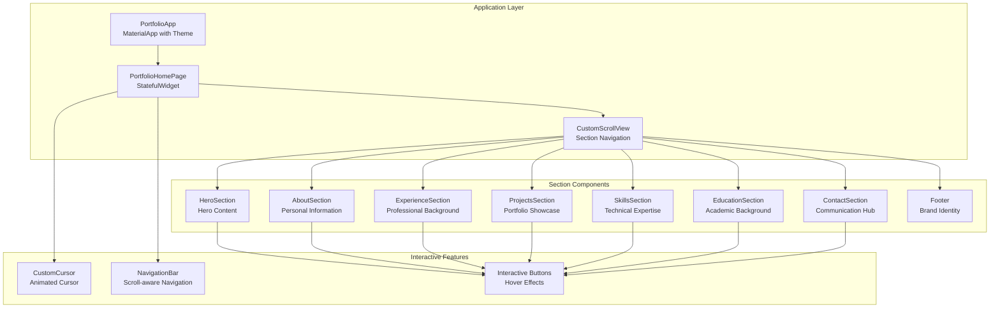

**Diagram sources**
- [main.dart:26-77](file://portfolio_flutter/lib/main.dart#L26-L77)
- [main.dart:79-186](file://portfolio_flutter/lib/main.dart#L79-L186)

**Section sources**
- [main.dart:26-77](file://portfolio_flutter/lib/main.dart#L26-L77)
- [main.dart:79-186](file://portfolio_flutter/lib/main.dart#L79-L186)

## Core Components
The application consists of several sophisticated components working together:

### Application Foundation
- **PortfolioApp**: A StatelessWidget that configures Material 3 theming with a modern dark color palette and custom typography
- **PortfolioHomePage**: A StatefulWidget managing scroll state and coordinating navigation between sections
- **AppColors**: Centralized color management with consistent design tokens

### Interactive Navigation System
- **NavigationBar**: Animated navigation bar that responds to scroll position with backdrop filtering
- **CustomCursor**: Sophisticated animated cursor with hover detection and smooth transitions
- **Section Keys**: Global keys enabling precise programmatic navigation between sections

### Comprehensive Content Sections
- **HeroSection**: Full-screen hero with animated gradient orbs and staggered content animations
- **AboutSection**: Personal introduction with responsive layout and interactive stats
- **ExperienceSection**: Professional timeline with animated timeline visualization
- **ProjectsSection**: Portfolio showcase with interactive project cards
- **SkillsSection**: Technical expertise presentation with categorized skill displays
- **EducationSection**: Academic background with language proficiency indicators
- **ContactSection**: Communication hub with functional contact forms and external links
- **Footer**: Brand identity with social media integration

**Section sources**
- [main.dart:12-24](file://portfolio_flutter/lib/main.dart#L12-L24)
- [main.dart:26-77](file://portfolio_flutter/lib/main.dart#L26-L77)
- [main.dart:79-186](file://portfolio_flutter/lib/main.dart#L79-L186)
- [main.dart:262-397](file://portfolio_flutter/lib/main.dart#L262-L397)
- [main.dart:188-259](file://portfolio_flutter/lib/main.dart#L188-L259)

## Architecture Overview
The application follows a modern Flutter architecture with clear separation of concerns:

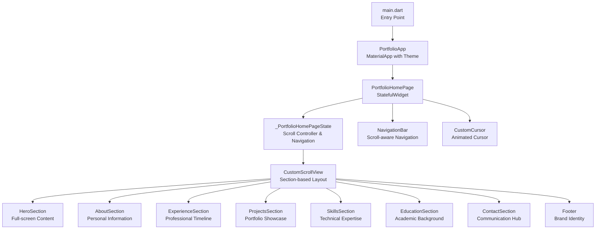

**Diagram sources**
- [main.dart:8-10](file://portfolio_flutter/lib/main.dart#L8-L10)
- [main.dart:26-77](file://portfolio_flutter/lib/main.dart#L26-L77)
- [main.dart:79-186](file://portfolio_flutter/lib/main.dart#L79-L186)

## Detailed Component Analysis

### Modern Material 3 Theming System
The application implements a comprehensive Material 3 theming approach with custom color schemes:

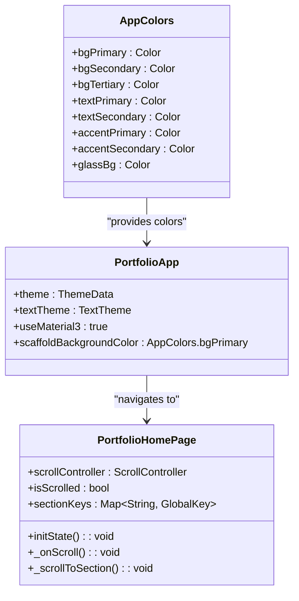

**Diagram sources**
- [main.dart:12-24](file://portfolio_flutter/lib/main.dart#L12-L24)
- [main.dart:26-77](file://portfolio_flutter/lib/main.dart#L26-L77)
- [main.dart:86-129](file://portfolio_flutter/lib/main.dart#L86-L129)

The theming system includes:
- **Color Palette**: Dark theme with indigo and purple accents
- **Typography System**: Space Grotesk for headings, Inter for body text
- **Glass Morphism**: Frosted glass effects with backdrop filters
- **Gradient Accents**: Dynamic linear gradients for interactive elements

**Section sources**
- [main.dart:12-77](file://portfolio_flutter/lib/main.dart#L12-L77)

### Advanced State Management Patterns
The application demonstrates sophisticated state management beyond simple counters:

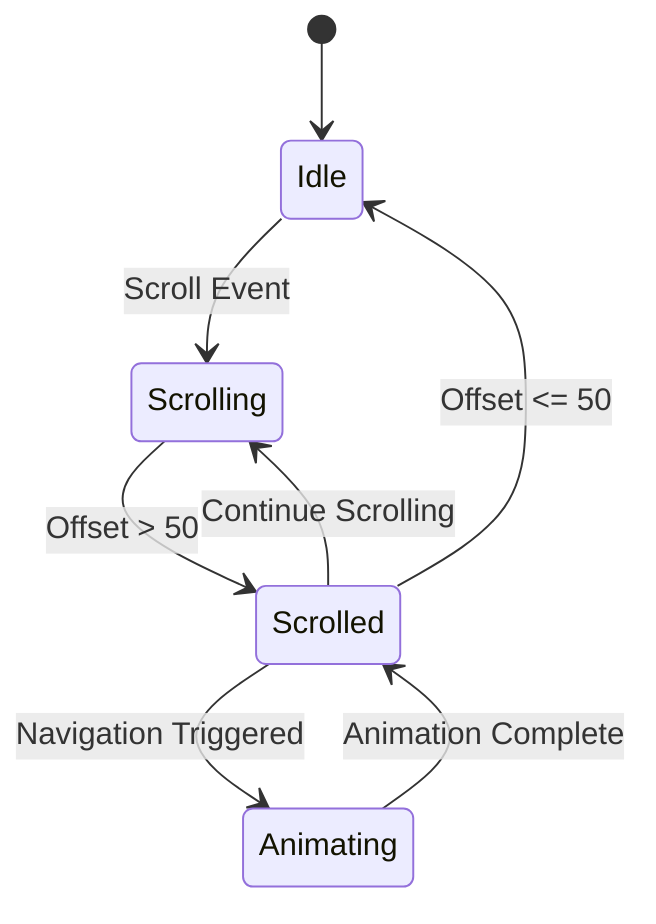

**Diagram sources**
- [main.dart:96-102](file://portfolio_flutter/lib/main.dart#L96-L102)
- [main.dart:104-113](file://portfolio_flutter/lib/main.dart#L104-L113)

Key state management features:
- **Scroll Controller**: Manages scroll position and triggers UI state changes
- **Section Navigation**: Programmatic scrolling between sections using GlobalKey references
- **Responsive Navigation**: Navigation bar adapts to scroll position with backdrop filtering
- **Hover States**: Comprehensive hover detection across all interactive elements

**Section sources**
- [main.dart:86-129](file://portfolio_flutter/lib/main.dart#L86-L129)
- [main.dart:262-397](file://portfolio_flutter/lib/main.dart#L262-L397)

### Comprehensive Section Components
Each section implements consistent design patterns with responsive layouts:

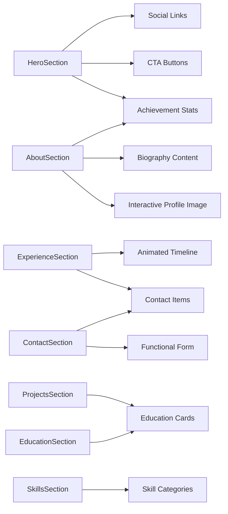

**Diagram sources**
- [main.dart:400-541](file://portfolio_flutter/lib/main.dart#L400-L541)
- [main.dart:837-878](file://portfolio_flutter/lib/main.dart#L837-L878)
- [main.dart:1107-1129](file://portfolio_flutter/lib/main.dart#L1107-L1129)
- [main.dart:1345-1407](file://portfolio_flutter/lib/main.dart#L1345-L1407)
- [main.dart:1594-1657](file://portfolio_flutter/lib/main.dart#L1594-L1657)
- [main.dart:1792-1839](file://portfolio_flutter/lib/main.dart#L1792-L1839)
- [main.dart:1952-2006](file://portfolio_flutter/lib/main.dart#L1952-L2006)

**Section sources**
- [main.dart:400-541](file://portfolio_flutter/lib/main.dart#L400-L541)
- [main.dart:837-2402](file://portfolio_flutter/lib/main.dart#L837-L2402)

## Modern Design System
The application implements a comprehensive modern design system:

### Color System
- **Primary Palette**: Deep space-inspired dark theme (bgPrimary: #0a0a0f)
- **Accent Colors**: Indigo (#6366f1) and purple (#8b5cf6) gradients
- **Text Hierarchy**: Primary (white), secondary (rgba 160,160,170), muted (rgba 106,106,122)
- **Glass Effects**: Semi-transparent backgrounds with backdrop filters

### Typography System
- **Headings**: Space Grotesk font with varying weights (w700, w600)
- **Body Text**: Inter font with consistent line heights (1.8)
- **Responsive Sizing**: Dynamic font sizing based on screen dimensions
- **Letter Spacing**: Strategic letter spacing for headings

### Layout System
- **Grid System**: Responsive grid with flexible column arrangements
- **Spacing Scale**: Consistent spacing units (16px base)
- **Breakpoints**: Tablet and desktop optimized layouts
- **Aspect Ratios**: Maintained aspect ratios for visual consistency

**Section sources**
- [main.dart:12-77](file://portfolio_flutter/lib/main.dart#L12-L77)
- [main.dart:400-541](file://portfolio_flutter/lib/main.dart#L400-L541)

## Interactive Features
The application incorporates numerous interactive elements designed to enhance user experience:

### Custom Animated Cursor
The animated cursor provides visual feedback and enhances the overall user experience:

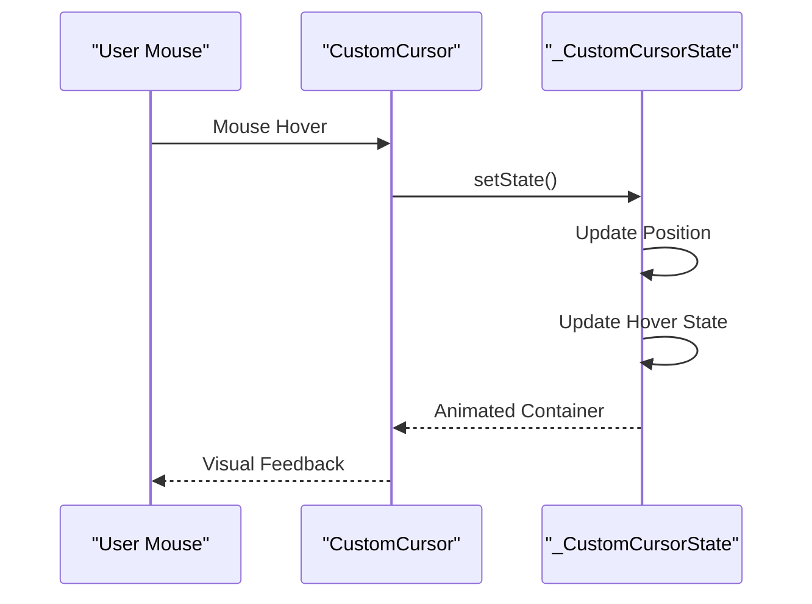

**Diagram sources**
- [main.dart:189-259](file://portfolio_flutter/lib/main.dart#L189-L259)

Key cursor features:
- **Smooth Transitions**: 100ms position animations with ease-out curves
- **Hover Detection**: Size increases from 20px to 50px on hover
- **Visual Effects**: Border color transitions and subtle glow effects
- **Responsive Behavior**: Hidden on mobile devices (width < 768px)

### Interactive Navigation
The navigation system adapts to user interactions and scroll position:

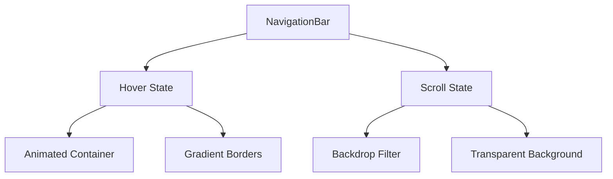

**Diagram sources**
- [main.dart:262-397](file://portfolio_flutter/lib/main.dart#L262-L397)

Navigation features:
- **Scroll-aware**: Changes appearance when scrolled beyond 50px
- **Backdrop Filtering**: Frosted glass effect with dynamic blur
- **Gradient Borders**: Bottom border with animated gradient
- **Responsive Layout**: Hides navigation links on mobile devices

### Hover Effects System
Comprehensive hover effects across all interactive elements:

| Component | Effect | Duration | Curve |
|-----------|--------|----------|-------|
| Buttons | Lift + Shadow | 300ms | Ease-out |
| Cards | Lift + Glow | 400ms | Ease-out |
| Links | Underline | 300ms | Ease-out |
| Stats | Glow + Shadow | 300ms | Ease-out |
| Social | Scale + Color | 300ms | Ease-out |

**Section sources**
- [main.dart:189-259](file://portfolio_flutter/lib/main.dart#L189-L259)
- [main.dart:262-397](file://portfolio_flutter/lib/main.dart#L262-L397)
- [main.dart:646-776](file://portfolio_flutter/lib/main.dart#L646-L776)

## Responsive Design Implementation
The application implements a comprehensive responsive design strategy:

### Breakpoint Strategy
- **Mobile First**: Base styles optimized for small screens
- **Tablet Range**: 768px and above for enhanced layouts
- **Desktop Optimization**: Full-width layouts with expanded content areas

### Adaptive Layout Patterns
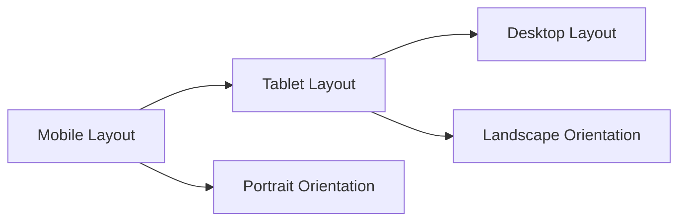

Layout adaptations:
- **Hero Section**: Full-screen hero on mobile, split-content on desktop
- **About Section**: Stacked layout on mobile, side-by-side on desktop
- **Project Grid**: Single column on mobile, multi-column on desktop
- **Navigation**: Full-width navigation on mobile, compact on desktop

### Typography Responsiveness
- **Hero Titles**: 80px on desktop, 40px on mobile
- **Section Headers**: 48px desktop, 32px mobile
- **Body Text**: 18px desktop, 16px mobile
- **Responsive Spacing**: Dynamic margins and padding based on viewport

**Section sources**
- [main.dart:853-877](file://portfolio_flutter/lib/main.dart#L853-L877)
- [main.dart:1362-1402](file://portfolio_flutter/lib/main.dart#L1362-L1402)
- [main.dart:405-409](file://portfolio_flutter/lib/main.dart#L405-L409)

## Animation and Micro-interactions
The application employs sophisticated animations and micro-interactions:

### Staggered Animations
Content elements animate in sequence for dramatic effect:
- **Hero Subtitle**: 300ms delay, fade-in with slide-up
- **Character Animation**: Individual character fades with 50ms delays
- **CTA Buttons**: 1400ms delay, fade-in with slide-up
- **Social Links**: 1600ms delay, fade-in with slide-up

### Motion Design Principles
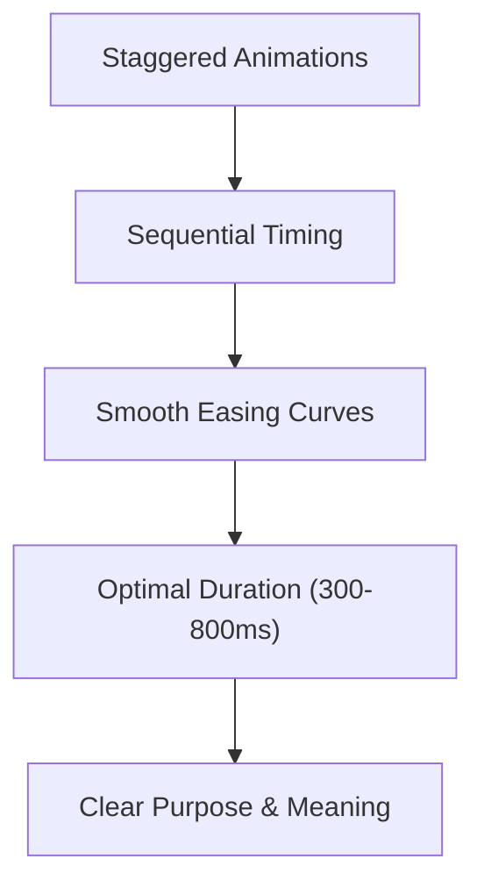

Animation characteristics:
- **Curved Easing**: Ease-out for natural movement
- **Duration Balance**: Fast enough for responsiveness, slow enough for perception
- **Motion Purpose**: Every animation serves a functional purpose
- **Performance Focus**: Hardware-accelerated animations

### Interactive Feedback
- **Button Press**: Subtle scale-down during press
- **Hover States**: Smooth transitions between states
- **Scroll Effects**: Dynamic navigation appearance
- **Cursor Feedback**: Visual response to user interactions

**Section sources**
- [main.dart:458-534](file://portfolio_flutter/lib/main.dart#L458-L534)
- [main.dart:638-642](file://portfolio_flutter/lib/main.dart#L638-L642)
- [main.dart:671-707](file://portfolio_flutter/lib/main.dart#L671-L707)

## Testing Framework
The testing framework maintains focus on core functionality:

### Test Structure
The existing test validates fundamental state management concepts:

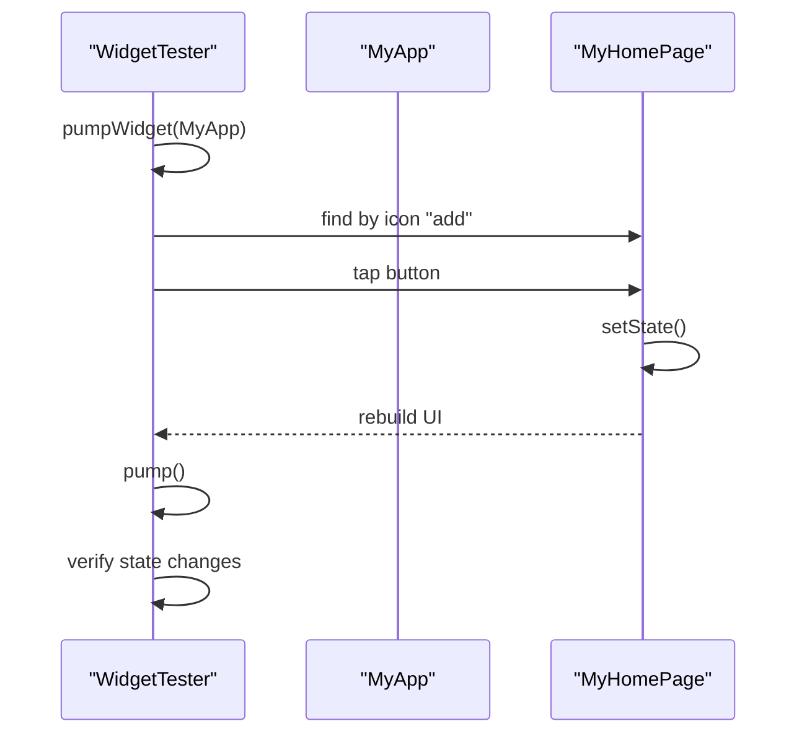

**Diagram sources**
- [widget_test.dart:13-30](file://portfolio_flutter/test/widget_test.dart#L13-L30)

Testing capabilities:
- **State Management**: Validates setState() functionality
- **UI Rebuild**: Confirms widget tree updates
- **Interaction Testing**: Tests button press events
- **Smoke Testing**: Basic functionality verification

**Section sources**
- [widget_test.dart:13-30](file://portfolio_flutter/test/widget_test.dart#L13-L30)

## Code Quality Standards
The project maintains high code quality through established practices:

### Lint Configuration
The analysis configuration follows Flutter best practices:
- **Recommended Lints**: Activated through flutter_lints package
- **Customization Options**: Flexible rule configuration
- **IDE Integration**: Real-time error detection
- **Command Line Support**: `flutter analyze` compatibility

### Code Organization
- **File Structure**: Logical separation of concerns
- **Naming Conventions**: Consistent naming patterns
- **Documentation**: Inline documentation for complex logic
- **Modularity**: Reusable component patterns

**Section sources**
- [analysis_options.yaml:8-29](file://portfolio_flutter/analysis_options.yaml#L8-L29)

## Deployment and PWA Capabilities
The application supports modern web deployment patterns:

### Web Configuration
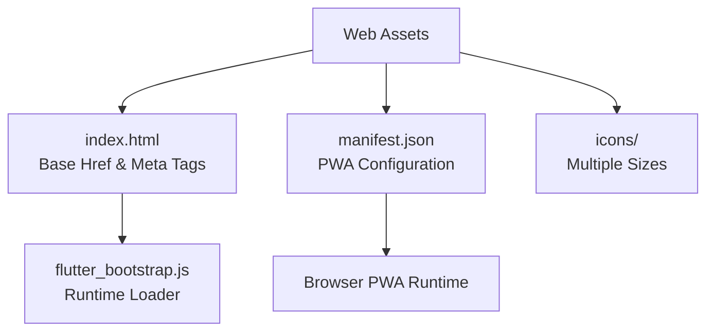

**Diagram sources**
- [index.html:17](file://portfolio_flutter/web/index.html#L17)
- [manifest.json:1-36](file://portfolio_flutter/web/manifest.json#L1-L36)

Deployment features:
- **Progressive Web App**: Full PWA support with manifest
- **Responsive Design**: Mobile-first web optimization
- **Service Worker**: Built-in caching and offline support
- **Cross-platform**: Single codebase for web and mobile

### PWA Configuration
- **Display Mode**: Standalone for app-like experience
- **Theme Colors**: Consistent with application branding
- **Icon Assets**: Multiple resolutions for different contexts
- **Offline Support**: Service worker integration

**Section sources**
- [index.html:17-38](file://portfolio_flutter/web/index.html#L17-L38)
- [manifest.json:1-36](file://portfolio_flutter/web/manifest.json#L1-L36)

## Performance Considerations
The application implements several performance optimization strategies:

### Rendering Optimizations
- **Selective Rebuilds**: Minimal widget tree updates through targeted setState()
- **Hardware Acceleration**: GPU-accelerated animations and transforms
- **Lazy Loading**: Section-based loading for optimal performance
- **Memory Management**: Proper disposal of controllers and listeners

### Animation Performance
- **Transform Animations**: Prefer transform over layout-changing animations
- **Duration Optimization**: Balanced animation durations for responsiveness
- **Easing Functions**: Smooth curves for natural motion perception
- **Frame Rate**: Consistent 60fps animation performance

### State Management Efficiency
- **State Isolation**: Local state management for component-specific data
- **Scroll Controller**: Efficient scroll event handling
- **Global Keys**: Optimized section navigation
- **Dispose Pattern**: Proper resource cleanup

## Troubleshooting Guide
Common issues and solutions:

### Navigation Issues
- **Section Not Scrolling**: Verify GlobalKey references and ensure keys are attached to section widgets
- **Navigation Clicks Not Working**: Check onNavTap callback implementation and ensure proper function passing
- **Scroll Position Problems**: Confirm ScrollController initialization and listener registration

### Animation Issues
- **Animations Not Playing**: Verify flutter_animate package import and ensure proper animation chaining
- **Cursor Not Visible**: Check device width detection and ensure proper conditional rendering
- **Hover Effects Broken**: Verify MouseRegion wrapping and setState() calls in hover handlers

### Responsive Design Issues
- **Layout Breaks on Mobile**: Check MediaQuery usage and ensure proper responsive patterns
- **Typography Issues**: Verify font loading and responsive font sizing logic
- **Touch Target Problems**: Ensure adequate touch target sizes for mobile interaction

### Performance Issues
- **Slow Animations**: Check animation duration settings and easing functions
- **Memory Leaks**: Verify proper controller disposal in initState()/dispose() patterns
- **Scroll Performance**: Ensure proper scroll controller management and listener cleanup

**Section sources**
- [main.dart:86-129](file://portfolio_flutter/lib/main.dart#L86-L129)
- [main.dart:189-259](file://portfolio_flutter/lib/main.dart#L189-L259)

## Conclusion
This enhanced Flutter portfolio application demonstrates modern Flutter development practices through its comprehensive implementation of Material 3 design principles, sophisticated state management patterns, interactive navigation systems, and responsive design strategies. The application successfully transforms from a simple counter demonstration to a professional portfolio showcasing advanced Flutter capabilities including custom animations, interactive elements, and progressive web app deployment.

The implementation serves as an excellent example of how Flutter can be used to create sophisticated, user-friendly applications that adapt seamlessly across platforms and screen sizes while maintaining high performance and visual appeal. The comprehensive design system, interactive features, and modern development practices make this portfolio a standout example of contemporary Flutter development.

## Appendices
- Getting started resources and guidance are documented in the project README
- Additional Flutter development resources and best practices are available in the official Flutter documentation

**Section sources**
- [README.md](file://portfolio_flutter/README.md)