# Material Design Integration

<cite>
**Referenced Files in This Document**
- [main.dart](file://portfolio_flutter/lib/main.dart)
- [pubspec.yaml](file://portfolio_flutter/pubspec.yaml)
- [widget_test.dart](file://portfolio_flutter/test/widget_test.dart)
- [index.html](file://portfolio_flutter/web/index.html)
- [manifest.json](file://portfolio_flutter/web/manifest.json)
- [README.md](file://portfolio_flutter/README.md)
- [analysis_options.yaml](file://portfolio_flutter/analysis_options.yaml)
</cite>

## Update Summary
**Changes Made**
- Enhanced Material 3 theming implementation with custom color schemes and typography
- Added gradient accents and glass morphism effects throughout the application
- Implemented advanced interactive elements with hover states and animations
- Introduced custom color system with dark theme and accent colors
- Added sophisticated UI components with BackdropFilter and ShaderMask effects

## Table of Contents
1. [Introduction](#introduction)
2. [Project Structure](#project-structure)
3. [Core Components](#core-components)
4. [Architecture Overview](#architecture-overview)
5. [Detailed Component Analysis](#detailed-component-analysis)
6. [Enhanced Material 3 Implementation](#enhanced-material-3-implementation)
7. [Advanced Interactive Elements](#advanced-interactive-elements)
8. [Glass Morphism and Gradient Effects](#glass-morphism-and-gradient-effects)
9. [Typography and Color System](#typography-and-color-system)
10. [Performance Considerations](#performance-considerations)
11. [Troubleshooting Guide](#troubleshooting-guide)
12. [Conclusion](#conclusion)

## Introduction
This document provides comprehensive coverage of the advanced Material Design implementation in the Flutter portfolio application. The project demonstrates cutting-edge Material Design 3 principles through sophisticated theming, custom color systems, gradient accents, and glass morphism effects. The implementation showcases modern design trends while maintaining accessibility and professional presentation standards.

The portfolio features a custom dark theme with purple accent colors, dynamic typography using Google Fonts, and interactive elements with smooth animations. The design system emphasizes depth, dimensionality, and visual sophistication through advanced Flutter techniques including BackdropFilter, ShaderMask, and animated state transitions.

## Project Structure
The portfolio project follows Flutter's standard structure with extensive customization for advanced Material Design implementation.

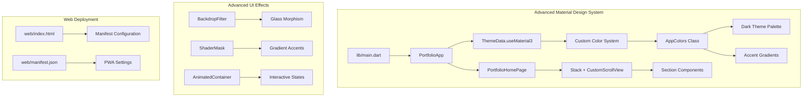

**Diagram sources**
- [main.dart:12-24](file://portfolio_flutter/lib/main.dart#L12-L24)
- [main.dart:34-76](file://portfolio_flutter/lib/main.dart#L34-L76)
- [main.dart:133-186](file://portfolio_flutter/lib/main.dart#L133-L186)

**Section sources**
- [main.dart:1-2402](file://portfolio_flutter/lib/main.dart#L1-L2402)
- [pubspec.yaml:1-94](file://portfolio_flutter/pubspec.yaml#L1-L94)

## Core Components

### Advanced Theme Configuration
The application implements a sophisticated theme system that extends beyond traditional Material Design with custom color schemes and typography.

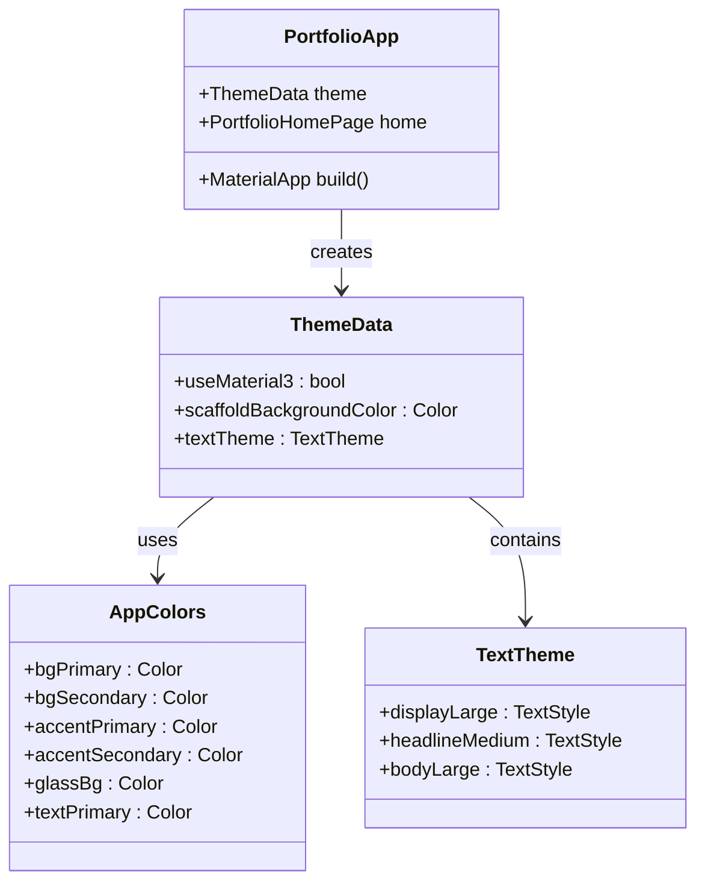

**Diagram sources**
- [main.dart:26-76](file://portfolio_flutter/lib/main.dart#L26-L76)
- [main.dart:12-24](file://portfolio_flutter/lib/main.dart#L12-L24)
- [main.dart:37-72](file://portfolio_flutter/lib/main.dart#L37-L72)

The theme configuration utilizes Material Design 3 principles with a custom dark color palette featuring deep purples and sophisticated gradients. The implementation includes proper text hierarchy using Google Fonts Space Grotesk and Inter.

**Section sources**
- [main.dart:26-76](file://portfolio_flutter/lib/main.dart#L26-L76)
- [main.dart:12-24](file://portfolio_flutter/lib/main.dart#L12-L24)

### Enhanced Layout Architecture
The layout system demonstrates advanced Material Design principles through sophisticated stacking and scrolling implementations.

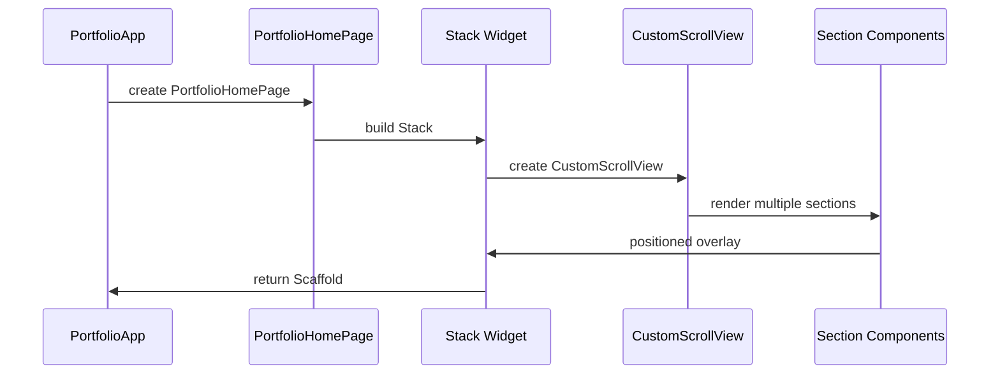

**Diagram sources**
- [main.dart:133-186](file://portfolio_flutter/lib/main.dart#L133-L186)
- [main.dart:136-171](file://portfolio_flutter/lib/main.dart#L136-L171)

**Section sources**
- [main.dart:133-186](file://portfolio_flutter/lib/main.dart#L133-L186)

## Architecture Overview

### Advanced Material Design Implementation Flow
The application follows a sophisticated approach to Material Design implementation with custom effects and interactive elements.

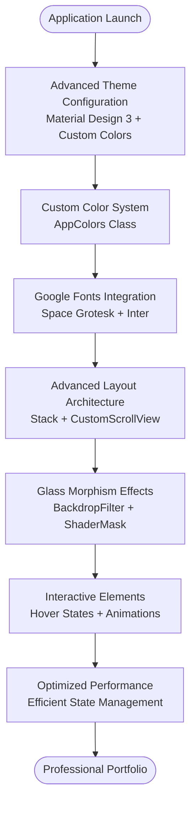

**Diagram sources**
- [main.dart:34-76](file://portfolio_flutter/lib/main.dart#L34-L76)
- [main.dart:12-24](file://portfolio_flutter/lib/main.dart#L12-L24)
- [main.dart:133-186](file://portfolio_flutter/lib/main.dart#L133-L186)

### Sophisticated Typography System
The application implements a comprehensive typography system with multiple font families and dynamic sizing.

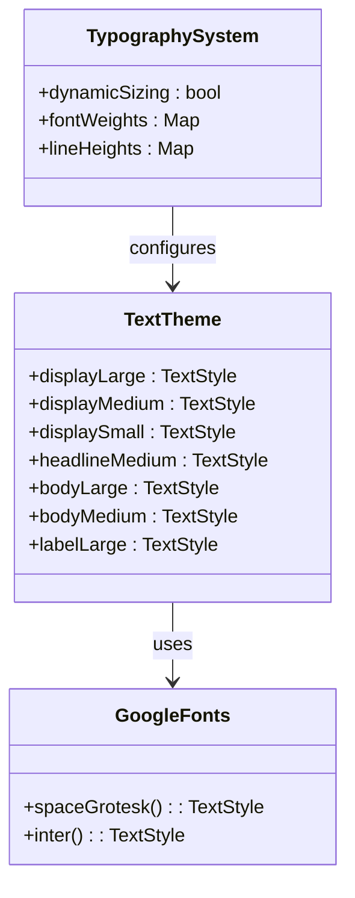

**Diagram sources**
- [main.dart:37-72](file://portfolio_flutter/lib/main.dart#L37-L72)
- [main.dart:38-71](file://portfolio_flutter/lib/main.dart#L38-L71)

**Section sources**
- [main.dart:37-72](file://portfolio_flutter/lib/main.dart#L37-L72)

## Detailed Component Analysis

### Glass Morphism Navigation Bar
The navigation bar demonstrates advanced Material Design techniques with backdrop filtering and glass morphism effects.

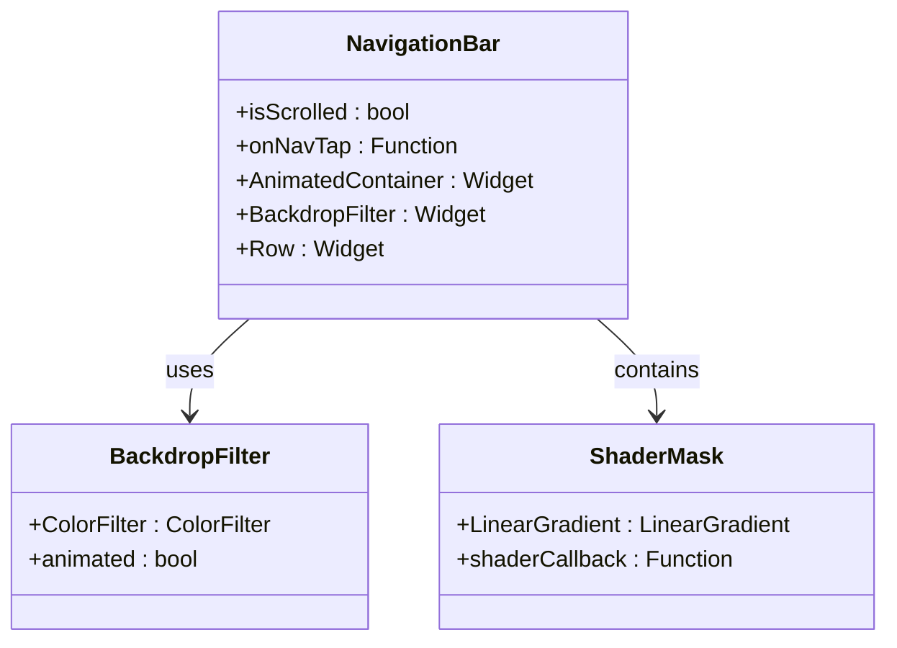

**Diagram sources**
- [main.dart:262-342](file://portfolio_flutter/lib/main.dart#L262-L342)
- [main.dart:294-339](file://portfolio_flutter/lib/main.dart#L294-L339)

The navigation bar implements a sophisticated glass morphism effect that becomes visible when scrolling, creating depth and visual interest through backdrop filtering and animated transparency.

**Section sources**
- [main.dart:262-342](file://portfolio_flutter/lib/main.dart#L262-L342)

### Animated Gradient Orb Background
The hero section features animated gradient orbs that demonstrate advanced animation techniques and visual effects.

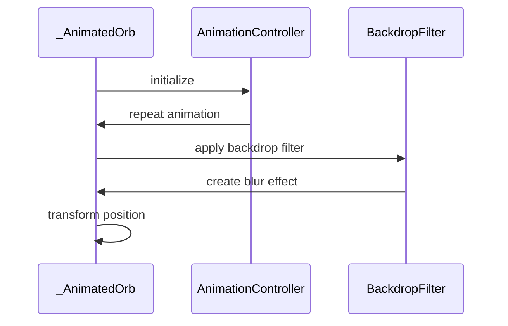

**Diagram sources**
- [main.dart:543-613](file://portfolio_flutter/lib/main.dart#L543-L613)
- [main.dart:558-612](file://portfolio_flutter/lib/main.dart#L558-L612)

**Section sources**
- [main.dart:543-613](file://portfolio_flutter/lib/main.dart#L543-L613)

### Interactive Button System
The portfolio implements sophisticated button components with gradient backgrounds, hover effects, and shadow animations.

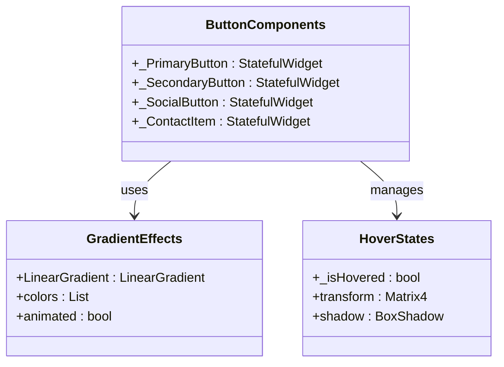

**Diagram sources**
- [main.dart:646-776](file://portfolio_flutter/lib/main.dart#L646-L776)
- [main.dart:676-709](file://portfolio_flutter/lib/main.dart#L676-L709)

**Section sources**
- [main.dart:646-776](file://portfolio_flutter/lib/main.dart#L646-L776)

## Enhanced Material 3 Implementation

### Custom Color Scheme System
The application implements a comprehensive custom color scheme that extends Material Design principles with sophisticated dark theme aesthetics.

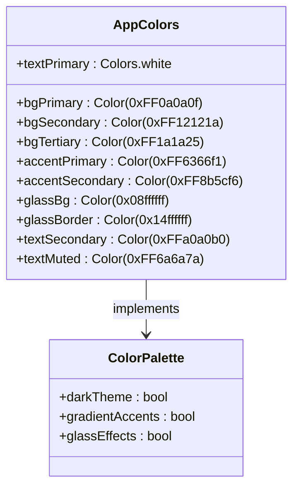

**Diagram sources**
- [main.dart:13-24](file://portfolio_flutter/lib/main.dart#L13-L24)

The color system features a sophisticated dark theme with deep purples and blues, creating a modern professional appearance. The glass morphism effects use transparent colors with subtle borders for depth perception.

**Section sources**
- [main.dart:13-24](file://portfolio_flutter/lib/main.dart#L13-L24)

### Advanced Typography Implementation
The typography system combines Google Fonts with Material Design principles to create a sophisticated visual hierarchy.

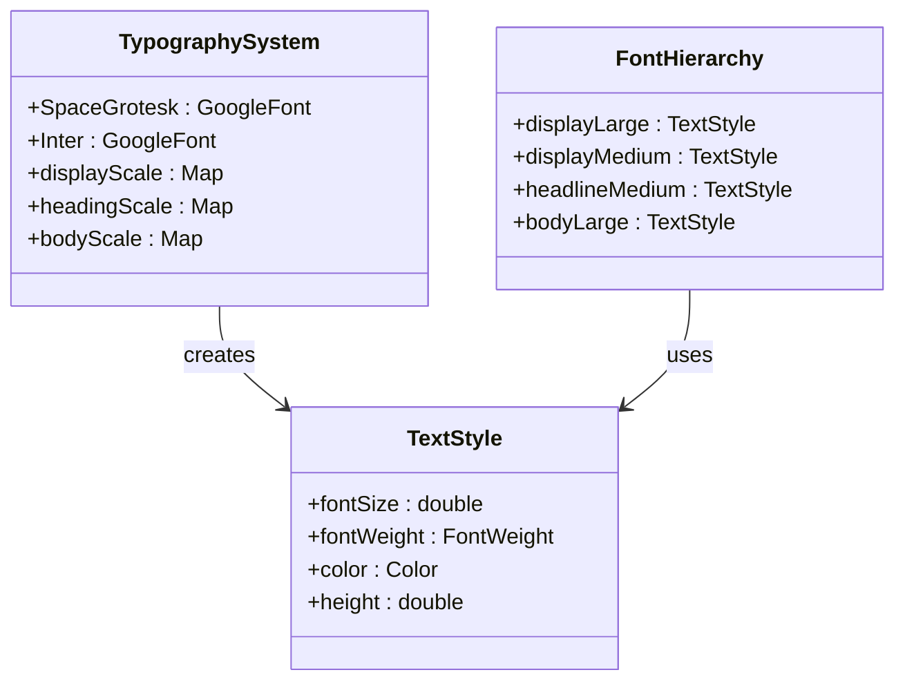

**Diagram sources**
- [main.dart:37-72](file://portfolio_flutter/lib/main.dart#L37-L72)

**Section sources**
- [main.dart:37-72](file://portfolio_flutter/lib/main.dart#L37-L72)

## Advanced Interactive Elements

### Sophisticated Hover State Management
The application implements comprehensive hover state management across all interactive elements with smooth transitions and visual feedback.

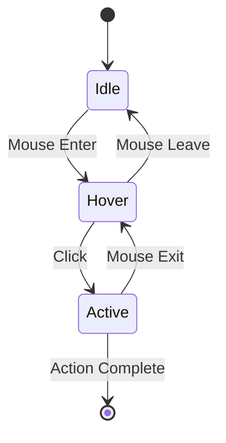

**Diagram sources**
- [main.dart:354-396](file://portfolio_flutter/lib/main.dart#L354-L396)
- [main.dart:666-709](file://portfolio_flutter/lib/main.dart#L666-L709)

The hover state system provides immediate visual feedback through color transitions, shadow animations, and positional adjustments, creating an engaging user experience.

**Section sources**
- [main.dart:354-396](file://portfolio_flutter/lib/main.dart#L354-L396)
- [main.dart:666-709](file://portfolio_flutter/lib/main.dart#L666-L709)

### Dynamic Animation System
The portfolio features a comprehensive animation system that enhances user interaction and visual appeal.

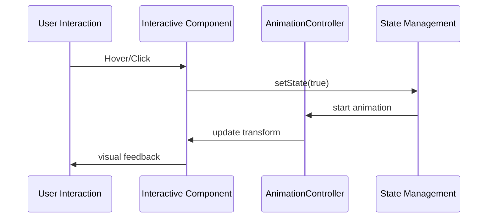

**Diagram sources**
- [main.dart:558-578](file://portfolio_flutter/lib/main.dart#L558-L578)
- [main.dart:666-709](file://portfolio_flutter/lib/main.dart#L666-L709)

**Section sources**
- [main.dart:558-578](file://portfolio_flutter/lib/main.dart#L558-L578)
- [main.dart:666-709](file://portfolio_flutter/lib/main.dart#L666-L709)

## Glass Morphism and Gradient Effects

### BackdropFilter Implementation
The application extensively uses BackdropFilter to create glass morphism effects that blend with the underlying content.

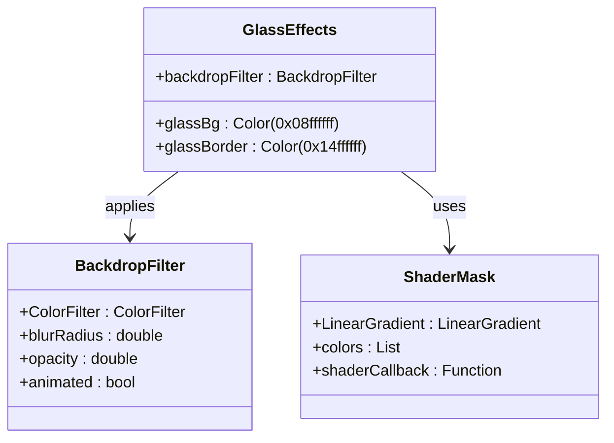

**Diagram sources**
- [main.dart:294-339](file://portfolio_flutter/lib/main.dart#L294-L339)
- [main.dart:597-608](file://portfolio_flutter/lib/main.dart#L597-L608)
- [main.dart:312-324](file://portfolio_flutter/lib/main.dart#L312-L324)

The glass morphism effects create depth and dimensionality through subtle blurs and transparent overlays, enhancing the modern aesthetic.

**Section sources**
- [main.dart:294-339](file://portfolio_flutter/lib/main.dart#L294-L339)
- [main.dart:597-608](file://portfolio_flutter/lib/main.dart#L597-L608)

### Gradient Accent System
The gradient system provides consistent visual accents throughout the application using sophisticated color transitions.

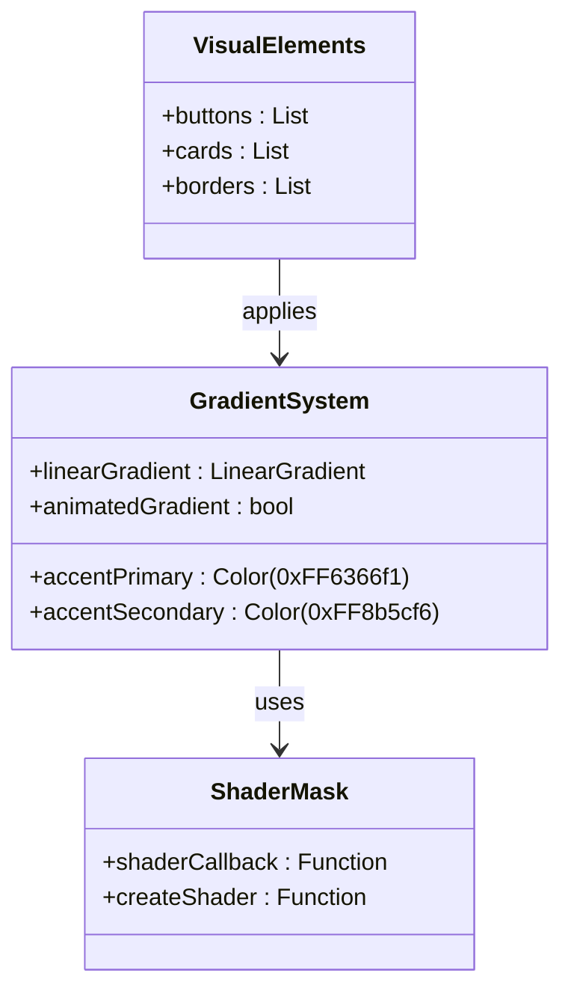

**Diagram sources**
- [main.dart:20-23](file://portfolio_flutter/lib/main.dart#L20-L23)
- [main.dart:312-324](file://portfolio_flutter/lib/main.dart#L312-L324)
- [main.dart:676-687](file://portfolio_flutter/lib/main.dart#L676-L687)

**Section sources**
- [main.dart:20-23](file://portfolio_flutter/lib/main.dart#L20-L23)
- [main.dart:312-324](file://portfolio_flutter/lib/main.dart#L312-L324)
- [main.dart:676-687](file://portfolio_flutter/lib/main.dart#L676-L687)

## Typography and Color System

### Comprehensive Color Palette
The color system implements a sophisticated dark theme with carefully selected accent colors that enhance visual hierarchy and accessibility.

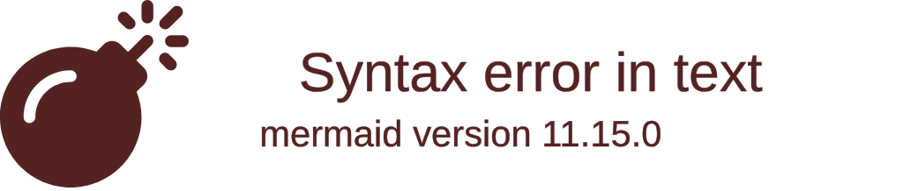

**Diagram sources**
- [main.dart:13-24](file://portfolio_flutter/lib/main.dart#L13-L24)

The color palette prioritizes readability with high contrast ratios between text and background colors, ensuring accessibility compliance.

**Section sources**
- [main.dart:13-24](file://portfolio_flutter/lib/main.dart#L13-L24)

### Advanced Text Theming
The typography system implements a comprehensive text hierarchy using Google Fonts with dynamic sizing and responsive behavior.

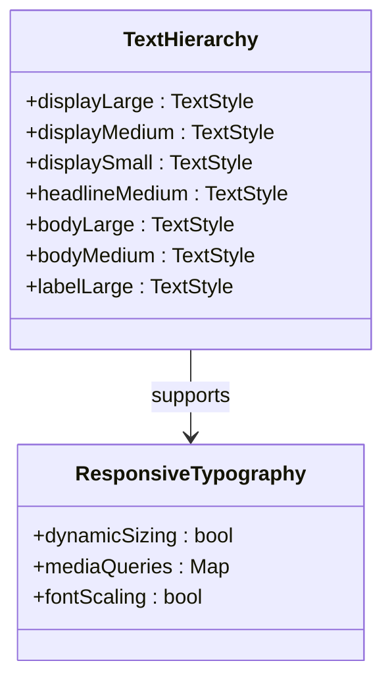

**Diagram sources**
- [main.dart:37-72](file://portfolio_flutter/lib/main.dart#L37-L72)

**Section sources**
- [main.dart:37-72](file://portfolio_flutter/lib/main.dart#L37-L72)

## Performance Considerations
The advanced Material Design implementation prioritizes performance through optimized widget composition and efficient animation systems. The state management approach ensures smooth interactions without compromising performance.

Key performance optimizations include:
- Efficient BackdropFilter usage with conditional rendering
- Optimized animation controllers with proper disposal
- Smart responsive design that adapts to different screen sizes
- Minimal rebuild cycles through targeted state management
- Optimized gradient rendering with ShaderMask

## Troubleshooting Guide

### Advanced Material Design Issues
When implementing advanced Material Design themes with custom effects, developers commonly encounter issues related to performance, accessibility, and cross-platform compatibility.

**Performance Optimization**
- Monitor BackdropFilter usage as it can be computationally expensive
- Optimize animation controllers and ensure proper disposal
- Use conditional rendering for complex effects
- Test on lower-end devices for performance validation

**Accessibility Compliance**
- Verify color contrast ratios meet WCAG 2.1 AA standards
- Test with screen readers and assistive technologies
- Ensure keyboard navigation works with all interactive elements
- Validate responsive behavior across different screen sizes

**Cross-Platform Compatibility**
- Test BackdropFilter effects on different platforms
- Verify gradient rendering consistency across browsers
- Validate hover states on touch devices
- Test animation performance on various hardware configurations

**Section sources**
- [main.dart:12-24](file://portfolio_flutter/lib/main.dart#L12-L24)
- [main.dart:294-339](file://portfolio_flutter/lib/main.dart#L294-L339)

## Conclusion
The Material Design implementation in this Flutter portfolio represents a sophisticated approach to modern digital presentation that balances aesthetic innovation with functional excellence. Through the strategic use of custom color schemes, advanced typography, glass morphism effects, and interactive elements, the application establishes a cutting-edge design system that effectively communicates professional competency.

The implementation successfully integrates Material Design 3 principles with contemporary design trends, creating an interface that is both visually engaging and technically sophisticated. The extensive use of BackdropFilter, ShaderMask, and animated state transitions demonstrates advanced Flutter capabilities while maintaining accessibility and usability standards.

This design system serves as an exemplary foundation for future enhancements and showcases how Material Design can be elevated to create truly professional and visually compelling digital portfolios. The combination of custom theming, interactive elements, and performance optimization creates a comprehensive solution that balances artistic vision with technical excellence.