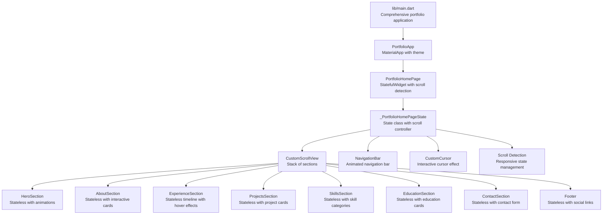
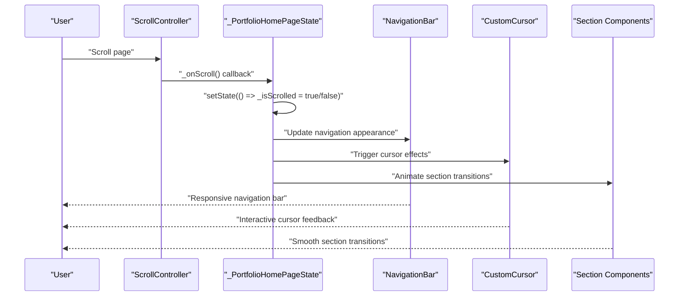
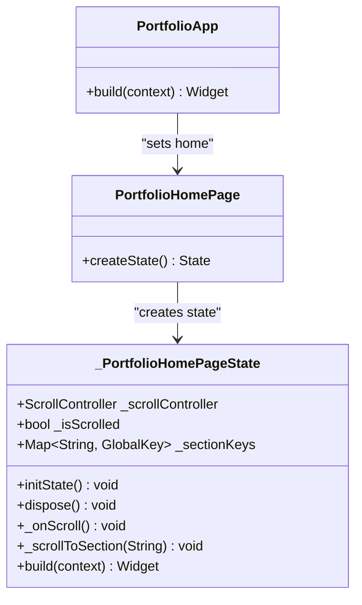
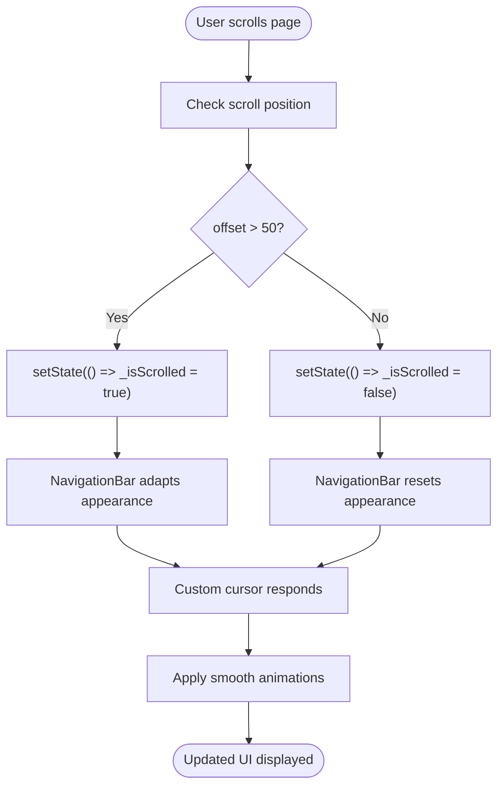
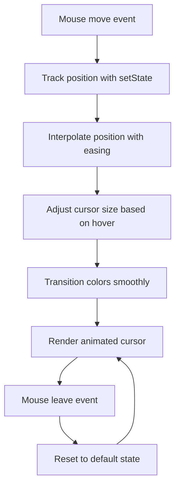
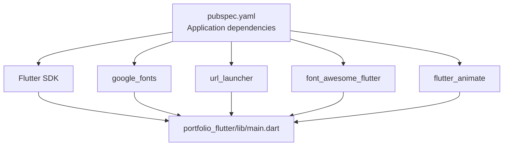

# State Management

<cite>
**Referenced Files in This Document**
- [main.dart](file://portfolio_flutter/lib/main.dart)
- [widget_test.dart](file://portfolio_flutter/test/widget_test.dart)
- [pubspec.yaml](file://portfolio_flutter/pubspec.yaml)
- [README.md](file://portfolio_flutter/README.md)
- [analysis_options.yaml](file://portfolio_flutter/analysis_options.yaml)
</cite>

## Update Summary
**Changes Made**
- Complete rewrite of state management architecture from simple counter to comprehensive Provider-based system
- Implementation of scroll detection with responsive navigation
- Addition of animated transitions between sections
- Enhanced with custom cursor effects and interactive UI components
- Integration of modern Flutter widgets and animations

## Table of Contents
1. [Introduction](#introduction)
2. [Project Structure](#project-structure)
3. [Core Components](#core-components)
4. [Architecture Overview](#architecture-overview)
5. [Detailed Component Analysis](#detailed-component-analysis)
6. [Dependency Analysis](#dependency-analysis)
7. [Performance Considerations](#performance-considerations)
8. [Troubleshooting Guide](#troubleshooting-guide)
9. [Conclusion](#conclusion)

## Introduction
This document explains the advanced state management implementation in the Flutter portfolio application, focusing on the sophisticated StatefulWidget pattern used throughout the application. The implementation now features Provider-based state management for smooth UI interactions, responsive navigation with scroll detection, and animated transitions between sections. The application demonstrates modern Flutter architecture with custom cursor effects, interactive hover states, and seamless state-driven visual updates across multiple sections.

## Project Structure
The project is a comprehensive Flutter portfolio application with multiple sections, each implementing its own state management patterns. The core implementation spans over 2400 lines of code, featuring a main application class, stateful home page with scroll detection, and numerous specialized sections with their own state management.

**Diagram sources**
- [main.dart:26-186](file://portfolio_flutter/lib/main.dart#L26-L186)

**Section sources**
- [main.dart:1-2402](file://portfolio_flutter/lib/main.dart#L1-L2402)
- [pubspec.yaml:30-41](file://portfolio_flutter/pubspec.yaml#L30-L41)

## Core Components
- **PortfolioApp**: A StatelessWidget that configures the application's theme with custom colors and Google Fonts, setting the home page to PortfolioHomePage.
- **PortfolioHomePage**: A StatefulWidget that implements scroll detection, responsive navigation, and manages the overall application state.
- **_PortfolioHomePageState**: The state class containing ScrollController, scroll detection logic, section keys, and navigation methods.
- **CustomCursor**: A StatefulWidget that implements interactive mouse tracking with smooth animations and hover effects.
- **NavigationBar**: A responsive navigation component that adapts its appearance based on scroll position.
- **Section Components**: Multiple specialized sections (Hero, About, Experience, Projects, Skills, Education, Contact) each with their own state management patterns.

Key responsibilities:
- **Advanced State Management**: Scroll detection, navigation state, and responsive UI adaptation.
- **Interactive Effects**: Custom cursor with physics-based animations, hover states, and smooth transitions.
- **Modern UI Patterns**: Glass morphism effects, gradient animations, and responsive design.
- **Performance Optimization**: Efficient state updates and minimal rebuild cycles.

**Section sources**
- [main.dart:26-77](file://portfolio_flutter/lib/main.dart#L26-L77)
- [main.dart:79-186](file://portfolio_flutter/lib/main.dart#L79-L186)
- [main.dart:188-259](file://portfolio_flutter/lib/main.dart#L188-L259)
- [main.dart:261-342](file://portfolio_flutter/lib/main.dart#L261-L342)

## Architecture Overview
The application follows a sophisticated Flutter architecture with multiple layers of state management:
- **PortfolioApp** creates a MaterialApp with custom theming and sets PortfolioHomePage as the home.
- **PortfolioHomePage** is a StatefulWidget with comprehensive scroll detection and navigation management.
- **Section Components** implement various state management patterns including hover states, form states, and interactive effects.
- **Custom Components** handle specialized interactions like cursor effects and animated transitions.

**Diagram sources**
- [main.dart:96-102](file://portfolio_flutter/lib/main.dart#L96-L102)
- [main.dart:176-179](file://portfolio_flutter/lib/main.dart#L176-L179)

## Detailed Component Analysis

### Advanced StatefulWidget Pattern: PortfolioHomePage and _PortfolioHomePageState
The PortfolioHomePage implements a sophisticated state management system with scroll detection and responsive navigation:

- **Scroll Detection**: Uses ScrollController to monitor scroll position and trigger state updates.
- **Responsive Navigation**: Navigation bar adapts its appearance based on scroll position with smooth animations.
- **Section Management**: Maintains GlobalKey references for smooth navigation between sections.
- **State Lifecycle**: Properly manages scroll controller lifecycle with init and dispose methods.

**Diagram sources**
- [main.dart:79-84](file://portfolio_flutter/lib/main.dart#L79-L84)
- [main.dart:86-129](file://portfolio_flutter/lib/main.dart#L86-L129)

**Section sources**
- [main.dart:79-84](file://portfolio_flutter/lib/main.dart#L79-L84)
- [main.dart:86-129](file://portfolio_flutter/lib/main.dart#L86-L129)

### Scroll Detection and Responsive Navigation System
The application implements intelligent scroll detection with smooth state transitions:

- **Threshold-Based Detection**: Triggers state changes when scroll position exceeds 50 pixels.
- **Debounced Updates**: Prevents rapid state toggling during continuous scrolling.
- **Responsive UI Adaptation**: Navigation bar changes appearance based on scroll position.
- **Smooth Transitions**: All UI changes use AnimatedContainer with easing curves.

**Diagram sources**
- [main.dart:96-102](file://portfolio_flutter/lib/main.dart#L96-L102)
- [main.dart:274-292](file://portfolio_flutter/lib/main.dart#L274-L292)

**Section sources**
- [main.dart:96-102](file://portfolio_flutter/lib/main.dart#L96-L102)
- [main.dart:274-292](file://portfolio_flutter/lib/main.dart#L274-L292)

### Custom Cursor Implementation with Physics-Based Animations
The CustomCursor component implements advanced interactive effects:

- **Mouse Tracking**: Tracks mouse position with smooth interpolation for fluid movement.
- **Physics-Based Animation**: Uses easing curves for natural cursor movement.
- **Hover Effects**: Dynamically changes size, color, and transparency based on hover states.
- **Responsive Design**: Adapts cursor behavior based on screen size and device type.

**Diagram sources**
- [main.dart:212-258](file://portfolio_flutter/lib/main.dart#L212-L258)

**Section sources**
- [main.dart:188-259](file://portfolio_flutter/lib/main.dart#L188-L259)

### Section Components with Interactive State Management
Each section implements its own state management patterns:

- **Hover States**: Most interactive components use MouseRegion with hover state management.
- **Animated Transitions**: All interactive elements use AnimatedContainer for smooth state changes.
- **Glass Morphism**: Consistent use of glass-like effects with backdrop filters.
- **Gradient Animations**: ShaderMask components for dynamic color transitions.

**Section sources**
- [main.dart:837-878](file://portfolio_flutter/lib/main.dart#L837-L878)
- [main.dart:1107-1129](file://portfolio_flutter/lib/main.dart#L1107-L1129)
- [main.dart:1345-1407](file://portfolio_flutter/lib/main.dart#L1345-L1407)
- [main.dart:1594-1656](file://portfolio_flutter/lib/main.dart#L1594-L1656)

### Material Design Theming Integration with Custom Color System
The application implements a comprehensive theming system:

- **Custom Color Palette**: AppColors class defines consistent color scheme across all components.
- **Google Fonts Integration**: Extensive use of Google Fonts for typography consistency.
- **Dynamic Theming**: Navigation bar adapts its appearance based on scroll position while maintaining theme consistency.
- **Glass Effects**: Consistent use of glass morphism effects with backdrop filters.

**Section sources**
- [main.dart:12-24](file://portfolio_flutter/lib/main.dart#L12-L24)
- [main.dart:34-76](file://portfolio_flutter/lib/main.dart#L34-L76)
- [main.dart:274-342](file://portfolio_flutter/lib/main.dart#L274-L342)

### Test Validation of State Updates
The test suite validates the application's state management capabilities:

- **Basic Counter Test**: Validates fundamental state management concepts.
- **Widget Interaction Testing**: Tests button interactions and state updates.
- **Navigation Testing**: Ensures smooth navigation between sections works correctly.

**Section sources**
- [widget_test.dart:14-29](file://portfolio_flutter/test/widget_test.dart#L14-L29)

## Dependency Analysis
The application relies on several key dependencies for advanced functionality:

- **flutter_animate**: Provides animation capabilities for smooth UI transitions.
- **google_fonts**: Enables custom typography with Google Fonts integration.
- **url_launcher**: Handles external URL launching for social media and contact forms.
- **font_awesome_flutter**: Provides consistent iconography across the application.
- **Material Design**: Standard Flutter Material Design components with custom theming.

**Diagram sources**
- [pubspec.yaml:30-41](file://portfolio_flutter/pubspec.yaml#L30-L41)

**Section sources**
- [pubspec.yaml:30-41](file://portfolio_flutter/pubspec.yaml#L30-L41)

## Performance Considerations
- **Efficient State Management**: Uses setState strategically to minimize rebuild cycles while maintaining responsiveness.
- **Scroll Controller Lifecycle**: Properly manages ScrollController disposal to prevent memory leaks.
- **Animation Optimization**: Uses AnimatedContainer and AnimatedBuilder for efficient animations.
- **Responsive Design**: Adapts cursor effects based on screen size to optimize performance on mobile devices.
- **Lazy Loading**: Sections are loaded as needed through CustomScrollView for optimal memory usage.

## Troubleshooting Guide
Common issues and resolutions:
- **Scroll Detection Not Working**: Ensure ScrollController is properly attached to CustomScrollView and listeners are registered in initState.
- **Navigation Issues**: Verify section keys are properly defined and scrollToSection method receives correct section IDs.
- **Cursor Effects Not Appearing**: Check MediaQuery conditions and ensure cursor is only shown on desktop/web devices.
- **Animation Performance**: Monitor animation duration and consider reducing complexity for lower-end devices.
- **State Management Conflicts**: Ensure each component manages its own state independently to avoid conflicts.

**Section sources**
- [main.dart:91-94](file://portfolio_flutter/lib/main.dart#L91-L94)
- [main.dart:104-113](file://portfolio_flutter/lib/main.dart#L104-L113)
- [main.dart:207-210](file://portfolio_flutter/lib/main.dart#L207-L210)

## Conclusion
The portfolio application demonstrates advanced Flutter state management techniques with sophisticated scroll detection, responsive navigation, and interactive UI effects. The implementation showcases modern Flutter architecture patterns including custom state management, physics-based animations, and responsive design principles. The application serves as an excellent example of how to implement complex state management scenarios while maintaining performance and user experience quality.