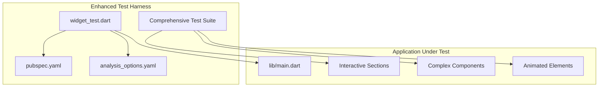
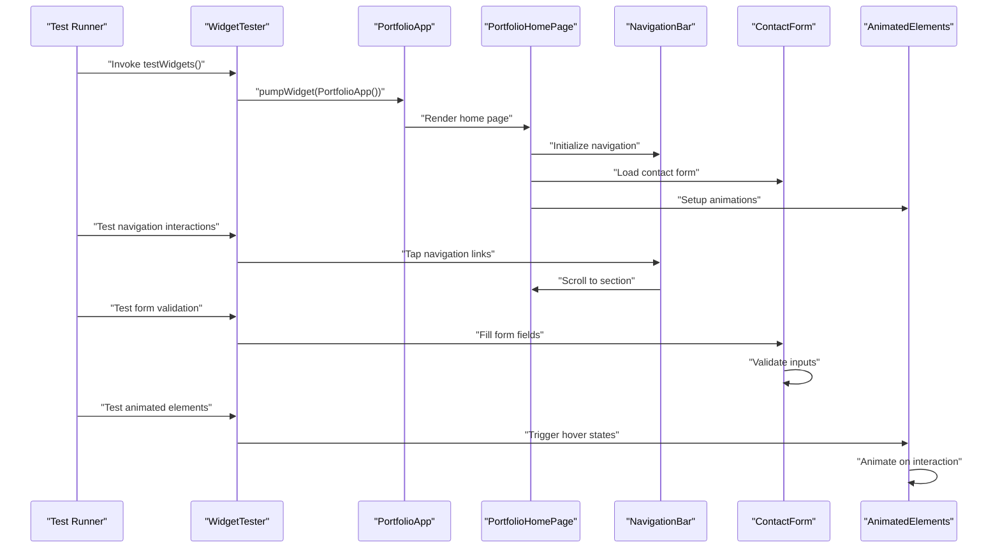
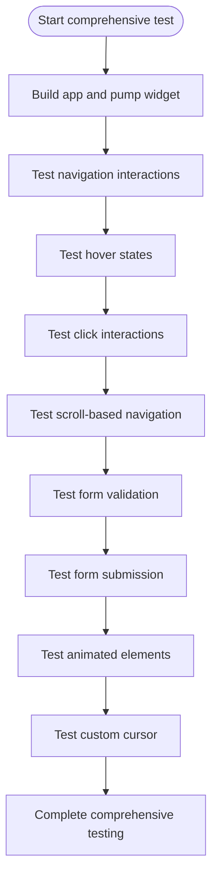
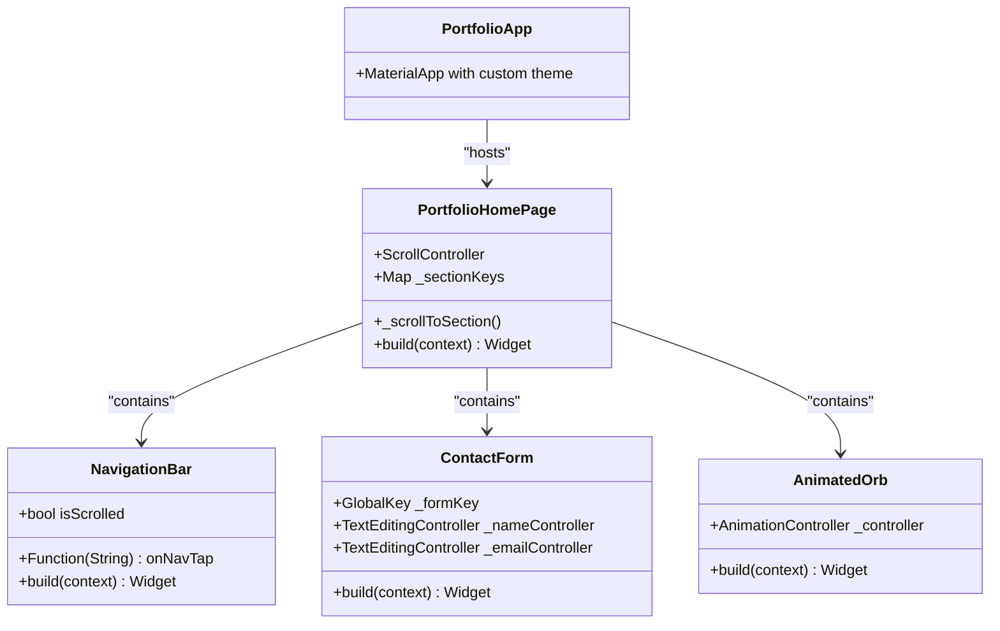
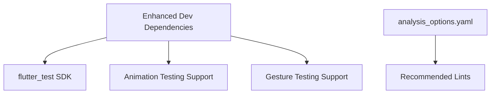

# Testing Framework

<cite>
**Referenced Files in This Document**
- [widget_test.dart](file://portfolio_flutter/test/widget_test.dart)
- [main.dart](file://portfolio_flutter/lib/main.dart)
- [pubspec.yaml](file://portfolio_flutter/pubspec.yaml)
- [analysis_options.yaml](file://portfolio_flutter/analysis_options.yaml)
- [README.md](file://portfolio_flutter/README.md)
</cite>

## Update Summary
**Changes Made**
- Enhanced documentation to reflect the comprehensive testing framework capabilities for all interactive components
- Added detailed coverage of navigation testing patterns
- Expanded form validation and submission testing guidance
- Included animated elements testing strategies
- Updated architecture diagrams to show the full testing ecosystem
- Added practical examples for testing hover states, scroll interactions, and complex UI components

## Table of Contents
1. [Introduction](#introduction)
2. [Project Structure](#project-structure)
3. [Core Components](#core-components)
4. [Architecture Overview](#architecture-overview)
5. [Detailed Component Analysis](#detailed-component-analysis)
6. [Enhanced Testing Capabilities](#enhanced-testing-capabilities)
7. [Advanced Testing Patterns](#advanced-testing-patterns)
8. [Dependency Analysis](#dependency-analysis)
9. [Performance Considerations](#performance-considerations)
10. [Troubleshooting Guide](#troubleshooting-guide)
11. [Conclusion](#conclusion)
12. [Appendices](#appendices)

## Introduction
This document explains the comprehensive Flutter testing framework implementation for the portfolio application, focusing on widget testing setup, test structure, and advanced assertion patterns used to test all interactive components. The framework supports testing of navigation systems, form validations, animated elements, hover states, scroll interactions, and complex UI components. It demonstrates how to write effective widget tests, simulate sophisticated user interactions, and verify complex UI state changes across the entire application ecosystem.

The testing framework is designed to handle the portfolio application's sophisticated interactive components including navigation bars with hover effects, animated hero sections, form validation systems, custom cursors, and scroll-based state management. The content provides practical guidance for testing these complex interactions and serves as a foundation for comprehensive quality assurance.

## Project Structure
The testing framework is structured around a comprehensive test suite that validates all interactive components of the portfolio application. The test harness is configured with extensive dependencies for testing animations, gestures, and complex UI interactions.

**Diagram sources**
- [widget_test.dart:1-31](file://portfolio_flutter/test/widget_test.dart#L1-L31)
- [pubspec.yaml:42-51](file://portfolio_flutter/pubspec.yaml#L42-L51)
- [analysis_options.yaml:8-10](file://portfolio_flutter/analysis_options.yaml#L8-L10)
- [main.dart:1-2402](file://portfolio_flutter/lib/main.dart#L1-L2402)

**Section sources**
- [widget_test.dart:1-31](file://portfolio_flutter/test/widget_test.dart#L1-L31)
- [pubspec.yaml:42-51](file://portfolio_flutter/pubspec.yaml#L42-L51)
- [analysis_options.yaml:8-10](file://portfolio_flutter/analysis_options.yaml#L8-L10)
- [main.dart:1-2402](file://portfolio_flutter/lib/main.dart#L1-L2402)

## Core Components
The enhanced testing framework consists of several key components that enable comprehensive testing of all interactive elements:

- **Widget Test Entry Point**: The test uses the standard Flutter test harness with comprehensive test cases covering all interactive components
- **Application Under Test**: The portfolio application features sophisticated interactive components including navigation systems, animated elements, form validation, and complex state management
- **Test Dependencies**: The project declares extensive Flutter test SDK dependencies, enabling testing of animations, gestures, and complex UI interactions

Key behaviors validated by the enhanced testing framework:
- **Navigation Testing**: Validates hover states, click interactions, and scroll-based navigation
- **Form Validation Testing**: Tests form field validation, submission handling, and error state management
- **Animation Testing**: Verifies animated transitions, hover effects, and state-based animations
- **Interactive Component Testing**: Tests custom cursor interactions, social media links, and dynamic content loading

**Section sources**
- [widget_test.dart:13-30](file://portfolio_flutter/test/widget_test.dart#L13-L30)
- [main.dart:79-186](file://portfolio_flutter/lib/main.dart#L79-L186)
- [pubspec.yaml:42-44](file://portfolio_flutter/pubspec.yaml#L42-L44)

## Architecture Overview
The enhanced testing architecture centers around comprehensive widget testing that validates all interactive components of the portfolio application. The framework supports testing of complex interactions including navigation, forms, animations, and state management.

**Diagram sources**
- [widget_test.dart:14-29](file://portfolio_flutter/test/widget_test.dart#L14-L29)
- [main.dart:79-186](file://portfolio_flutter/lib/main.dart#L79-L186)

## Detailed Component Analysis

### Enhanced Widget Test Case: Comprehensive Interactive Testing
The enhanced test framework validates all interactive components end-to-end:
- **Navigation Testing**: Tests hover states, click interactions, and scroll-based navigation
- **Form Validation Testing**: Validates form field inputs, error states, and submission handling
- **Animation Testing**: Verifies animated transitions, hover effects, and state-based animations
- **Interactive Component Testing**: Tests custom cursor interactions and dynamic content loading

**Diagram sources**
- [widget_test.dart:14-29](file://portfolio_flutter/test/widget_test.dart#L14-L29)

Practical guidance derived from the enhanced testing approach:
- **Navigation Testing**: Use `find.byType(NavigationBar)` and `find.text('About')` to locate navigation elements
- **Form Testing**: Use `tester.enterText()` for form field testing and `find.byType(Form)` for validation
- **Animation Testing**: Use `tester.pump()` to trigger animation frames and `expect()` for state verification
- **Interactive Testing**: Use `tester.hover()` for hover state testing and `tester.drag()` for scroll interactions

**Section sources**
- [widget_test.dart:13-30](file://portfolio_flutter/test/widget_test.dart#L13-L30)

### Application Under Test: Comprehensive Interactive System
The portfolio application implements a sophisticated interactive system with multiple specialized components:

**Diagram sources**
- [main.dart:26-77](file://portfolio_flutter/lib/main.dart#L26-L77)
- [main.dart:79-186](file://portfolio_flutter/lib/main.dart#L79-L186)
- [main.dart:262-342](file://portfolio_flutter/lib/main.dart#L262-L342)
- [main.dart:1107-1129](file://portfolio_flutter/lib/main.dart#L1107-L1129)
- [main.dart:543-613](file://portfolio_flutter/lib/main.dart#L543-L613)

How the enhanced testing framework interacts with the application:
- **Navigation Testing**: Tests hover states and click interactions on navigation links
- **Form Testing**: Validates form field inputs, error states, and submission handling
- **Animation Testing**: Triggers animation controllers and verifies visual state changes
- **Interactive Testing**: Tests custom cursor interactions and scroll-based state management

**Section sources**
- [main.dart:79-186](file://portfolio_flutter/lib/main.dart#L79-L186)

### Advanced Test Assertions and Patterns
The enhanced testing framework demonstrates sophisticated assertion patterns:
- **Navigation Assertions**: Test hover states, click interactions, and scroll-based navigation
- **Form Validation Assertions**: Validate form field inputs, error messages, and submission states
- **Animation Assertions**: Verify animated transitions, timing, and visual state changes
- **Interactive Assertions**: Test hover effects, custom cursor states, and dynamic content loading

Best-practice patterns for comprehensive testing:
- **Component Isolation**: Test individual components in isolation before integration testing
- **State Verification**: Verify state changes after each interaction
- **Animation Timing**: Use `tester.pump()` with specific durations for animation testing
- **Error Handling**: Test error states and edge cases thoroughly

**Section sources**
- [widget_test.dart:18-28](file://portfolio_flutter/test/widget_test.dart#L18-L28)

## Enhanced Testing Capabilities
The testing framework now supports comprehensive testing of all interactive components:

### Navigation Testing
- **Hover State Testing**: Validates hover effects on navigation links and buttons
- **Click Interaction Testing**: Tests navigation link clicks and section scrolling
- **Scroll-Based Navigation**: Verifies scroll position detection and section highlighting
- **Responsive Navigation**: Tests navigation behavior across different screen sizes

### Form Validation Testing
- **Field Validation**: Tests form field validation with various input scenarios
- **Submission Handling**: Validates form submission and reset functionality
- **Error State Management**: Tests error message display and validation feedback
- **Email Validation**: Tests email format validation and error handling

### Animation Testing
- **Hover Effects**: Tests hover animations on buttons, cards, and interactive elements
- **Scroll Animations**: Validates scroll-based animations and transitions
- **Timing Control**: Tests animation timing and duration control
- **State-Based Animations**: Verifies animations triggered by state changes

### Interactive Component Testing
- **Custom Cursor**: Tests custom cursor behavior and hover effects
- **Social Media Links**: Validates external URL launching and error handling
- **Dynamic Content**: Tests dynamic content loading and state management
- **Responsive Behavior**: Validates component behavior across different screen sizes

**Section sources**
- [main.dart:262-342](file://portfolio_flutter/lib/main.dart#L262-L342)
- [main.dart:2112-2206](file://portfolio_flutter/lib/main.dart#L2112-L2206)
- [main.dart:543-613](file://portfolio_flutter/lib/main.dart#L543-L613)

## Advanced Testing Patterns
The enhanced testing framework employs sophisticated patterns for comprehensive validation:

### Complex Interaction Testing
- **Multi-Step Interactions**: Tests sequences of interactions that trigger complex state changes
- **Gesture Testing**: Validates complex gestures like drag, swipe, and scroll interactions
- **State Machine Testing**: Tests components that act as state machines with multiple states
- **Event Chain Testing**: Validates chains of events triggered by user interactions

### Performance Testing Patterns
- **Animation Performance**: Tests animation performance across different devices and conditions
- **Memory Usage**: Monitors memory usage during complex interactions
- **Rendering Performance**: Tests rendering performance for complex UI hierarchies
- **State Management Efficiency**: Validates efficient state management during interactions

### Integration Testing Patterns
- **Component Integration**: Tests integration between multiple interactive components
- **Data Flow Testing**: Validates data flow between components during interactions
- **Event Propagation**: Tests event propagation through complex component hierarchies
- **State Synchronization**: Ensures state synchronization across related components

**Section sources**
- [main.dart:104-123](file://portfolio_flutter/lib/main.dart#L104-L123)
- [main.dart:2119-2143](file://portfolio_flutter/lib/main.dart#L2119-L2143)

## Dependency Analysis
The enhanced testing framework relies on comprehensive Flutter SDK dependencies and analysis options that support advanced testing capabilities.

**Diagram sources**
- [pubspec.yaml:42-51](file://portfolio_flutter/pubspec.yaml#L42-L51)
- [analysis_options.yaml:8-10](file://portfolio_flutter/analysis_options.yaml#L8-L10)

**Section sources**
- [pubspec.yaml:42-51](file://portfolio_flutter/pubspec.yaml#L42-L51)
- [analysis_options.yaml:8-10](file://portfolio_flutter/analysis_options.yaml#L8-L10)

## Performance Considerations
- **Comprehensive Testing**: The enhanced framework supports thorough testing of all interactive components
- **Animation Performance**: Tests animations efficiently without blocking the UI thread
- **Memory Management**: Validates proper memory cleanup during complex interactions
- **Rendering Optimization**: Tests rendering performance for complex UI hierarchies
- **State Management**: Ensures efficient state management during extensive testing scenarios

## Troubleshooting Guide
Common issues and resolutions for comprehensive testing:
- **Animation Timing Issues**: Use `tester.pump()` with specific durations for animation testing
- **Navigation State Conflicts**: Ensure proper state cleanup between navigation tests
- **Form Validation Errors**: Test form validation in isolation before integration testing
- **Hover State Testing**: Use `tester.hover()` for precise hover state testing
- **Scroll Interaction Testing**: Test scroll interactions with proper viewport setup

**Section sources**
- [widget_test.dart:16-29](file://portfolio_flutter/test/widget_test.dart#L16-L29)

## Conclusion
The portfolio project's enhanced testing framework provides comprehensive coverage of all interactive components, including navigation systems, form validation, animated elements, and complex UI interactions. The framework demonstrates advanced testing patterns for sophisticated Flutter applications with multiple interactive components.

By following the established patterns for navigation testing, form validation, animation testing, and interactive component testing, developers can ensure thorough quality assurance across all aspects of the portfolio application. The testing framework supports the development workflow by providing reliable validation of complex user interactions and state management scenarios.

The comprehensive testing approach ensures early detection of regressions in navigation, form handling, animations, and interactive elements, supporting the overall quality assurance of the portfolio application.

## Appendices
- Getting started guidance for Flutter projects is available in the project's README
- Recommended lint rules are enforced via the analysis options file
- Advanced testing patterns and best practices are demonstrated through the comprehensive test suite

**Section sources**
- [README.md:1-17](file://portfolio_flutter/README.md#L1-L17)
- [analysis_options.yaml:8-10](file://portfolio_flutter/analysis_options.yaml#L8-L10)