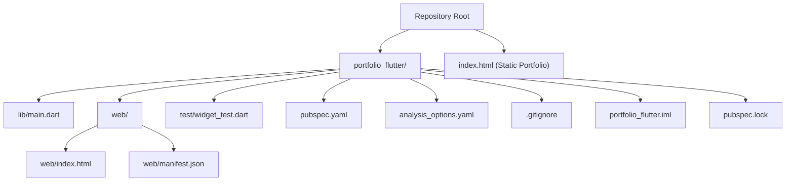

# Getting Started

<cite>
**Referenced Files in This Document**
- [pubspec.yaml](file://portfolio_flutter/pubspec.yaml)
- [main.dart](file://portfolio_flutter/lib/main.dart)
- [index.html (Flutter Web)](file://portfolio_flutter/web/index.html)
- [manifest.json](file://portfolio_flutter/web/manifest.json)
- [README.md](file://portfolio_flutter/README.md)
- [analysis_options.yaml](file://portfolio_flutter/analysis_options.yaml)
- [.gitignore](file://portfolio_flutter/.gitignore)
- [widget_test.dart](file://portfolio_flutter/test/widget_test.dart)
- [portfolio_flutter.iml](file://portfolio_flutter/portfolio_flutter.iml)
- [pubspec.lock](file://portfolio_flutter/pubspec.lock)
- [index.html (Static Portfolio)](file://index.html)
</cite>

## Table of Contents
1. [Introduction](#introduction)
2. [Prerequisites](#prerequisites)
3. [Installation](#installation)
4. [Running Locally](#running-locally)
5. [Project Structure](#project-structure)
6. [Accessing Applications](#accessing-applications)
7. [Verification Steps](#verification-steps)
8. [Troubleshooting Guide](#troubleshooting-guide)
9. [Conclusion](#conclusion)

## Introduction
This guide helps you set up and run the Flutter portfolio project locally. It covers prerequisites, environment setup, running the Flutter web application, accessing the static portfolio website, verifying the installations, and resolving common issues.

## Prerequisites
- Flutter SDK version aligned with the project’s environment requirement.
- Dart language fundamentals.
- Basic understanding of web development (HTML, CSS, JavaScript) to customize the static portfolio.

Key requirement from the repository:
- Flutter SDK constraint is defined in the project configuration.

**Section sources**
- [pubspec.yaml:21-22](file://portfolio_flutter/pubspec.yaml#L21-L22)
- [pubspec.lock:212-213](file://portfolio_flutter/pubspec.lock#L212-L213)

## Installation
Follow these steps to prepare your development environment.

1) Install Flutter SDK
- Ensure your Flutter SDK version satisfies the environment requirement declared in the project configuration.

2) Install dependencies for the Flutter app
- Navigate to the Flutter project directory and install dependencies.

3) Enable web target (if not already enabled)
- Add the web platform to your Flutter project.

4) Prepare the static portfolio website
- The static portfolio is a standalone HTML file located at the repository root. No build step is required.

Notes:
- The Flutter project declares a minimal set of dependencies and uses Material Design.
- The static portfolio is a single HTML file with embedded styles and scripts.

**Section sources**
- [pubspec.yaml:30-47](file://portfolio_flutter/pubspec.yaml#L30-L47)
- [pubspec.yaml:53-58](file://portfolio_flutter/pubspec.yaml#L53-L58)
- [README.md:5-16](file://portfolio_flutter/README.md#L5-L16)

## Running Locally
Run the Flutter web application using the Chrome device.

- Command:
  - flutter run -d chrome

What this does:
- Builds and runs the Flutter web app in Chrome.
- Uses the web entry point configured by the Flutter project.

Where the web app entry point is defined:
- The Flutter web index template is provided under the web directory.

**Section sources**
- [index.html (Flutter Web):1-38](file://portfolio_flutter/web/index.html#L1-L38)

## Project Structure
High-level overview of the repository layout and key directories.

- Root
  - Static portfolio website: index.html
- portfolio_flutter/
  - lib/main.dart: Application entry point and UI scaffold
  - web/: Flutter web assets and entry point
  - test/: Example widget tests
  - pubspec.yaml: Project metadata, SDK constraints, dependencies
  - analysis_options.yaml: Lint configuration
  - .gitignore: Ignored files and folders
  - portfolio_flutter.iml: IntelliJ module configuration
  - pubspec.lock: Resolved dependency versions

**Diagram sources**
- [main.dart:1-123](file://portfolio_flutter/lib/main.dart#L1-L123)
- [index.html (Flutter Web):1-38](file://portfolio_flutter/web/index.html#L1-L38)
- [manifest.json:1-35](file://portfolio_flutter/web/manifest.json#L1-L35)
- [README.md:1-17](file://portfolio_flutter/README.md#L1-L17)
- [analysis_options.yaml:1-29](file://portfolio_flutter/analysis_options.yaml#L1-L29)
- [.gitignore:1-46](file://portfolio_flutter/.gitignore#L1-L46)
- [portfolio_flutter.iml:1-18](file://portfolio_flutter/portfolio_flutter.iml#L1-L18)
- [pubspec.lock:1-214](file://portfolio_flutter/pubspec.lock#L1-L214)

**Section sources**
- [main.dart:1-123](file://portfolio_flutter/lib/main.dart#L1-L123)
- [index.html (Flutter Web):1-38](file://portfolio_flutter/web/index.html#L1-L38)
- [manifest.json:1-35](file://portfolio_flutter/web/manifest.json#L1-L35)
- [README.md:1-17](file://portfolio_flutter/README.md#L1-L17)
- [analysis_options.yaml:1-29](file://portfolio_flutter/analysis_options.yaml#L1-L29)
- [.gitignore:1-46](file://portfolio_flutter/.gitignore#L1-L46)
- [portfolio_flutter.iml:1-18](file://portfolio_flutter/portfolio_flutter.iml#L1-L18)
- [pubspec.lock:1-214](file://portfolio_flutter/pubspec.lock#L1-L214)

## Accessing Applications
- Flutter Web Application
  - Run the app locally using the Chrome device.
  - The web entry point is provided by the Flutter project’s web/index.html.

- Static Portfolio Website
  - Open the static portfolio directly in a browser by navigating to the root index.html file.

**Section sources**
- [index.html (Flutter Web):1-38](file://portfolio_flutter/web/index.html#L1-L38)
- [index.html (Static Portfolio):1-800](file://index.html#L1-L800)

## Verification Steps
Confirm successful setup and operation for both applications.

- Flutter Web App
  - Build and run the app with the Chrome device.
  - Interact with the UI to verify the counter increments.
  - Run tests to ensure the app behaves as expected.

- Static Portfolio Website
  - Open the static portfolio in a browser.
  - Verify that styles, animations, and navigation render correctly.

**Section sources**
- [widget_test.dart:13-30](file://portfolio_flutter/test/widget_test.dart#L13-L30)
- [index.html (Static Portfolio):1-800](file://index.html#L1-L800)

## Troubleshooting Guide
Common setup and runtime issues with suggested actions.

- Flutter SDK Version Mismatch
  - Symptom: Errors indicating incompatible Flutter SDK.
  - Action: Align your Flutter SDK version with the environment requirement declared in the project configuration.

- Missing Web Platform
  - Symptom: flutter run -d chrome fails due to missing web support.
  - Action: Enable the web platform for the project.

- Dependency Resolution Issues
  - Symptom: Errors during pub get or build.
  - Action: Re-run dependency resolution and clean caches if needed.

- Static Portfolio Not Loading
  - Symptom: Static portfolio does not render or styles are missing.
  - Action: Open the file directly in a browser and check for console errors.

**Section sources**
- [pubspec.yaml:21-22](file://portfolio_flutter/pubspec.yaml#L21-L22)
- [pubspec.lock:212-213](file://portfolio_flutter/pubspec.lock#L212-L213)
- [README.md:5-16](file://portfolio_flutter/README.md#L5-L16)

## Conclusion
You now have the essentials to install, run, and verify both the Flutter web application and the static portfolio website. Use the provided commands and verification steps to ensure a smooth local development experience.