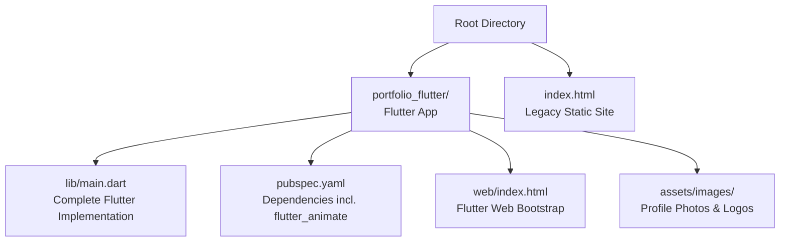
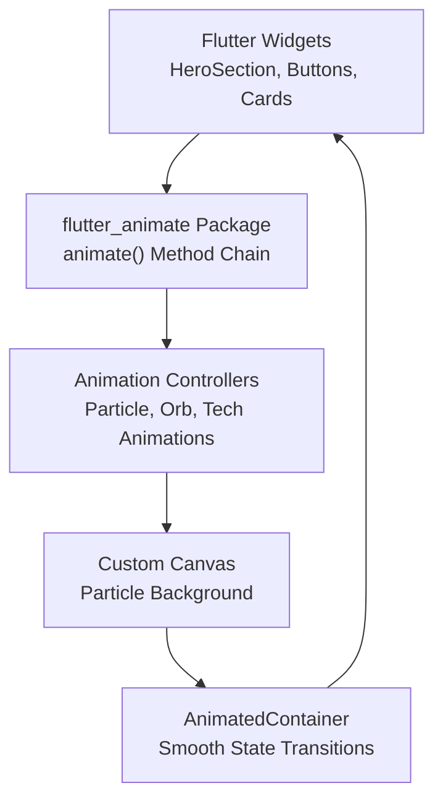
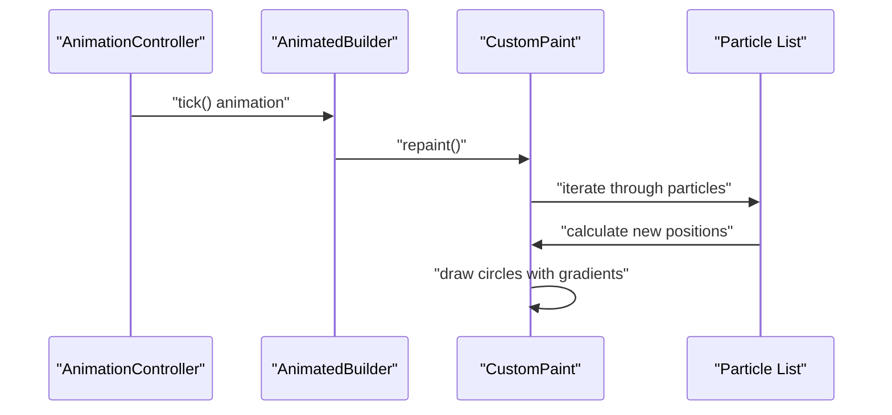
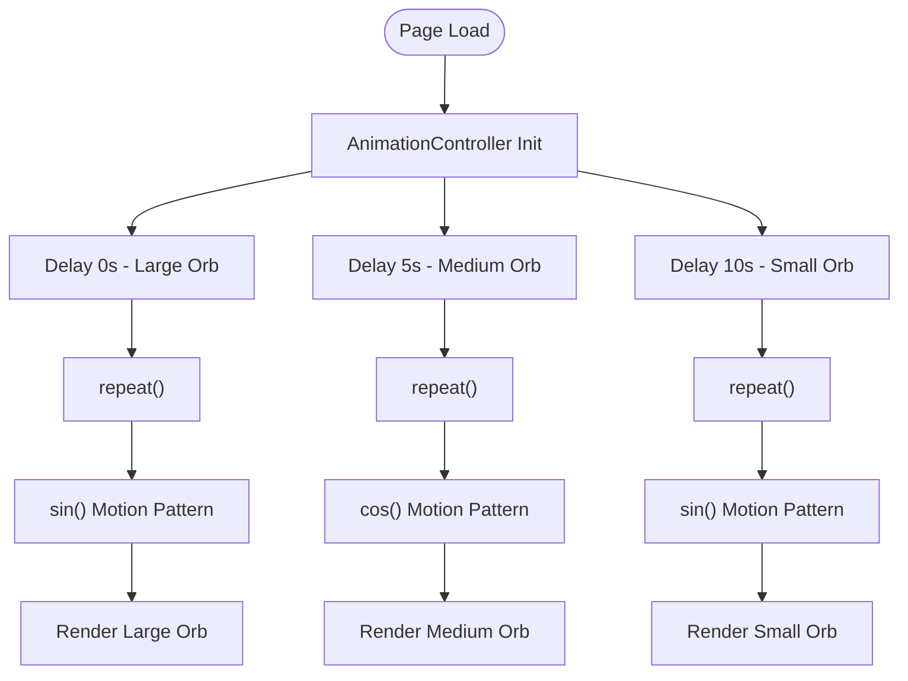
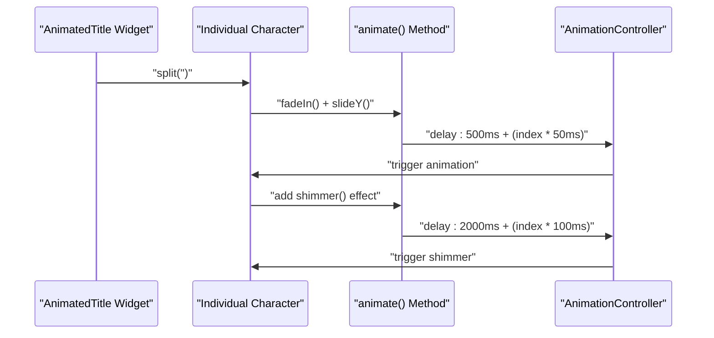
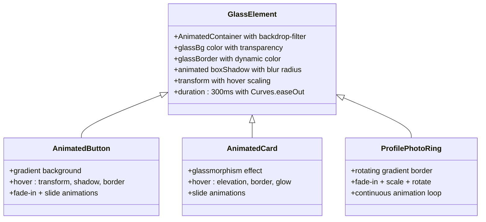
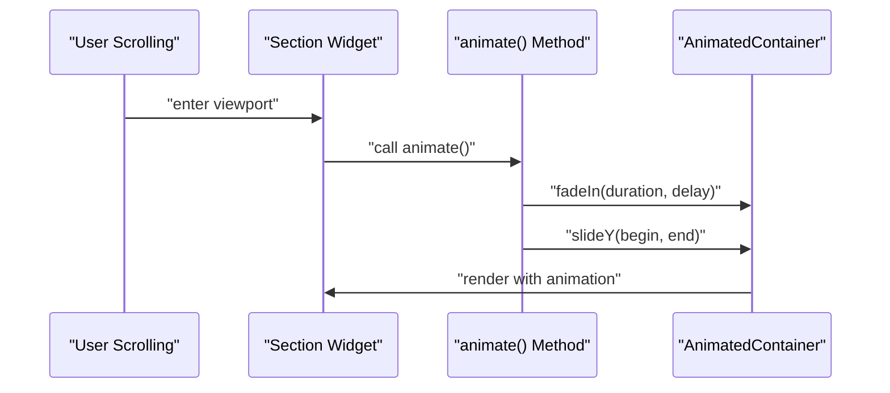
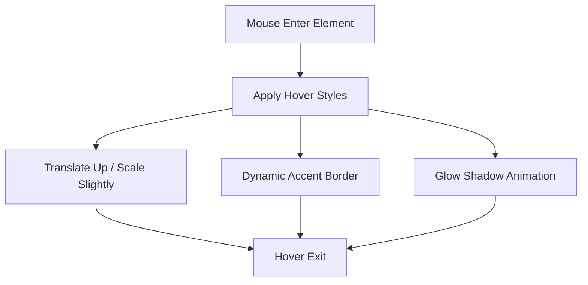
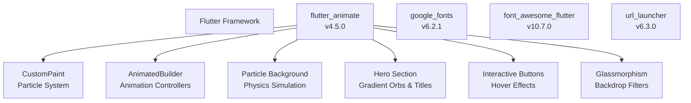

# Animation and Visual Effects

<cite>
**Referenced Files in This Document**
- [main.dart](file://portfolio_flutter/lib/main.dart)
- [pubspec.yaml](file://portfolio_flutter/pubspec.yaml)
- [web/index.html](file://portfolio_flutter/web/index.html)
- [index.html](file://index.html)
</cite>

## Update Summary
**Changes Made**
- Updated to reflect the complete migration from static HTML/CSS/JavaScript to Flutter-based implementation
- Documented comprehensive Flutter animation system using flutter_animate package
- Added detailed documentation for particle background system with custom painting
- Enhanced gradient orb animations with staggered timing and physics-based movement
- Documented sophisticated character-by-character title animations with shimmer effects
- Added comprehensive hover states with interactive button effects and micro-interactions
- Documented glassmorphism animations with backdrop filters and animated transitions
- Updated scroll-triggered animations using animate() method chains with staggered delays

## Table of Contents
1. [Introduction](#introduction)
2. [Project Structure](#project-structure)
3. [Core Components](#core-components)
4. [Architecture Overview](#architecture-overview)
5. [Detailed Component Analysis](#detailed-component-analysis)
6. [Dependency Analysis](#dependency-analysis)
7. [Performance Considerations](#performance-considerations)
8. [Troubleshooting Guide](#troubleshooting-guide)
9. [Conclusion](#conclusion)

## Introduction
This document explains the comprehensive animation and visual effects system implemented in the portfolio website. The system has been completely modernized from static HTML/CSS/JavaScript to a sophisticated Flutter-based implementation using the flutter_animate package. The animation system features:

- **Particle Background System**: Custom Canvas-based particle animation with physics-based movement
- **Enhanced Gradient Orbs**: Floating gradient orbs with staggered timing and sinusoidal motion
- **Sophisticated Character Animations**: Individual character animations with staggered delays and shimmer effects
- **Advanced Glassmorphism**: Backdrop blur, semi-transparent backgrounds, and dynamic glow effects
- **Interactive Hover States**: Comprehensive micro-interactions across all UI components with smooth transformations
- **Scroll-Triggered Animations**: AnimatedContainer-based animations with staggered entrance effects
- **Flutter Animation Pipeline**: Integration of Flutter widgets with flutter_animate package for dynamic motion design

## Project Structure
The portfolio has been completely migrated to a Flutter-based architecture with comprehensive animation support. The main application is built using Flutter widgets with the flutter_animate package for sophisticated motion design elements and custom particle systems.

**Diagram sources**
- [main.dart:1-2720](file://portfolio_flutter/lib/main.dart#L1-L2720)
- [pubspec.yaml:1-97](file://portfolio_flutter/pubspec.yaml#L1-L97)
- [web/index.html:1-39](file://portfolio_flutter/web/index.html#L1-L39)
- [index.html:1-1678](file://index.html#L1-L1678)

**Section sources**
- [main.dart:1-2720](file://portfolio_flutter/lib/main.dart#L1-L2720)
- [pubspec.yaml:1-97](file://portfolio_flutter/pubspec.yaml#L1-L97)
- [web/index.html:1-39](file://portfolio_flutter/web/index.html#L1-L39)
- [index.html:1-1678](file://index.html#L1-L1678)

## Core Components
- **Particle Background System**: Custom Canvas-based particle animation with physics simulation and gradient effects
- **Floating Gradient Orbs**: Animated gradient orbs with staggered timing and sinusoidal motion patterns
- **Character-by-Character Animations**: Individual character animations with staggered delays and shimmer effects
- **Glassmorphism Effects**: Backdrop blur, semi-transparent backgrounds, and dynamic glow shadows with animated transitions
- **Interactive Hover States**: Comprehensive micro-interactions across buttons, cards, and social links with animated transformations
- **Scroll-Triggered Animations**: AnimatedContainer-based animations with staggered entrance effects using animate() method chains
- **Profile Photo Ring**: Rotating gradient ring animation with scale and fade effects
- **Technology Showcase**: Animated tech logos with wave-like motion and hover interactions

**Section sources**
- [main.dart:356-448](file://portfolio_flutter/lib/main.dart#L356-L448)
- [main.dart:450-761](file://portfolio_flutter/lib/main.dart#L450-L761)
- [main.dart:763-788](file://portfolio_flutter/lib/main.dart#L763-L788)
- [main.dart:630-700](file://portfolio_flutter/lib/main.dart#L630-L700)
- [main.dart:188-259](file://portfolio_flutter/lib/main.dart#L188-L259)
- [main.dart:800-975](file://portfolio_flutter/lib/main.dart#L800-L975)

## Architecture Overview
The animation pipeline integrates Flutter widgets with the flutter_animate package for dynamic interactions. The system uses a combination of AnimatedBuilder, AnimationController, and custom painting for complex animations. The widget tree defines visual elements, AnimatedContainer provides smooth state transitions, and the animate() method chain applies sophisticated animations including fade-in, slide, and staggered character effects.

**Diagram sources**
- [main.dart:356-448](file://portfolio_flutter/lib/main.dart#L356-L448)
- [main.dart:450-761](file://portfolio_flutter/lib/main.dart#L450-L761)
- [main.dart:763-788](file://portfolio_flutter/lib/main.dart#L763-L788)

## Detailed Component Analysis

### Particle Background System
The particle background creates a dynamic, interactive canvas with 30 randomly generated particles that move with physics-based animation. Each particle has unique properties including position, size, speed, and opacity.

**Diagram sources**
- [main.dart:356-448](file://portfolio_flutter/lib/main.dart#L356-L448)

Implementation highlights:
- **Physics Simulation**: Each particle moves with velocity vectors and boundary wrapping
- **Random Generation**: 30 particles generated with random positions, speeds, and opacities
- **Custom Painting**: Uses CustomPainter for efficient canvas drawing
- **Animation Loop**: 10-second duration controller with repeat() for continuous animation
- **Performance Optimized**: Single repaint cycle per animation frame

**Section sources**
- [main.dart:356-448](file://portfolio_flutter/lib/main.dart#L356-L448)

### Floating Gradient Orbs
The hero section features three animated gradient orbs with staggered timing and sinusoidal motion patterns. Each orb has unique size, color, and delay properties.

**Diagram sources**
- [main.dart:702-761](file://portfolio_flutter/lib/main.dart#L702-L761)

Implementation highlights:
- **Staggered Timing**: 5-second delays between each orb animation
- **Physics-Based Movement**: Sinusoidal motion with amplitude and frequency control
- **Color Gradients**: Each orb uses unique accent colors with alpha transparency
- **Responsive Sizing**: Orb sizes scale with screen dimensions
- **Independent Controllers**: Each orb has its own AnimationController for precise control

**Section sources**
- [main.dart:702-761](file://portfolio_flutter/lib/main.dart#L702-L761)

### Character-by-Character Animations
The title animation breaks down the full name into individual characters with staggered delays and combined effects including fade-in, slide, and shimmer animations.

**Diagram sources**
- [main.dart:763-788](file://portfolio_flutter/lib/main.dart#L763-L788)

Implementation highlights:
- **Staggered Delays**: 50ms intervals between character animations
- **Combined Effects**: Fade-in, slide-down, and shimmer effects applied sequentially
- **Responsive Typography**: Font size adjusts based on screen width
- **Character Spacing**: Non-breaking spaces for proper spacing in wrapped layout
- **Performance Optimization**: Single animation controller manages all character animations

**Section sources**
- [main.dart:763-788](file://portfolio_flutter/lib/main.dart#L763-L788)

### Glassmorphism Animations and Shadow Effects
Glassmorphism is achieved through animated backdrop blur, semi-transparent backgrounds, and dynamic glow shadows. All elements use AnimatedContainer for smooth state transitions with sophisticated hover interactions.

**Diagram sources**
- [main.dart:630-700](file://portfolio_flutter/lib/main.dart#L630-L700)
- [main.dart:800-975](file://portfolio_flutter/lib/main.dart#L800-L975)
- [main.dart:1075-1130](file://portfolio_flutter/lib/main.dart#L1075-L1130)

**Section sources**
- [main.dart:630-700](file://portfolio_flutter/lib/main.dart#L630-L700)
- [main.dart:800-975](file://portfolio_flutter/lib/main.dart#L800-L975)
- [main.dart:1075-1130](file://portfolio_flutter/lib/main.dart#L1075-L1130)

### Scroll-Triggered Animations
The animate() method chain applies fade-in and slide effects with staggered delays to create sequential entrance animations across multiple elements. Each section uses the animate() extension method for consistent animation behavior.

**Diagram sources**
- [main.dart:1028](file://portfolio_flutter/lib/main.dart#L1028)
- [main.dart:1483](file://portfolio_flutter/lib/main.dart#L1483)
- [main.dart:1772](file://portfolio_flutter/lib/main.dart#L1772)

Implementation highlights:
- **Consistent Animation API**: All sections use animate() method chain for uniform behavior
- **Staggered Delays**: Sequential delays create smooth entrance cascades
- **Multiple Effects**: Combined fadeIn(), slideY(), and slideX() animations
- **Responsive Timing**: Animation durations adjust based on element complexity
- **Performance Optimized**: Single animation controller per section for efficient rendering

**Section sources**
- [main.dart:1028](file://portfolio_flutter/lib/main.dart#L1028)
- [main.dart:1483](file://portfolio_flutter/lib/main.dart#L1483)
- [main.dart:1772](file://portfolio_flutter/lib/main.dart#L1772)

### Interactive Hover States and Micro-Interactions
Comprehensive hover states provide immediate feedback across all interactive elements with smooth animated transformations including translation, scaling, and color transitions.

**Diagram sources**
- [main.dart:800-975](file://portfolio_flutter/lib/main.dart#L800-L975)
- [main.dart:1075-1130](file://portfolio_flutter/lib/main.dart#L1075-L1130)
- [main.dart:1600-1774](file://portfolio_flutter/lib/main.dart#L1600-L1774)

**Section sources**
- [main.dart:800-975](file://portfolio_flutter/lib/main.dart#L800-L975)
- [main.dart:1075-1130](file://portfolio_flutter/lib/main.dart#L1075-L1130)
- [main.dart:1600-1774](file://portfolio_flutter/lib/main.dart#L1600-L1774)

## Dependency Analysis
The Flutter implementation leverages the flutter_animate package extensively for comprehensive animation support alongside standard Flutter components and third-party libraries.

**Diagram sources**
- [pubspec.yaml:30-40](file://portfolio_flutter/pubspec.yaml#L30-L40)
- [main.dart:356-448](file://portfolio_flutter/lib/main.dart#L356-L448)

**Section sources**
- [pubspec.yaml:30-40](file://portfolio_flutter/pubspec.yaml#L30-L40)
- [main.dart:356-448](file://portfolio_flutter/lib/main.dart#L356-L448)

## Performance Considerations
- **GPU Acceleration**: CustomPaint and AnimatedBuilder leverage GPU acceleration for smooth animations
- **Animation Optimization**: Strategic use of staggered delays prevents overwhelming the UI thread
- **Memory Management**: Proper disposal of AnimationController instances prevents memory leaks
- **Canvas Efficiency**: Single CustomPaint instance handles all particle rendering efficiently
- **Responsive Design**: Animations adapt to different screen sizes and device capabilities
- **Lazy Loading**: Complex animations are triggered on-demand rather than during initial render
- **State Management**: Efficient setState usage minimizes rebuild cycles during animations
- **Asset Optimization**: Images are loaded asynchronously to prevent blocking animations

## Troubleshooting Guide
Common issues and resolutions:
- **Animation not triggering**: Ensure flutter_animate is properly imported and animate() method is chained correctly
- **Particle rendering issues**: Verify CustomPaint is properly sized and animation controller is disposed
- **Gradient orb positioning**: Check screen dimension calculations and animation timing
- **Character animation stuttering**: Reduce staggered animation count or adjust delay intervals
- **Navigation scroll issues**: Verify section keys are properly defined and Scrollable.ensureVisible is configured correctly
- **Glassmorphism rendering problems**: Check backdrop-filter support and validate color transparency values
- **Animation performance**: Monitor frame rates and consider reducing particle count or animation complexity
- **Asset loading errors**: Implement error builders for missing images in project cards

**Section sources**
- [main.dart:356-448](file://portfolio_flutter/lib/main.dart#L356-L448)
- [main.dart:702-761](file://portfolio_flutter/lib/main.dart#L702-L761)

## Conclusion
The portfolio's animation and visual effects system represents a comprehensive migration to Flutter with sophisticated motion design capabilities. The system successfully integrates custom particle backgrounds, floating gradient orbs, character-by-character animations, and interactive hover states. The flutter_animate package enables seamless integration of complex animations including fade-in effects, slide animations, staggered entrances, and shimmer effects. The glassmorphism styling with backdrop filters, smooth scrolling behavior, and comprehensive hover interactions create a cohesive and performant interface that showcases both technical proficiency and aesthetic design principles. The modern Flutter architecture provides excellent foundation for future animation enhancements and maintains optimal performance across various devices and platforms.