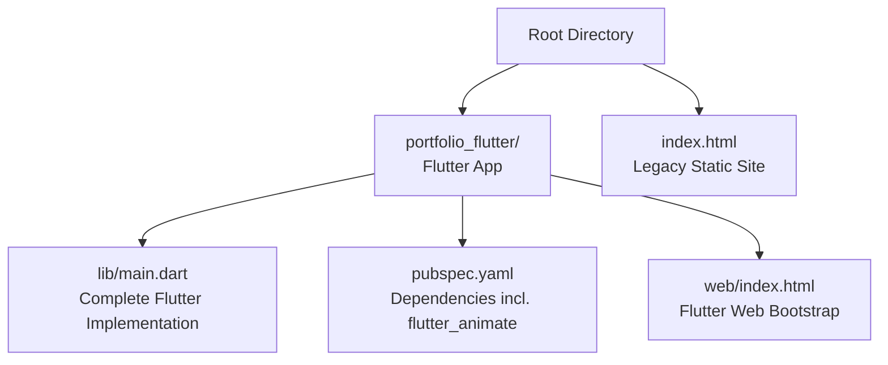
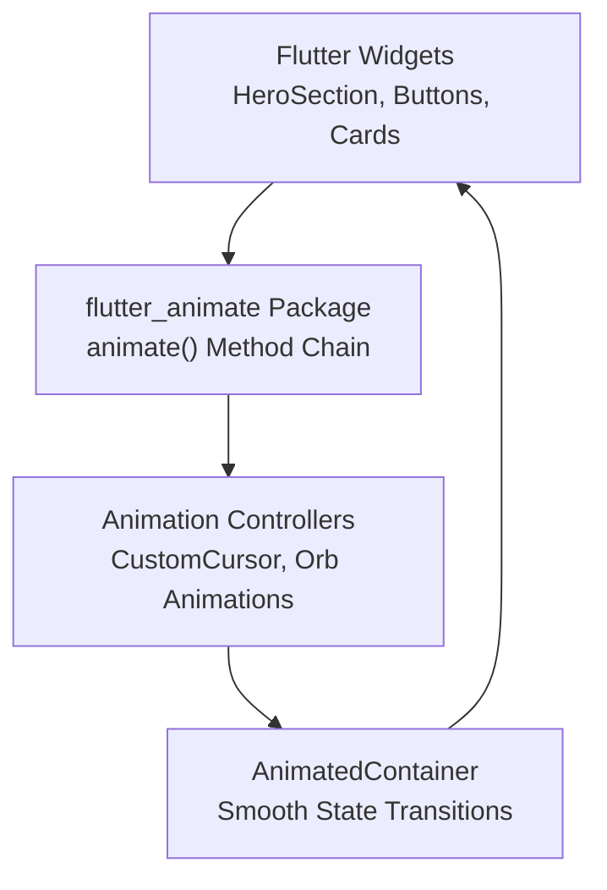
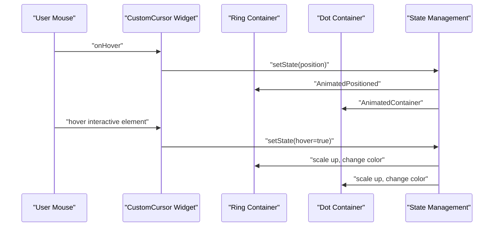
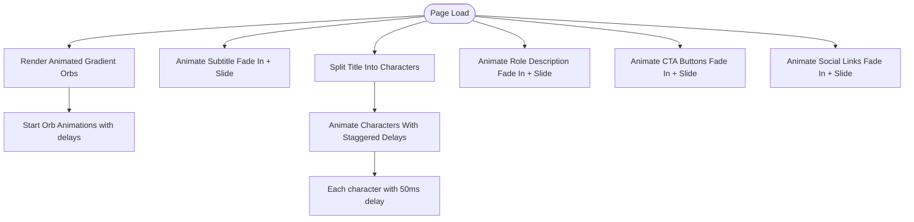
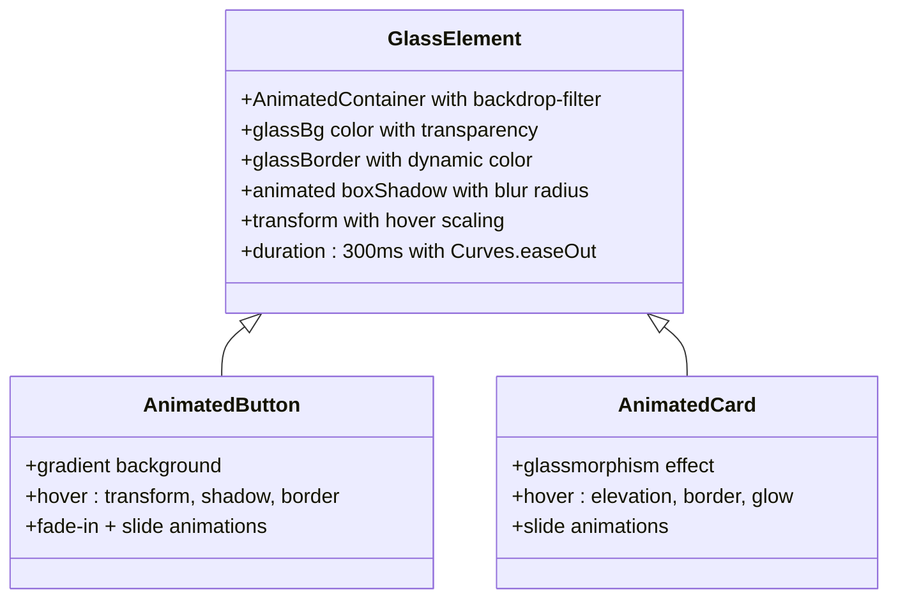
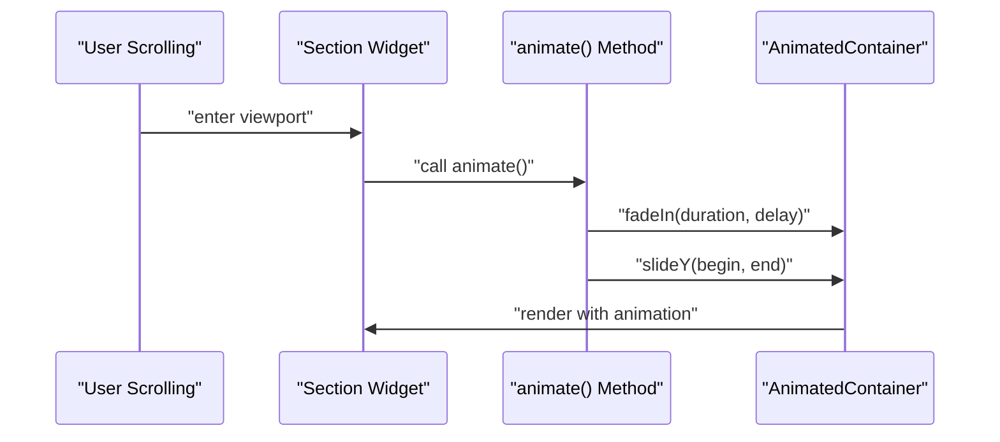
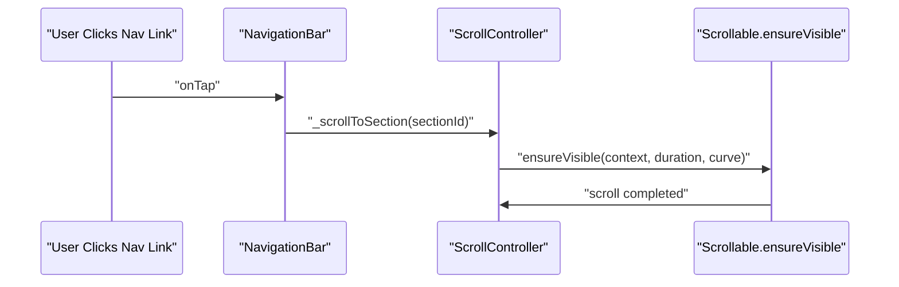
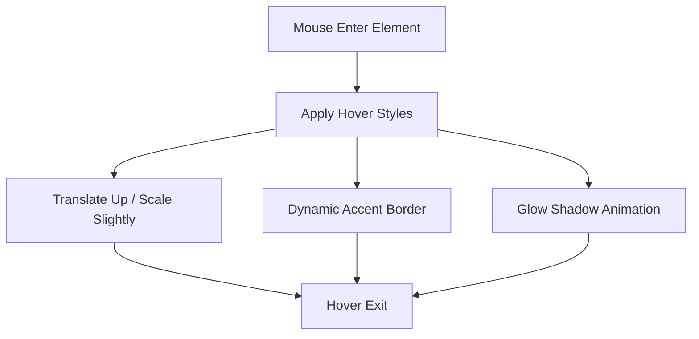
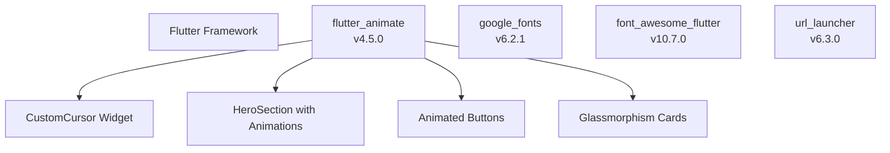

# Animation and Visual Effects

<cite>
**Referenced Files in This Document**
- [index.html](file://index.html)
- [main.dart](file://portfolio_flutter/lib/main.dart)
- [pubspec.yaml](file://portfolio_flutter/pubspec.yaml)
- [web/index.html](file://portfolio_flutter/web/index.html)
</cite>

## Update Summary
**Changes Made**
- Updated to reflect the migration from static HTML/CSS/JavaScript to Flutter-based implementation
- Added comprehensive documentation for Flutter animation system using flutter_animate package
- Documented character-by-character title animations with staggered delays
- Added fade-in and slide animations throughout the interface
- Updated hover states with interactive cursor effects
- Enhanced glassmorphism animations with animated transitions
- Documented scroll-triggered animations using AnimatedContainer and animate() methods

## Table of Contents
1. [Introduction](#introduction)
2. [Project Structure](#project-structure)
3. [Core Components](#core-components)
4. [Architecture Overview](#architecture-overview)
5. [Detailed Component Analysis](#detailed-component-analysis)
6. [Dependency Analysis](#dependency-analysis)
7. [Performance Considerations](#performance-considerations)
8. [Troubleshooting Guide](#troubleshooting-guide)
9. [Conclusion](#conclusion)

## Introduction
This document explains the animation and visual effects system implemented in the portfolio website. The system has been migrated from static HTML/CSS/JavaScript to a comprehensive Flutter-based implementation using the flutter_animate package. It focuses on:
- Custom cursor with dual-layer effects and magnetic interactions
- Smooth scrolling behavior with programmatic navigation
- Hero section animations: character-by-character reveal, floating gradient orbs, and staggered entrance effects
- Glassmorphism animations, shadow effects, and transition timing functions
- Scroll-triggered animations using AnimatedContainer and animate() methods
- Interactive hover states with micro-interactions across all UI components
- Guidance on performance optimization and browser compatibility

## Project Structure
The portfolio has been migrated to a Flutter-based architecture with comprehensive animation support. The main application is built using Flutter widgets with the flutter_animate package for sophisticated motion design elements.

**Diagram sources**
- [main.dart:1-2402](file://portfolio_flutter/lib/main.dart#L1-L2402)
- [pubspec.yaml:1-94](file://portfolio_flutter/pubspec.yaml#L1-L94)
- [web/index.html:1-39](file://portfolio_flutter/web/index.html#L1-L39)
- [index.html:1-1678](file://index.html#L1-L1678)

**Section sources**
- [main.dart:1-2402](file://portfolio_flutter/lib/main.dart#L1-L2402)
- [pubspec.yaml:1-94](file://portfolio_flutter/pubspec.yaml#L1-L94)
- [web/index.html:1-39](file://portfolio_flutter/web/index.html#L1-L39)
- [index.html:1-1678](file://index.html#L1-L1678)

## Core Components
- **Custom Cursor**: Dual-layer ring and dot with smooth tracking, hover scaling, and magnetic pull on interactive elements
- **Hero Section**: Floating gradient orbs, staggered entrance animations, and character-by-character reveal using flutter_animate
- **Glassmorphism**: Backdrop blur, borders, and subtle glow shadows with animated transitions
- **Scroll-triggered Animations**: AnimatedContainer-based reveal for content sections using animate() methods
- **Smooth Scrolling**: Programmatic smooth scroll for navigation anchors with custom curves
- **Hover States**: Comprehensive micro-interactions across buttons, cards, and social links with animated transformations
- **Character-by-character Animations**: Individual character animations with staggered delays for typographic effects

**Section sources**
- [main.dart:188-259](file://portfolio_flutter/lib/main.dart#L188-L259)
- [main.dart:400-541](file://portfolio_flutter/lib/main.dart#L400-L541)
- [main.dart:615-644](file://portfolio_flutter/lib/main.dart#L615-L644)
- [main.dart:837-878](file://portfolio_flutter/lib/main.dart#L837-L878)
- [main.dart:1056-1105](file://portfolio_flutter/lib/main.dart#L1056-L1105)
- [main.dart:188-259](file://portfolio_flutter/lib/main.dart#L188-L259)

## Architecture Overview
The animation pipeline integrates Flutter widgets with the flutter_animate package for dynamic interactions. The widget tree defines the visual elements, AnimatedContainer provides smooth state transitions, and the animate() method chain applies sophisticated animations including fade-in, slide, and staggered character effects.

**Diagram sources**
- [main.dart:400-541](file://portfolio_flutter/lib/main.dart#L400-L541)
- [main.dart:615-644](file://portfolio_flutter/lib/main.dart#L615-L644)
- [main.dart:188-259](file://portfolio_flutter/lib/main.dart#L188-L259)

## Detailed Component Analysis

### Custom Cursor Implementation
The cursor comprises two overlapping elements: a ring and a small dot. They track the mouse with different easing factors for a trailing effect. On hover over interactive elements, the cursor scales up and changes color. Interactive elements also receive a subtle magnetic translation to draw attention.

**Diagram sources**
- [main.dart:188-259](file://portfolio_flutter/lib/main.dart#L188-L259)

Implementation highlights:
- Dual-layer cursor with distinct easing for ring and dot using AnimatedPositioned and AnimatedContainer
- Hover scaling and color change via AnimatedContainer with gradient borders
- Magnetic effect on interactive elements with transform-based translation
- Graceful degradation on mobile devices with conditional rendering

**Section sources**
- [main.dart:188-259](file://portfolio_flutter/lib/main.dart#L188-L259)

### Hero Section Animations
The hero section combines floating gradient orbs with staggered delays and character-by-character reveal animations. The title uses individual character animations with staggered delays for a typewriter effect.

**Diagram sources**
- [main.dart:400-541](file://portfolio_flutter/lib/main.dart#L400-L541)
- [main.dart:615-644](file://portfolio_flutter/lib/main.dart#L615-L644)

Implementation highlights:
- Orb animations use AnimationController with sine/cosine wave transforms and staggered delays
- Character reveal splits text into spans and animates each with 50ms delay increments
- Fade-in and slide animations use animate() method chain with duration and delay parameters
- Responsive typography adjusts font sizes based on screen dimensions

**Section sources**
- [main.dart:400-541](file://portfolio_flutter/lib/main.dart#L400-L541)
- [main.dart:615-644](file://portfolio_flutter/lib/main.dart#L615-L644)

### Glassmorphism Animations and Shadow Effects
Glassmorphism is achieved through animated backdrop blur, semi-transparent backgrounds, and dynamic glow shadows. All elements use AnimatedContainer for smooth state transitions.

**Diagram sources**
- [main.dart:646-776](file://portfolio_flutter/lib/main.dart#L646-L776)
- [main.dart:837-878](file://portfolio_flutter/lib/main.dart#L837-L878)
- [main.dart:1056-1105](file://portfolio_flutter/lib/main.dart#L1056-L1105)

**Section sources**
- [main.dart:646-776](file://portfolio_flutter/lib/main.dart#L646-L776)
- [main.dart:837-878](file://portfolio_flutter/lib/main.dart#L837-L878)
- [main.dart:1056-1105](file://portfolio_flutter/lib/main.dart#L1056-L1105)

### Scroll-Triggered Animations
AnimatedContainer-based animations provide smooth transitions for content sections. The animate() method chain applies fade-in and slide effects with staggered delays.

**Diagram sources**
- [main.dart:837-878](file://portfolio_flutter/lib/main.dart#L837-L878)
- [main.dart:1056-1105](file://portfolio_flutter/lib/main.dart#L1056-L1105)
- [main.dart:1341](file://portfolio_flutter/lib/main.dart#L1341)

Implementation highlights:
- Fade-in animations use animate().fadeIn() with configurable duration and delay
- Slide animations use animate().slideY() or animate().slideX() for directional effects
- Staggered animations create sequential entrance effects across multiple elements
- Smooth transitions use Curves.easeOut for natural motion

**Section sources**
- [main.dart:837-878](file://portfolio_flutter/lib/main.dart#L837-L878)
- [main.dart:1056-1105](file://portfolio_flutter/lib/main.dart#L1056-L1105)
- [main.dart:1341](file://portfolio_flutter/lib/main.dart#L1341)

### Smooth Scrolling Behavior
Programmatic smooth scrolling is implemented using Scrollable.ensureVisible with custom curves and durations for precise navigation.

**Diagram sources**
- [main.dart:104-113](file://portfolio_flutter/lib/main.dart#L104-L113)

**Section sources**
- [main.dart:104-113](file://portfolio_flutter/lib/main.dart#L104-L113)

### Hover States and Micro-Interactions
Comprehensive hover states provide immediate feedback across all interactive elements with smooth animated transformations.

**Diagram sources**
- [main.dart:646-776](file://portfolio_flutter/lib/main.dart#L646-L776)
- [main.dart:837-878](file://portfolio_flutter/lib/main.dart#L837-L878)
- [main.dart:1056-1105](file://portfolio_flutter/lib/main.dart#L1056-L1105)

**Section sources**
- [main.dart:646-776](file://portfolio_flutter/lib/main.dart#L646-L776)
- [main.dart:837-878](file://portfolio_flutter/lib/main.dart#L837-L878)
- [main.dart:1056-1105](file://portfolio_flutter/lib/main.dart#L1056-L1105)

## Dependency Analysis
The Flutter implementation leverages the flutter_animate package extensively for comprehensive animation support. The dependency structure includes animation-specific packages alongside standard Flutter components.

**Diagram sources**
- [pubspec.yaml:30-40](file://portfolio_flutter/pubspec.yaml#L30-L40)
- [main.dart:6](file://portfolio_flutter/lib/main.dart#L6)

**Section sources**
- [pubspec.yaml:30-40](file://portfolio_flutter/pubspec.yaml#L30-L40)
- [main.dart:6](file://portfolio_flutter/lib/main.dart#L6)

## Performance Considerations
- **GPU Acceleration**: Prefer AnimatedContainer and AnimatedBuilder for hardware-accelerated animations
- **Animation Optimization**: Use staggered delays judiciously to avoid overwhelming the UI thread
- **Memory Management**: Dispose AnimationController instances properly to prevent memory leaks
- **Responsive Design**: Font sizes and animations adapt to different screen sizes for optimal performance
- **Lazy Loading**: Complex animations are triggered on-demand rather than during initial render
- **State Management**: Efficient setState usage minimizes rebuild cycles during animations
- **Testing**: Validate animations across different devices and browsers for consistent performance

## Troubleshooting Guide
Common issues and resolutions:
- **Animation not triggering**: Ensure flutter_animate is properly imported and animate() method is chained correctly
- **Cursor not visible on mobile**: The implementation automatically hides custom cursor on screens smaller than 768px
- **Staggered animations stuttering**: Reduce the number of simultaneous animations or increase delay intervals
- **Navigation scroll issues**: Verify section keys are properly defined and Scrollable.ensureVisible is configured correctly
- **Glassmorphism rendering problems**: Check backdrop-filter support and validate color transparency values
- **Animation performance**: Monitor frame rates and consider reducing animation complexity on lower-end devices

**Section sources**
- [main.dart:208-210](file://portfolio_flutter/lib/main.dart#L208-L210)
- [main.dart:104-113](file://portfolio_flutter/lib/main.dart#L104-L113)

## Conclusion
The portfolio's animation and visual effects system represents a comprehensive migration to Flutter with sophisticated motion design capabilities. The flutter_animate package enables character-by-character title animations, fade-in effects, slide animations, and interactive hover states with custom cursor effects. The system successfully blends modern Flutter architecture with targeted animation techniques to deliver a polished, immersive experience. The glassmorphism styling, smooth scrolling behavior, and comprehensive hover interactions create a cohesive and performant interface that showcases both technical proficiency and aesthetic design principles.