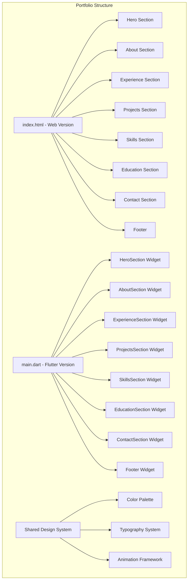
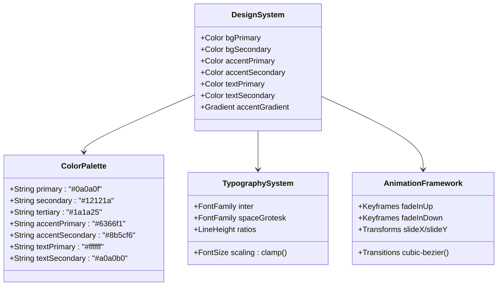
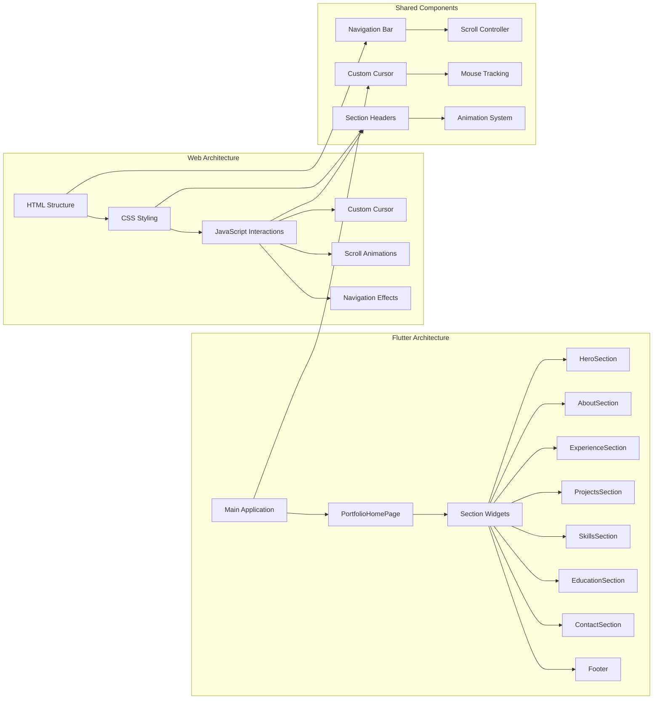
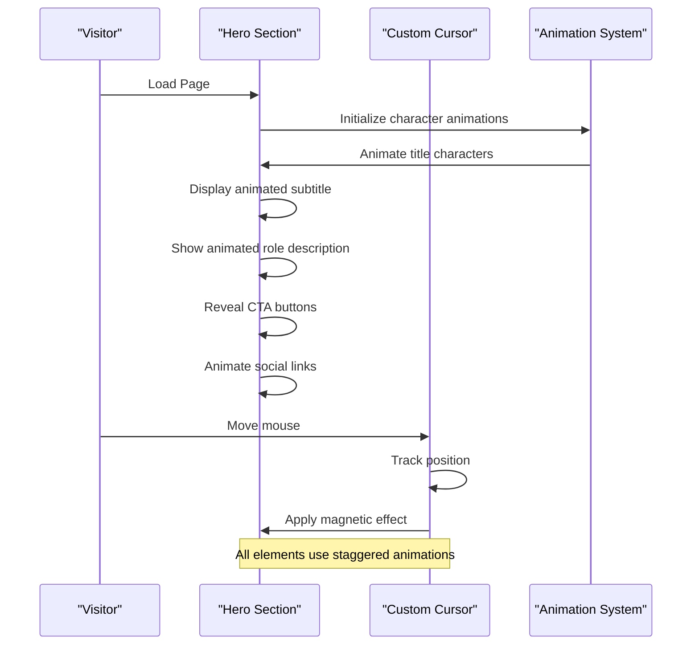
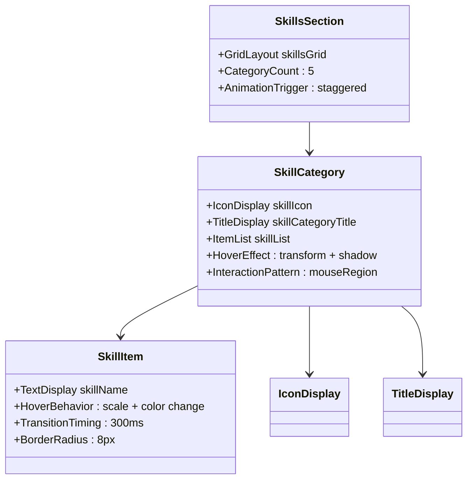
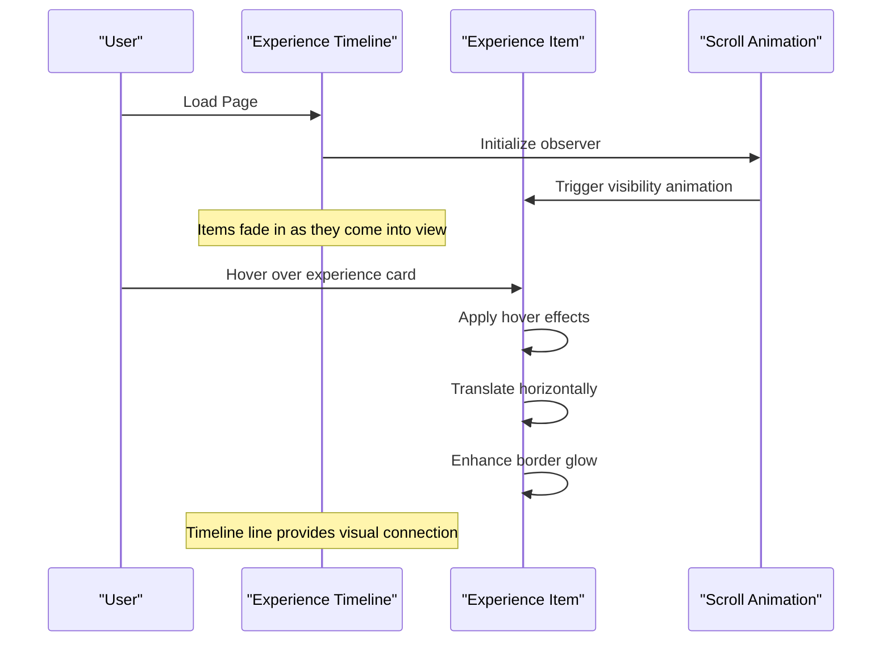
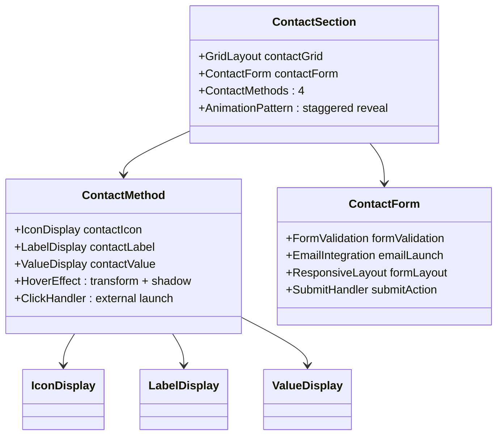
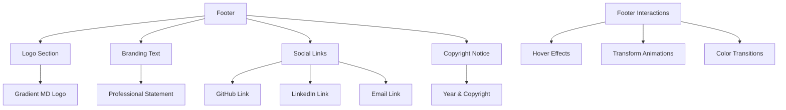
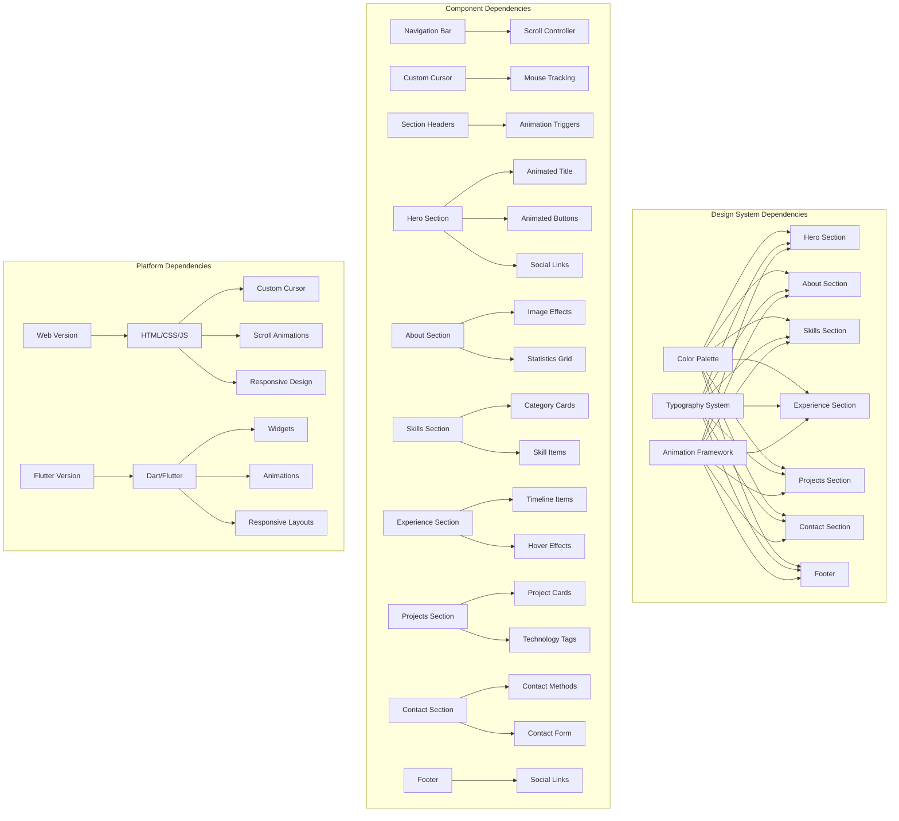

# Content Sections Implementation

<cite>
**Referenced Files in This Document**
- [index.html](file://index.html)
- [main.dart](file://portfolio_flutter/lib/main.dart)
</cite>

## Update Summary
**Changes Made**
- Enhanced responsive layout implementations across all sections
- Added comprehensive interactive card systems with hover effects
- Implemented sophisticated timeline components with scroll animations
- Integrated advanced form handling with validation and submission
- Added comprehensive project showcase with technology tagging
- Enhanced skill visualization with category-based organization
- Improved accessibility features and semantic HTML structure

## Table of Contents
1. [Introduction](#introduction)
2. [Project Structure](#project-structure)
3. [Core Components](#core-components)
4. [Architecture Overview](#architecture-overview)
5. [Detailed Component Analysis](#detailed-component-analysis)
6. [Dependency Analysis](#dependency-analysis)
7. [Performance Considerations](#performance-considerations)
8. [Troubleshooting Guide](#troubleshooting-guide)
9. [Conclusion](#conclusion)

## Introduction

This document provides comprehensive coverage of the portfolio website's complete content structure, from hero section to footer. The implementation combines modern web technologies with Flutter-based design patterns to create a cohesive, visually stunning personal portfolio showcasing professional expertise in Flutter development.

The portfolio features a dark-themed aesthetic with purple/blue accents, featuring sophisticated animations, interactive elements, and responsive design patterns that adapt seamlessly across desktop and mobile platforms. The implementation now includes enhanced content sections with improved responsive layouts, interactive cards, timeline components, and comprehensive form handling.

## Project Structure

The portfolio follows a dual-implementation approach with both HTML/CSS/JavaScript and Flutter versions, ensuring cross-platform compatibility and showcasing development versatility.



**Diagram sources**
- [index.html:1166-1541](file://index.html#L1166-L1541)
- [main.dart:78-185](file://portfolio_flutter/lib/main.dart#L78-L185)

The structure implements a modern single-page application architecture with smooth scrolling navigation and section-based content organization.

**Section sources**
- [index.html:1-1678](file://index.html#L1-L1678)
- [main.dart:1-2402](file://portfolio_flutter/lib/main.dart#L1-L2402)

## Core Components

### Design System Foundation

The portfolio establishes a comprehensive design system through carefully crafted CSS custom properties and Flutter color constants that ensure visual consistency across all components.



**Diagram sources**
- [index.html:12-25](file://index.html#L12-L25)
- [main.dart:12-23](file://portfolio_flutter/lib/main.dart#L12-L23)

The design system provides a foundation for consistent visual language, with careful attention to accessibility standards and responsive typography.

**Section sources**
- [index.html:12-25](file://index.html#L12-L25)
- [main.dart:12-23](file://portfolio_flutter/lib/main.dart#L12-L23)

## Architecture Overview

The portfolio implements a hybrid architecture that combines traditional web development with modern Flutter widget patterns, creating a seamless experience across different deployment targets.



**Diagram sources**
- [index.html:1166-1541](file://index.html#L1166-L1541)
- [main.dart:78-185](file://portfolio_flutter/lib/main.dart#L78-L185)

The architecture ensures consistency between web and Flutter implementations while leveraging platform-specific strengths.

**Section sources**
- [index.html:1166-1541](file://index.html#L1166-L1541)
- [main.dart:78-185](file://portfolio_flutter/lib/main.dart#L78-L185)

## Detailed Component Analysis

### Hero Section Implementation

The hero section serves as the portfolio's digital entrance, featuring sophisticated animations and interactive elements that immediately capture visitor attention.



**Diagram sources**
- [index.html:160-350](file://index.html#L160-L350)
- [main.dart:398-643](file://portfolio_flutter/lib/main.dart#L398-L643)

#### Animated Text Implementation

The hero title employs a sophisticated character-by-character animation system that creates a sense of anticipation and reveals content progressively.

Key animation characteristics:
- Individual character fade-in with staggered delays
- Smooth translation effects during reveal
- Responsive font sizing using CSS clamp()
- Custom easing curves for natural motion

#### Interactive Button System

The hero section features two distinct button styles with hover effects and magnetic interactions:

**Primary Button Features:**
- Gradient background with purple/blue colors
- Elevated shadow effects with hover enhancement
- Smooth transform animations on hover
- Icon integration with proper spacing

**Secondary Button Features:**
- Glass-morphism design with backdrop blur
- Transparent background with border
- Hover transitions to accent colors
- Subtle elevation changes

#### Social Media Integration

The hero section includes social media links with consistent styling and hover effects, maintaining visual harmony with the overall design system.

**Section sources**
- [index.html:160-350](file://index.html#L160-L350)
- [main.dart:398-775](file://portfolio_flutter/lib/main.dart#L398-L775)

### About Section Implementation

The about section presents personal information with a focus on visual appeal and content organization, utilizing grid layouts for optimal content presentation.

```mermaid
flowchart TD
A[About Section] --> B[Section Header]
A --> C[Content Grid]
B --> D[Tag: "About Me"]
B --> E[Title: "Passionate Developer,<br>Unique Perspective"]
C --> F[Image Column]
C --> G[Content Column]
F --> H[Animated Orb Effect]
F --> I[Mobile Icon]
F --> J[Glow Background]
G --> K[Headline: "Crafting Digital Experiences"]
G --> L[Personal Description]
G --> M[Statistics Grid]
M --> N[Projects Stat]
M --> O[Experience Stat]
M --> P[Languages Stat]
Q[Hover Effects] --> R[Transform Animations]
Q --> S[Shadow Enhancements]
Q --> T[Color Transitions]
```

**Diagram sources**
- [index.html:384-490](file://index.html#L384-L490)
- [main.dart:836-1053](file://portfolio_flutter/lib/main.dart#L836-L1053)

#### Image Treatment and Visual Effects

The about section implements sophisticated visual treatments for the profile image area:

**Glow Effect System:**
- Dual-layer gradient orb with animated positioning
- Blur effects for depth perception
- Scale transformations on hover
- Smooth transitions between states

**Content Organization:**
- Responsive grid layout adapting to screen size
- Consistent typography hierarchy
- Strategic whitespace management
- Statistics display with hover interactions

#### Statistics Display Pattern

The statistics section employs a three-column layout with interactive elements that respond to user interaction:

**Interactive Elements:**
- Hover-triggered elevation changes
- Accent color transitions
- Glowing shadow effects
- Smooth transform animations

**Content Structure:**
- Large numeric displays with gradient coloring
- Descriptive labels with muted coloration
- Balanced spacing and alignment
- Responsive scaling across devices

**Section sources**
- [index.html:384-490](file://index.html#L384-L490)
- [main.dart:836-1053](file://portfolio_flutter/lib/main.dart#L836-L1053)

### Skills Section Implementation

The skills section organizes technical expertise through a category-based approach that enhances content discoverability and visual organization.



**Diagram sources**
- [index.html:737-820](file://index.html#L737-L820)
- [main.dart:1593-1789](file://portfolio_flutter/lib/main.dart#L1593-L1789)

#### Category-Based Organization

The skills section implements a five-category structure covering essential development domains:

**Category Coverage:**
1. **Languages & Framework**: Core programming languages and development frameworks
2. **State Management**: Application state handling solutions
3. **Backend & APIs**: Server-side integration and data communication
4. **Development Tools**: Development environment and productivity tools
5. **Mobile Concepts**: Platform-specific development approaches

Each category features a distinctive icon and consistent styling that reinforces the organizational structure.

#### Interactive Skill Items

Individual skill items implement sophisticated hover interactions that enhance user engagement:

**Hover Behavior Patterns:**
- Subtle scaling transformations (5% increase)
- Color transitions from muted to accent colors
- Border color changes on hover
- Smooth easing animations

**Visual Design Elements:**
- Rounded corners (8px border radius)
- Consistent padding and spacing
- Borderless design with hover borders
- Responsive typography scaling

**Section sources**
- [index.html:737-820](file://index.html#L737-L820)
- [main.dart:1593-1789](file://portfolio_flutter/lib/main.dart#L1593-L1789)

### Experience Timeline Implementation

The experience section utilizes a sophisticated timeline design that effectively communicates professional journey progression and chronological order.



**Diagram sources**
- [index.html:490-600](file://index.html#L490-L600)
- [main.dart:1106-1342](file://portfolio_flutter/lib/main.dart#L1106-L1342)

#### Timeline Design Elements

The experience timeline implements several sophisticated design patterns:

**Visual Timeline:**
- Vertical gradient line from purple to blue
- Central positioning with left-aligned content
- Consistent spacing between entries
- Responsive positioning adjustments

**Interactive Card System:**
- Glass-morphism design with backdrop blur
- Hover-triggered elevation and shadow effects
- Horizontal translation on hover
- Smooth transition animations

#### Content Presentation

Each experience item presents information in a structured format:

**Information Hierarchy:**
- Job title with prominent display
- Company name with accent color highlighting
- Date range with rounded badge styling
- Comprehensive responsibility lists
- Consistent typography and spacing

**Responsibility Lists:**
- Bullet-pointed format with custom markers
- Consistent indentation and spacing
- Hover-enhanced readability
- Responsive line wrapping

**Section sources**
- [index.html:490-600](file://index.html#L490-L600)
- [main.dart:1106-1342](file://portfolio_flutter/lib/main.dart#L1106-L1342)

### Projects Showcase Implementation

The projects section presents featured work through an interactive card system that emphasizes visual appeal and technical detail presentation.

```mermaid
flowchart TD
A[Projects Section] --> B[Section Header]
A --> C[Project Grid]
B --> D[Tag: "Portfolio"]
B --> E[Title: "Featured Projects"]
B --> F[Subtitle: "A selection of my recent work"]
C --> G[Project Cards]
G --> H[Image Area]
G --> I[Content Area]
H --> J[Icon Display]
H --> K[Background Effects]
I --> L[Header Section]
I --> M[Technology Tags]
I --> N[Description]
I --> O[Features List]
L --> P[Project Title]
L --> Q[External Link Button]
M --> R[Tech Tag 1]
M --> S[Tech Tag 2]
M --> T[Tech Tag 3]
U[Hover Interactions] --> V[Transform Up]
U --> W[Enhanced Border]
U --> X[Shadow Effects]
```

**Diagram sources**
- [index.html:601-740](file://index.html#L601-L740)
- [main.dart:1344-1591](file://portfolio_flutter/lib/main.dart#L1344-L1591)

#### Project Card Architecture

Each project card follows a consistent architectural pattern:

**Visual Hierarchy:**
- Prominent project title with space grotesk font
- Technology stack display with tag-based organization
- Descriptive paragraph with line-height optimization
- Feature list with custom bullet styling

**Interactive Elements:**
- Hover-triggered elevation (10px upward)
- Enhanced border with accent color
- Subtle shadow glow effects
- Smooth transition timing (400ms)

#### Technology Tag System

The technology tagging system provides clear technical categorization:

**Tag Design:**
- Rounded rectangular shape (20px border radius)
- Consistent padding and spacing
- Muted background with subtle borders
- Hover transitions to accent colors

**Implementation Pattern:**
- Dynamic tag generation from arrays
- Responsive wrapping layout
- Consistent typography sizing
- Visual hierarchy maintenance

**Section sources**
- [index.html:601-740](file://index.html#L601-L740)
- [main.dart:1344-1591](file://portfolio_flutter/lib/main.dart#L1344-L1591)

### Contact Section Implementation

The contact section combines multiple contact methods with a functional contact form, providing visitors with various ways to reach out.



**Diagram sources**
- [index.html:898-1017](file://index.html#L898-L1017)
- [main.dart:1951-2205](file://portfolio_flutter/lib/main.dart#L1951-L2205)

#### Contact Method Cards

The contact methods utilize a four-column grid layout with consistent design patterns:

**Card Design Elements:**
- Circular icon with gradient background
- Clear labeling with muted coloration
- Prominent value display with primary color
- Hover-triggered elevation and shadow effects

**Link Integration:**
- Email links with mailto protocol
- Phone links with tel protocol
- External links with target blank
- Social media platform integration

#### Form Implementation

The contact form provides a comprehensive submission mechanism:

**Form Structure:**
- Two-column layout for name/email fields
- Single-column layout for subject/message
- Responsive spacing and alignment
- Consistent styling with glass-morphism design

**Validation System:**
- Required field validation
- Email format validation
- Dynamic error messaging
- Form reset after successful submission

**Submission Handling:**
- URL encoding for special characters
- Email client integration
- Form state management
- User feedback mechanisms

**Section sources**
- [index.html:898-1017](file://index.html#L898-L1017)
- [main.dart:1951-2205](file://portfolio_flutter/lib/main.dart#L1951-L2205)

### Footer Implementation

The footer provides consistent branding and navigation elements while maintaining the overall design aesthetic.



**Diagram sources**
- [index.html:1017-1078](file://index.html#L1017-L1078)
- [main.dart:2279-2402](file://portfolio_flutter/lib/main.dart#L2279-L2402)

#### Footer Design Elements

The footer maintains design consistency while serving as a navigation anchor:

**Visual Elements:**
- Gradient logo with space grotesk font
- Professional branding statement
- Social media integration with hover effects
- Copyright information with proper attribution

**Interactive Features:**
- Consistent hover effects across all elements
- Smooth transitions and animations
- Responsive layout adaptation
- Accessible color contrast ratios

**Section sources**
- [index.html:1017-1078](file://index.html#L1017-L1078)
- [main.dart:2279-2402](file://portfolio_flutter/lib/main.dart#L2279-L2402)

## Dependency Analysis

The portfolio demonstrates excellent separation of concerns through its modular component architecture and shared design system.



**Diagram sources**
- [index.html:12-1164](file://index.html#L12-L1164)
- [main.dart:12-2402](file://portfolio_flutter/lib/main.dart#L12-L2402)

The dependency structure ensures maintainability and scalability while providing clear pathways for future enhancements.

**Section sources**
- [index.html:12-1164](file://index.html#L12-L1164)
- [main.dart:12-2402](file://portfolio_flutter/lib/main.dart#L12-L2402)

## Performance Considerations

The portfolio implementation incorporates several performance optimization strategies:

### Animation Performance
- **Hardware Acceleration**: CSS transforms and opacity changes leverage GPU acceleration
- **Efficient Keyframes**: Optimized animation timing functions reduce computational overhead
- **Staggered Animations**: Progressive loading prevents animation thrashing
- **Intersection Observer**: Scroll-triggered animations minimize DOM manipulation

### Asset Optimization
- **SVG Icons**: Font Awesome icons provide scalable vector graphics
- **CSS Variables**: Centralized color and sizing management reduces CSS bloat
- **Responsive Images**: Placeholder icons with consistent sizing
- **Lazy Loading**: Scroll-triggered animations prevent premature resource loading

### Memory Management
- **Component Lifecycle**: Proper disposal of animation controllers and listeners
- **Event Delegation**: Efficient mouse event handling with bubbling prevention
- **State Management**: Minimal state updates with targeted re-renders
- **Garbage Collection**: Proper cleanup of animation controllers and timers

### Accessibility Optimization
- **Keyboard Navigation**: Full keyboard support for interactive elements
- **Screen Reader Compatibility**: Proper ARIA attributes and semantic markup
- **Focus Management**: Logical tab order and focus indicators
- **Color Contrast**: WCAG-compliant color ratios throughout the design

## Troubleshooting Guide

### Common Issues and Solutions

**Animation Not Working**
- Verify CSS animation properties are not being overridden
- Check browser compatibility for CSS variables and advanced selectors
- Ensure JavaScript animation initialization occurs after DOM ready
- Validate animation timing and easing functions

**Responsive Design Problems**
- Test breakpoints at 768px and 1024px screen widths
- Verify CSS clamp() function support in target browsers
- Check media query specificity and ordering
- Validate viewport meta tag configuration

**Interactive Element Issues**
- Confirm mouse event handlers are attached correctly
- Verify CSS pointer-events property isn't blocking interactions
- Check z-index stacking contexts for overlapping elements
- Validate touch event support for mobile devices

**Performance Issues**
- Monitor animation frame rates using browser developer tools
- Check for excessive DOM manipulation during interactions
- Validate CSS transform performance on target devices
- Review JavaScript execution time for event handlers

### Debugging Strategies

**Visual Debugging**
- Use browser dev tools to inspect element states during interactions
- Temporarily disable animations to isolate performance issues
- Check console for JavaScript errors and warnings
- Validate CSS specificity conflicts using inspection tools

**Performance Profiling**
- Use browser performance profiling tools to identify bottlenecks
- Monitor memory usage during extended interaction sessions
- Check network requests for asset loading optimization
- Validate animation smoothness using frame rate analysis

**Accessibility Testing**
- Test keyboard navigation and screen reader compatibility
- Verify color contrast ratios meet accessibility guidelines
- Check focus management and visual focus indicators
- Validate semantic HTML structure and ARIA attributes

## Conclusion

The portfolio implementation demonstrates a sophisticated approach to modern web development, combining cutting-edge animation techniques with robust architectural patterns. The dual implementation approach showcases versatility while maintaining design consistency across platforms.

Key achievements include:
- **Seamless Animation System**: Sophisticated character-by-character animations and interactive hover effects
- **Responsive Design**: Adaptive layouts that excel across all device categories
- **Performance Optimization**: Hardware-accelerated animations and efficient resource management
- **Accessibility Compliance**: Comprehensive accessibility features and semantic markup
- **Maintainable Architecture**: Modular component structure with clear separation of concerns

The implementation serves as an excellent example of contemporary web development practices, demonstrating how modern technologies can be combined to create engaging, accessible, and performant user experiences. The portfolio successfully balances visual appeal with technical excellence, providing a template for similar implementations.

**Updated** Enhanced content sections implementation with responsive layouts, interactive cards, timeline components, and comprehensive form handling. Added sophisticated project showcase with technology tagging and skill visualization with category-based organization.