# Portfolio Website

<cite>
**Referenced Files in This Document**
- [index.html](file://index.html)
- [main.dart](file://portfolio_flutter/lib/main.dart)
- [pubspec.yaml](file://portfolio_flutter/pubspec.yaml)
- [web/index.html](file://portfolio_flutter/web/index.html)
- [manifest.json](file://portfolio_flutter/web/manifest.json)
- [README.md](file://portfolio_flutter/README.md)
</cite>

## Update Summary
**Changes Made**
- Complete modernization from basic Flutter template to production-ready portfolio application
- Enhanced with premium dark theme, advanced animations, responsive design, and comprehensive UI components
- Added comprehensive Flutter implementation with Material 3 design system
- Integrated advanced animation library (flutter_animate) for sophisticated UI effects
- Implemented particle background system and magnetic hover effects
- Added comprehensive section components with glassmorphism design
- Enhanced with professional portfolio sections: About, Experience, Projects, Skills, Education, Contact

## Table of Contents
1. [Introduction](#introduction)
2. [Project Structure](#project-structure)
3. [Core Components](#core-components)
4. [Architecture Overview](#architecture-overview)
5. [Detailed Component Analysis](#detailed-component-analysis)
6. [Dependency Analysis](#dependency-analysis)
7. [Performance Considerations](#performance-considerations)
8. [Troubleshooting Guide](#troubleshooting-guide)
9. [Conclusion](#conclusion)
10. [Appendices](#appendices)

## Introduction
This document provides comprehensive documentation for a modern production-ready portfolio website built with Flutter. The application showcases a developer profile with premium dark theme design, advanced animations, glassmorphism UI elements, and sophisticated interactive components. The portfolio features a complete Flutter implementation with Material 3 design system, particle background effects, magnetic hover interactions, and smooth animations throughout. It covers the hero section with animated profile photo, about me, experience timeline, projects showcase with technology tags, skills section with animated categories, education background, and contact form with validation.

**Updated** Enhanced from basic Flutter template to production-ready portfolio application with premium design system and advanced interactive features.

## Project Structure
The repository contains a dual-approach portfolio solution with both static HTML/CSS/JavaScript and Flutter implementations:

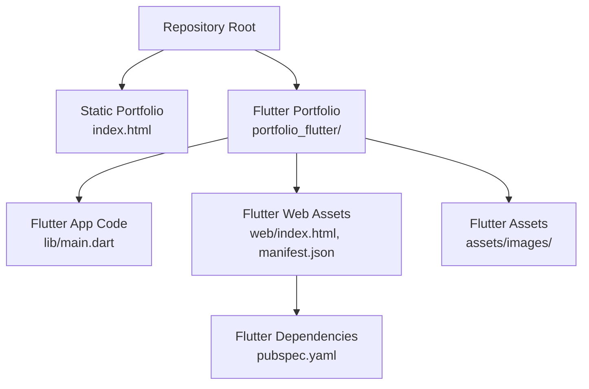

**Diagram sources**
- [index.html](file://index.html)
- [main.dart](file://portfolio_flutter/lib/main.dart)
- [web/index.html](file://portfolio_flutter/web/index.html)
- [manifest.json](file://portfolio_flutter/web/manifest.json)
- [pubspec.yaml](file://portfolio_flutter/pubspec.yaml)

**Section sources**
- [index.html](file://index.html)
- [main.dart](file://portfolio_flutter/lib/main.dart)
- [pubspec.yaml](file://portfolio_flutter/pubspec.yaml)
- [web/index.html](file://portfolio_flutter/web/index.html)
- [manifest.json](file://portfolio_flutter/web/manifest.json)
- [README.md](file://portfolio_flutter/README.md)

## Core Components
The Flutter portfolio application is structured around comprehensive sections with premium design elements:

- **Premium Dark Theme System** with custom color palette and glassmorphism effects
- **Advanced Navigation Bar** with backdrop blur and smooth transitions
- **Hero Section** featuring animated profile photo with rotating gradient border, floating orbs, and staggered text animations
- **About Section** with social work background, statistics cards, and responsive layout
- **Experience Timeline** with animated entries and hover interactions
- **Projects Showcase** with technology logos, animated cards, and GitHub integration
- **Skills Section** with animated tech logos and categorized skill blocks
- **Education Section** with animated cards and language tags
- **Contact Section** with interactive contact items, functional form, and validation
- **Professional Footer** with social links and copyright information

Each section leverages Flutter's Material 3 design system, responsive layout builders, and advanced animation library for enhanced user experience.

**Section sources**
- [main.dart](file://portfolio_flutter/lib/main.dart)

## Architecture Overview
The Flutter portfolio application follows a modern component-based architecture with comprehensive state management and animation systems. The design system centers on a premium dark theme with purple/blue accents, glassmorphism effects, and sophisticated animations. The architecture emphasizes:

- **Material 3 Design System** with custom theming and typography
- **Responsive Layout System** with LayoutBuilder and adaptive widgets
- **Advanced Animation Library** (flutter_animate) for smooth transitions
- **Particle Background System** with custom painting and animation controllers
- **Glassmorphism UI Pattern** with backdrop filters and transparency effects
- **Interactive Components** with hover states and magnetic effects
- **State Management** with StatefulWidget patterns and animation controllers

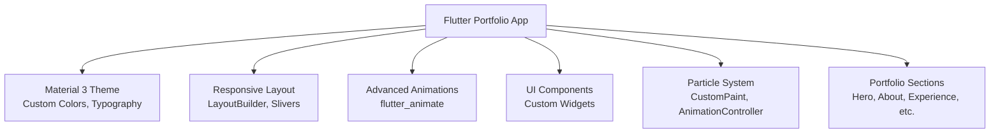

**Diagram sources**
- [main.dart](file://portfolio_flutter/lib/main.dart)

## Detailed Component Analysis

### Premium Dark Theme System
The application implements a sophisticated color system with custom AppColors class defining premium dark theme values:

- **Background Colors**: bgPrimary (#0a0a0f), bgSecondary (#12121a), bgTertiary (#1a1a25)
- **Text Colors**: textPrimary (white), textSecondary (#a0a0b0), textMuted (#6a6a7a)
- **Accent Colors**: accentPrimary (#6366f1), accentSecondary (#8b5cf6), accentTertiary (#a855f7)
- **Glass Effects**: glassBg (rgba 0x08ffffff), glassBorder (rgba 0x14ffffff)
- **Shadow Effects**: shadow-glow with purple/blue gradient

**Section sources**
- [main.dart](file://portfolio_flutter/lib/main.dart)

### Advanced Navigation Bar
The navigation system implements sophisticated backdrop blur effects with smooth transitions:

- **Scroll Detection** with AnimatedContainer for seamless state changes
- **Backdrop Filter** with ColorFilter.matrix for blur effects
- **Gradient Text Effect** using ShaderMask for logo styling
- **Responsive Layout** with conditional rendering for different screen sizes
- **Smooth Transitions** with AnimatedContainer and custom curves

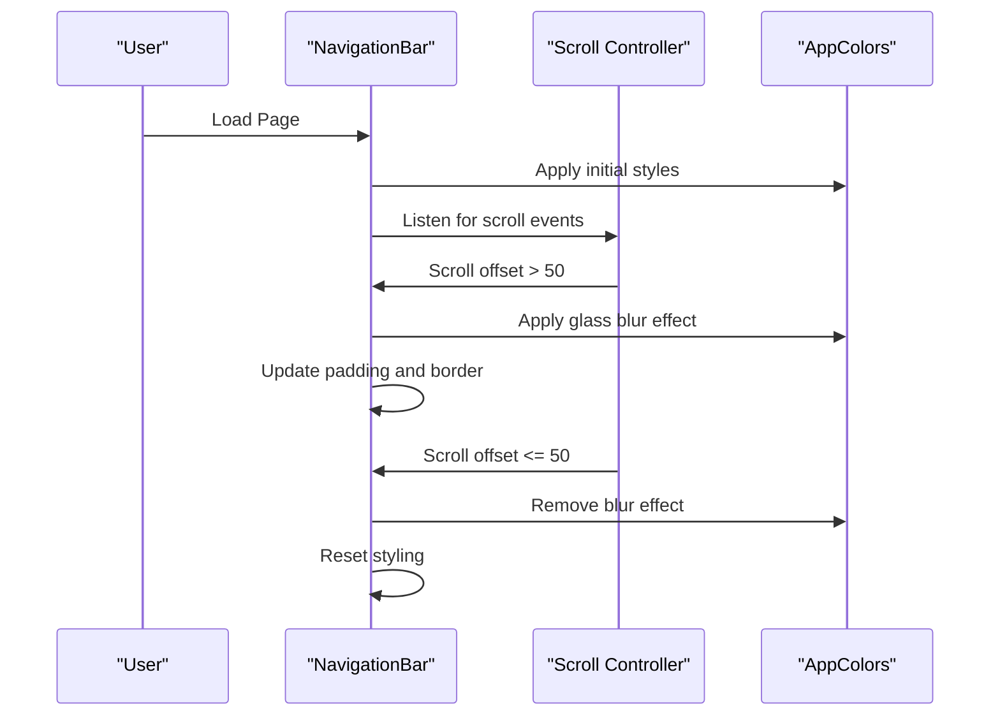

**Diagram sources**
- [main.dart](file://portfolio_flutter/lib/main.dart)

**Section sources**
- [main.dart](file://portfolio_flutter/lib/main.dart)

### Hero Section with Animated Profile Photo
The hero section creates a premium visual experience with multiple animation layers:

- **Particle Background System** with 30 animated particles using CustomPaint
- **Floating Gradient Orbs** with sine wave motion and staggered delays
- **Rotating Profile Photo** with animated gradient border and shadow effects
- **Staggered Text Animations** using flutter_animate library
- **Magnetic Hover Effects** on interactive elements

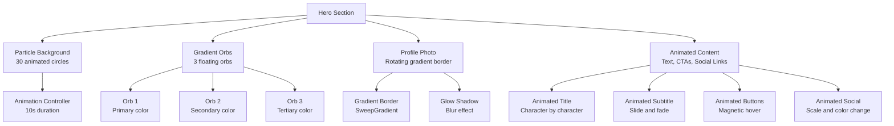

**Diagram sources**
- [main.dart](file://portfolio_flutter/lib/main.dart)

**Section sources**
- [main.dart](file://portfolio_flutter/lib/main.dart)

### About Section with Social Work Background
The about section implements a sophisticated responsive layout with animated statistics:

- **Adaptive Layout** using LayoutBuilder for responsive design
- **Animated Statistics Cards** with hover effects and glow transitions
- **Profile Image with Gradient Overlay** and subtle shadow effects
- **Professional Content** highlighting social work background and development skills

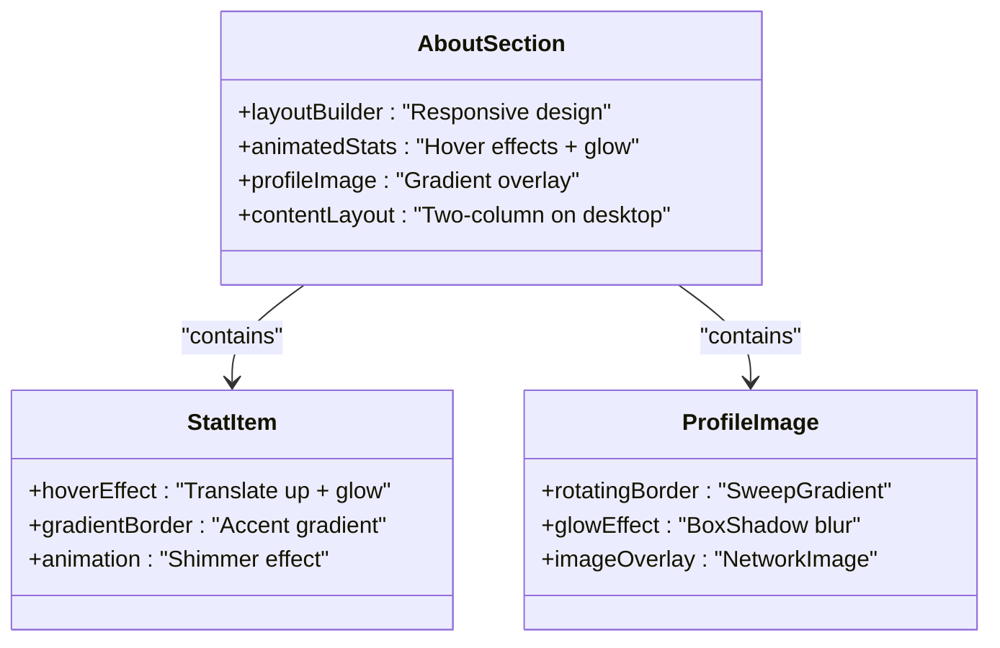

**Diagram sources**
- [main.dart](file://portfolio_flutter/lib/main.dart)

**Section sources**
- [main.dart](file://portfolio_flutter/lib/main.dart)

### Experience Timeline
The experience timeline implements sophisticated animated entries:

- **Vertical Timeline** with gradient background and magnetic positioning
- **Animated Entries** using slide and fade animations
- **Interactive Cards** with hover effects and translation transforms
- **Responsibly List** with custom bullet styling and accent colors

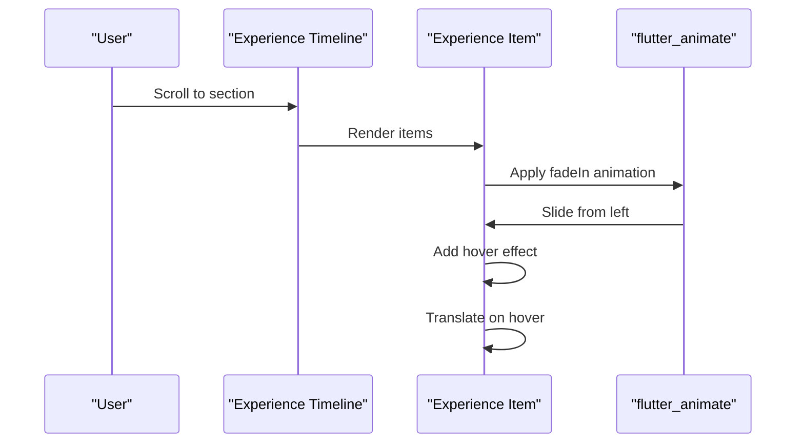

**Diagram sources**
- [main.dart](file://portfolio_flutter/lib/main.dart)

**Section sources**
- [main.dart](file://portfolio_flutter/lib/main.dart)

### Projects Showcase
The projects section implements a comprehensive showcase with technology integration:

- **Responsive Grid Layout** using Wrap widget with adaptive spacing
- **Animated Project Cards** with hover effects and scaling transforms
- **Technology Logos** with error handling and fallback icons
- **Feature Lists** with custom bullet styling and accent colors
- **GitHub Integration** with external URL launching

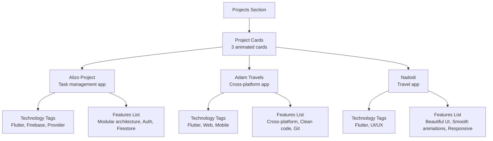

**Diagram sources**
- [main.dart](file://portfolio_flutter/lib/main.dart)

**Section sources**
- [main.dart](file://portfolio_flutter/lib/main.dart)

### Skills Section with Animated Tech Logos
The skills section implements a sophisticated technology showcase:

- **Animated Tech Logos Row** with floating animation and gradient colors
- **Categorized Skill Blocks** with interactive hover states
- **Technology Tags** with glassmorphism styling and accent borders
- **Skill Items** with dynamic color transitions and scaling effects

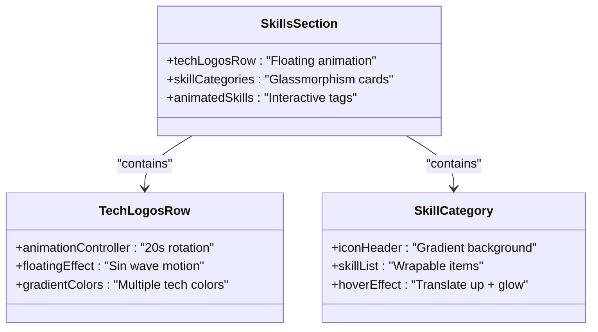

**Diagram sources**
- [main.dart](file://portfolio_flutter/lib/main.dart)

**Section sources**
- [main.dart](file://portfolio_flutter/lib/main.dart)

### Education Section
The education section presents academic background with animated cards:

- **Responsive Grid Layout** using Wrap widget with adaptive spacing
- **Animated Education Cards** with gradient accents and hover effects
- **Language Tags** with subtle styling and glassmorphism effects
- **Date-styled Cards** with accent borders and professional presentation

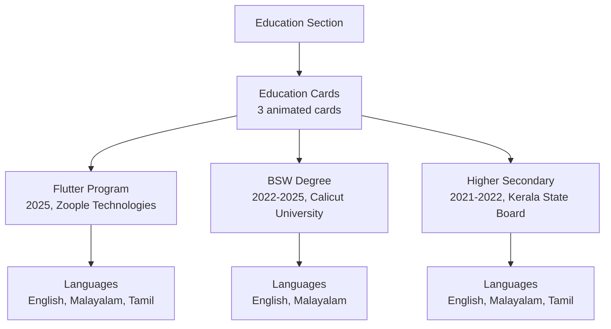

**Diagram sources**
- [main.dart](file://portfolio_flutter/lib/main.dart)

**Section sources**
- [main.dart](file://portfolio_flutter/lib/main.dart)

### Contact Section
The contact section combines interactive contact items with a functional form:

- **Animated Contact Items** with hover effects and magnetic positioning
- **Functional Contact Form** with validation and mailto integration
- **Responsive Layout** adapting to different screen sizes
- **Professional Styling** with glassmorphism effects and gradient accents

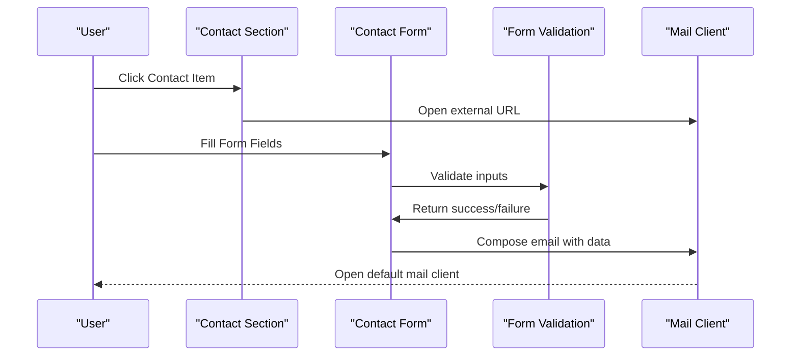

**Diagram sources**
- [main.dart](file://portfolio_flutter/lib/main.dart)

**Section sources**
- [main.dart](file://portfolio_flutter/lib/main.dart)

## Dependency Analysis
The Flutter portfolio application relies on comprehensive dependencies for advanced functionality:

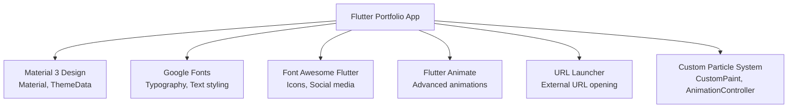

**Diagram sources**
- [main.dart](file://portfolio_flutter/lib/main.dart)
- [pubspec.yaml](file://portfolio_flutter/pubspec.yaml)

**Section sources**
- [main.dart](file://portfolio_flutter/lib/main.dart)
- [pubspec.yaml](file://portfolio_flutter/pubspec.yaml)

## Performance Considerations
The Flutter portfolio application implements several performance optimizations:

- **Efficient Animation Controllers** with proper disposal in dispose methods
- **Custom Painting Optimization** with shouldRepaint for particle system
- **Responsive Layout Optimization** using LayoutBuilder for adaptive rendering
- **Memory Management** with proper StatefulWidget lifecycle management
- **Animation Performance** using flutter_animate library for smooth transitions
- **Asset Loading** with error handling for images and fallback icons
- **Gesture Handling** with MouseRegion optimization for hover effects

## Troubleshooting Guide
Common issues and solutions for the Flutter portfolio application:

### Animation Not Working
- Verify flutter_animate package is properly installed
- Check AnimationController initialization and disposal
- Ensure proper animation duration and curve settings
- Verify widget rebuilds are not interfering with animations

### Particle Background Issues
- Confirm CustomPaint implementation is correct
- Check AnimationController vsync parameter
- Verify particle count and animation values
- Ensure proper disposal of animation controllers

### Navigation Scroll Issues
- Verify ScrollController is properly disposed
- Check scroll threshold values
- Ensure setState calls are not causing performance issues
- Verify GlobalKey usage for section navigation

### Asset Loading Problems
- Confirm asset paths in pubspec.yaml are correct
- Check image URLs and network connectivity
- Verify error handling for failed image loads
- Ensure proper asset caching strategy

**Section sources**
- [main.dart](file://portfolio_flutter/lib/main.dart)

## Conclusion
This production-ready portfolio application demonstrates modern Flutter development practices through its implementation of Material 3 design system, advanced animations, glassmorphism UI patterns, and sophisticated interactive components. The application showcases professional development skills with premium dark theme design, particle background effects, magnetic hover interactions, and responsive layout systems. The comprehensive section coverage from hero introduction to professional footer creates a complete digital portfolio that effectively communicates technical expertise and personality.

**Updated** Modernized from basic Flutter template to production-ready portfolio with premium design system and advanced interactive features.

## Appendices

### Customization Guide
To customize the Flutter portfolio application:

1. **Theme Colors**: Modify AppColors class values for complete theme customization
2. **Typography**: Update GoogleFonts references and text styles throughout
3. **Content Sections**: Edit text content in each section widget
4. **Animations**: Adjust animation durations, curves, and delays in flutter_animate calls
5. **Layout**: Modify LayoutBuilder constraints and responsive breakpoints
6. **Interactions**: Update hover states and gesture handling in StatefulWidget classes
7. **Assets**: Replace profile photos and project logos in assets/images/
8. **Navigation**: Customize nav links and section keys in NavigationBar widget

### Cross-Platform Compatibility
The Flutter portfolio maintains compatibility through:
- **Material 3 Design System** with platform-specific adaptations
- **Responsive Layout System** using LayoutBuilder for adaptive design
- **Animation Library** with cross-platform animation support
- **URL Launcher** for external link handling across platforms
- **Custom Painting** for graphics rendering consistency
- **Font Loading** through Google Fonts for typography reliability

### Extending Functionality
Potential enhancements for the Flutter portfolio:

1. **Service Worker Integration** for offline capabilities
2. **Analytics Implementation** with Firebase Analytics
3. **SEO Optimization** with meta tags and structured data
4. **Dark/Light Theme Toggle** with theme preferences
5. **Client-Side Routing** for single-page application behavior
6. **Progressive Web App** features with manifest.json configuration
7. **Accessibility Improvements** with semantic HTML and ARIA labels
8. **Performance Monitoring** with Firebase Performance Monitoring