# Portfolio Website

<cite>
**Referenced Files in This Document**
- [index.html](file://index.html)
- [main.dart](file://portfolio_flutter/lib/main.dart)
- [pubspec.yaml](file://portfolio_flutter/pubspec.yaml)
- [web/index.html](file://portfolio_flutter/web/index.html)
- [manifest.json](file://portfolio_flutter/web/manifest.json)
- [README.md](file://portfolio_flutter/README.md)
</cite>

## Table of Contents
1. [Introduction](#introduction)
2. [Project Structure](#project-structure)
3. [Core Components](#core-components)
4. [Architecture Overview](#architecture-overview)
5. [Detailed Component Analysis](#detailed-component-analysis)
6. [Dependency Analysis](#dependency-analysis)
7. [Performance Considerations](#performance-considerations)
8. [Troubleshooting Guide](#troubleshooting-guide)
9. [Conclusion](#conclusion)
10. [Appendices](#appendices)

## Introduction
This document provides comprehensive documentation for a modern static portfolio website built with HTML, CSS, and JavaScript. The site showcases a developer profile with a focus on contemporary web design principles, including responsive layouts using CSS Grid and Flexbox, glassmorphism UI elements, custom animated cursor effects, and smooth animations throughout. It covers the hero section, about me, skills and stats, experience timeline, projects showcase, education, and contact sections. Guidance is included for mobile-first responsive design, cross-browser compatibility, integration of external assets (Font Awesome icons and Google Fonts), and customization/extensibility tips.

## Project Structure
The repository contains two primary components:
- A modern static portfolio website implemented in a single HTML file with embedded CSS and JavaScript.
- A Flutter project scaffold (unused for the portfolio website) that demonstrates a separate Flutter application structure.

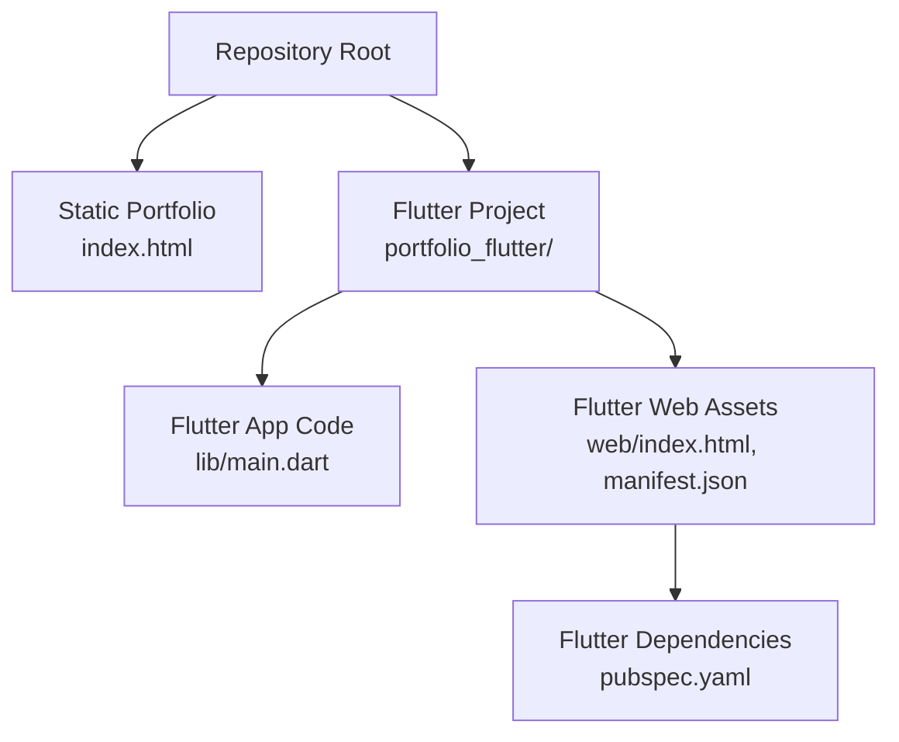

**Diagram sources**
- [index.html](file://index.html)
- [main.dart](file://portfolio_flutter/lib/main.dart)
- [web/index.html](file://portfolio_flutter/web/index.html)
- [manifest.json](file://portfolio_flutter/web/manifest.json)
- [pubspec.yaml](file://portfolio_flutter/pubspec.yaml)

**Section sources**
- [index.html](file://index.html)
- [main.dart](file://portfolio_flutter/lib/main.dart)
- [pubspec.yaml](file://portfolio_flutter/pubspec.yaml)
- [web/index.html](file://portfolio_flutter/web/index.html)
- [manifest.json](file://portfolio_flutter/web/manifest.json)
- [README.md](file://portfolio_flutter/README.md)

## Core Components
The portfolio website is structured around several key sections, each designed with modern UI patterns:

- Navigation bar with animated logo and hover effects
- Hero section featuring gradient orbs, staggered text animations, and social links
- About section with image glow, statistics cards, and responsive grid layout
- Experience timeline with animated entries and hover interactions
- Projects showcase with card-based layout and technology tags
- Skills section organized in glassmorphism cards with hover animations
- Education section with date-styled cards and language tags
- Contact section with interactive contact items and a functional form
- Footer with social links and copyright information

Each section leverages CSS Grid for layout and Flexbox for alignment, with custom animations and transitions for enhanced user experience.

**Section sources**
- [index.html](file://index.html)

## Architecture Overview
The portfolio website follows a single-page application (SPA) architecture with embedded styles and scripts. The design system centers on a dark theme with purple/blue accents, glassmorphism effects, and smooth animations. The architecture emphasizes:
- CSS custom properties for consistent theming
- CSS Grid for responsive layouts
- Flexbox for component alignment
- Intersection Observer for scroll-triggered animations
- Custom cursor with magnetic hover effects
- Parallax background elements

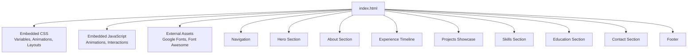

**Diagram sources**
- [index.html](file://index.html)

## Detailed Component Analysis

### Navigation Bar
The navigation bar implements a fixed header with backdrop blur effects and smooth transitions. It includes:
- Animated logo with fade-in down animation
- Navigation links with staggered fade-in animations
- Hover effects with gradient underline
- Scroll effect that applies blur and border when scrolling down

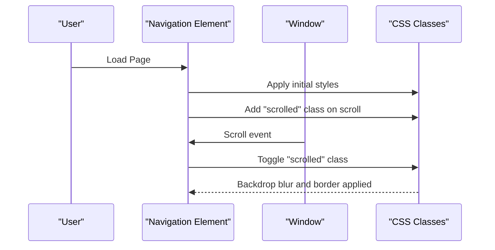

**Diagram sources**
- [index.html](file://index.html)

**Section sources**
- [index.html](file://index.html)

### Hero Section
The hero section creates a visually engaging entrance with:
- Animated gradient orbs that float and move with parallax
- Staggered character animations for the hero title
- Fade-up animations for subtitle, role, CTA buttons, and social links
- Magnetic hover effects on interactive elements

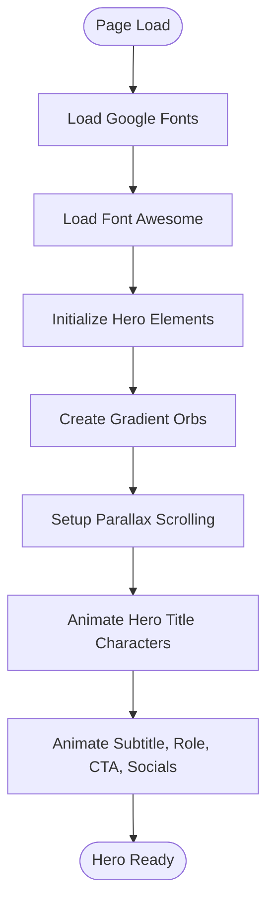

**Diagram sources**
- [index.html](file://index.html)

**Section sources**
- [index.html](file://index.html)

### About Section
The about section uses a responsive CSS Grid layout:
- Two-column layout on larger screens, single column on mobile
- Animated statistics cards with hover effects
- Image wrapper with gradient overlay and glow effect
- Content with staggered reveal animations

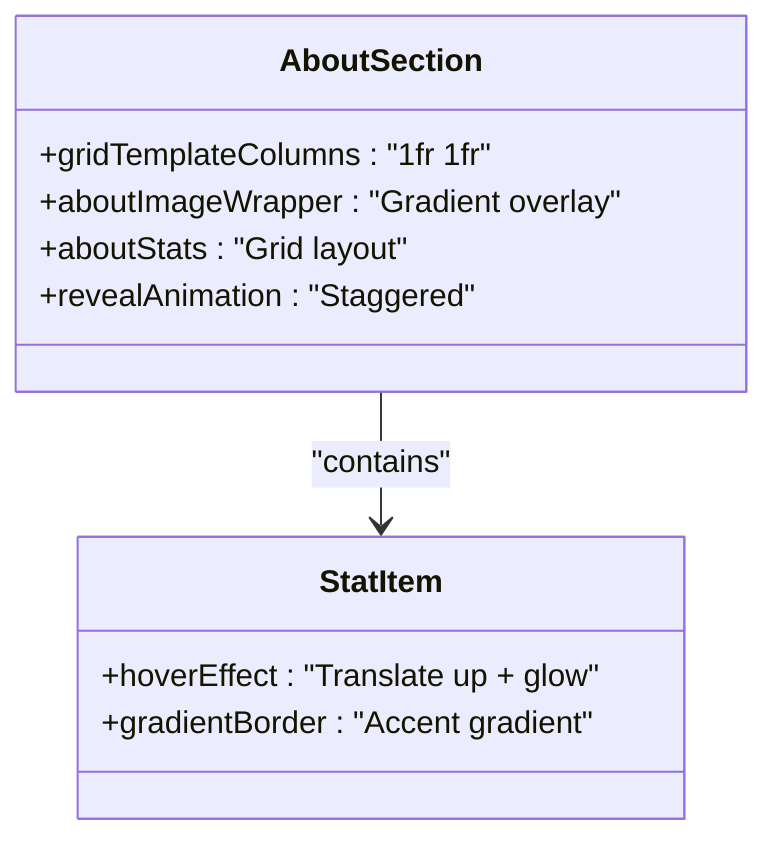

**Diagram sources**
- [index.html](file://index.html)

**Section sources**
- [index.html](file://index.html)

### Experience Timeline
The experience timeline implements:
- Vertical timeline with gradient background
- Animated entries that slide in when scrolled into view
- Interactive cards with hover effects and magnetic positioning
- Responsive adjustments for mobile devices

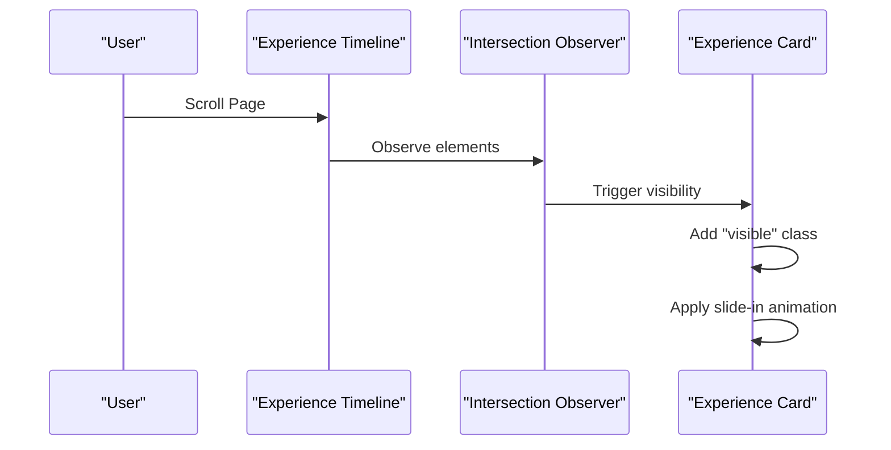

**Diagram sources**
- [index.html](file://index.html)

**Section sources**
- [index.html](file://index.html)

### Projects Showcase
The projects section uses a responsive grid:
- Auto-fit columns with minimum width constraints
- Animated project cards with hover effects
- Technology tags with accent styling
- Feature lists with custom bullet points

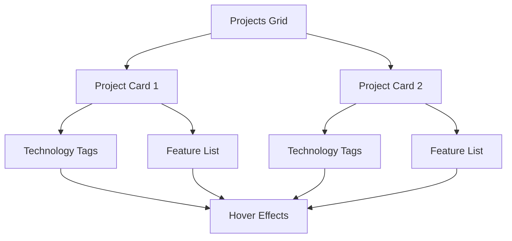

**Diagram sources**
- [index.html](file://index.html)

**Section sources**
- [index.html](file://index.html)

### Skills Section
The skills section organizes expertise into glassmorphism cards:
- Responsive grid with auto-fit columns
- Animated category cards with hover effects
- Skill items with interactive hover states
- Icon-based category headers

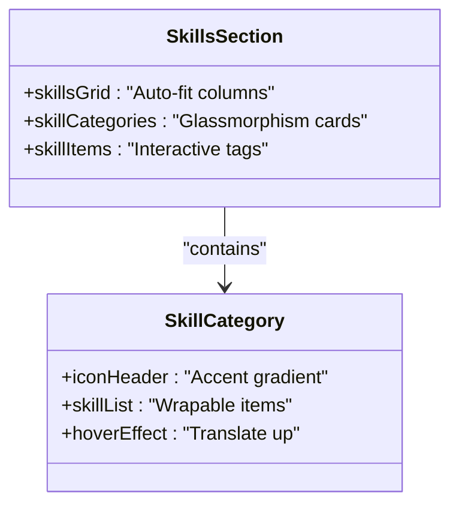

**Diagram sources**
- [index.html](file://index.html)

**Section sources**
- [index.html](file://index.html)

### Education Section
The education section presents academic background:
- Responsive grid with auto-fit columns
- Date-styled cards with accent borders
- Language tags with subtle styling
- Animated reveal on scroll

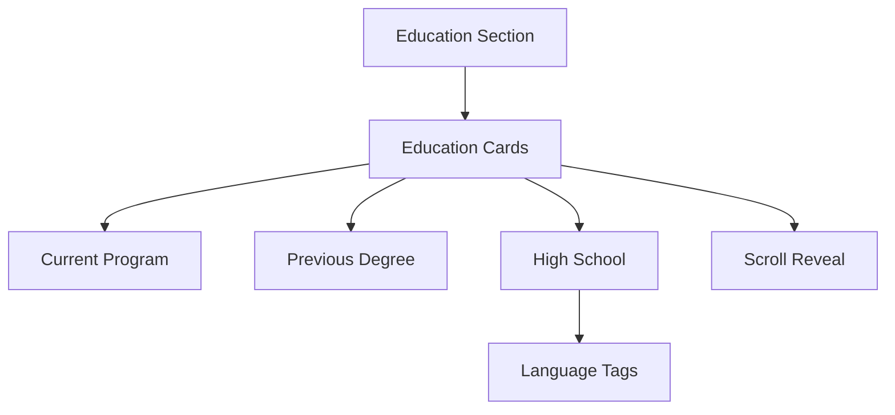

**Diagram sources**
- [index.html](file://index.html)

**Section sources**
- [index.html](file://index.html)

### Contact Section
The contact section combines interactive contact items with a functional form:
- Grid-based contact items with hover effects
- Form with validation and mailto integration
- Animated reveal on scroll
- Responsive layout adjustments

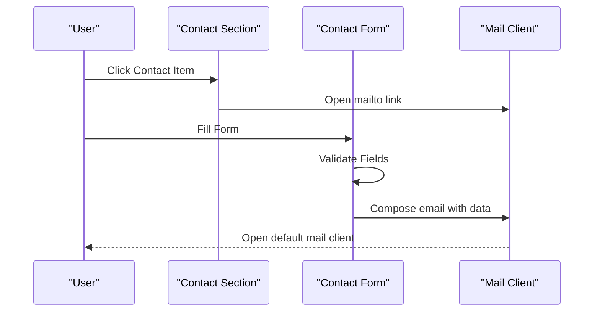

**Diagram sources**
- [index.html](file://index.html)

**Section sources**
- [index.html](file://index.html)

## Dependency Analysis
The portfolio website relies on external dependencies loaded via CDN:

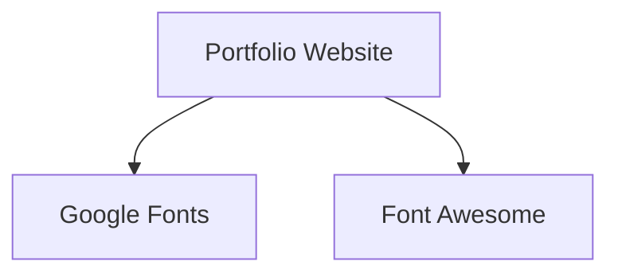

**Diagram sources**
- [index.html](file://index.html)

**Section sources**
- [index.html](file://index.html)

## Performance Considerations
The portfolio website implements several performance optimizations:
- CSS custom properties for efficient theming
- Intersection Observer for efficient scroll animations
- CSS transforms for hardware-accelerated animations
- Minimal JavaScript footprint with essential interactions
- Optimized image loading through icon fonts
- Efficient grid layouts with auto-fit columns

## Troubleshooting Guide
Common issues and solutions:

### Custom Cursor Not Working
- Verify pointer device support using media queries
- Check browser compatibility for requestAnimationFrame
- Ensure cursor elements are positioned absolutely

### Scroll Animations Not Triggering
- Confirm Intersection Observer API availability
- Verify element selectors match actual DOM structure
- Check viewport thresholds and margins

### Responsive Issues
- Test media query breakpoints across devices
- Verify CSS Grid fallbacks for older browsers
- Ensure touch-friendly button sizes

**Section sources**
- [index.html](file://index.html)

## Conclusion
This portfolio website demonstrates modern web design principles through its implementation of glassmorphism UI, responsive layouts, smooth animations, and custom interactive elements. The single-file architecture keeps deployment simple while maintaining professional presentation. The design system is built around a cohesive dark theme with purple/blue accents, creating a visually appealing developer portfolio that showcases technical skills and personality.

## Appendices

### Customization Guide
To customize the portfolio website:

1. **Theme Colors**: Modify CSS custom properties in the root selector
2. **Typography**: Update Google Fonts link and adjust font families
3. **Content Sections**: Edit HTML content within each section
4. **Animations**: Adjust timing functions and delays in keyframes
5. **Layout**: Modify CSS Grid templates and Flexbox properties
6. **Interactions**: Update JavaScript event handlers and animation triggers

### Cross-Browser Compatibility
The website maintains compatibility through:
- CSS custom properties with fallback values
- Standard CSS Grid with auto-fit support
- Modern JavaScript APIs with graceful degradation
- Font Awesome icons for universal icon support
- Google Fonts for reliable typography delivery

### Extending Functionality
Potential enhancements include:
- Adding service worker for offline capabilities
- Implementing lazy loading for images and videos
- Integrating analytics and SEO metadata
- Adding dark/light theme toggle
- Implementing client-side routing for SPA behavior