# Responsive Layout System

<cite>
**Referenced Files in This Document**
- [index.html](file://index.html)
- [portfolio_flutter/web/index.html](file://portfolio_flutter/web/index.html)
- [portfolio_flutter/lib/main.dart](file://portfolio_flutter/lib/main.dart)
</cite>

## Table of Contents
1. [Introduction](#introduction)
2. [Project Structure](#project-structure)
3. [Core Components](#core-components)
4. [Architecture Overview](#architecture-overview)
5. [Detailed Component Analysis](#detailed-component-analysis)
6. [Dependency Analysis](#dependency-analysis)
7. [Performance Considerations](#performance-considerations)
8. [Troubleshooting Guide](#troubleshooting-guide)
9. [Conclusion](#conclusion)

## Introduction
This document explains the responsive layout system implemented in the portfolio website, focusing on CSS Grid and Flexbox usage, mobile-first design, breakpoint strategies, adaptive patterns, and modern techniques such as clamp() for fluid typography and viewport units for dynamic sizing. It also covers touch-friendly interactive elements and guidance for maintaining layout integrity across devices and screen densities.

## Project Structure
The portfolio website is primarily a static HTML/CSS/JavaScript site with a dedicated Flutter web app module included. The responsive layout system is implemented in the main HTML file’s embedded stylesheet and JavaScript logic. The Flutter web module is minimal and serves as a placeholder for a Flutter-based web build.

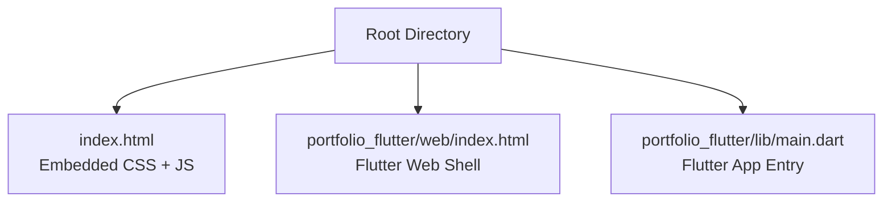

**Diagram sources**
- [index.html:1-1678](file://index.html#L1-L1678)
- [portfolio_flutter/web/index.html:1-39](file://portfolio_flutter/web/index.html#L1-L39)
- [portfolio_flutter/lib/main.dart:1-123](file://portfolio_flutter/lib/main.dart#L1-L123)

**Section sources**
- [index.html:1-1678](file://index.html#L1-L1678)
- [portfolio_flutter/web/index.html:1-39](file://portfolio_flutter/web/index.html#L1-L39)
- [portfolio_flutter/lib/main.dart:1-123](file://portfolio_flutter/lib/main.dart#L1-L123)

## Core Components
- CSS custom properties define a cohesive design system with dark theme colors and gradients.
- Flexbox is used extensively for navigation alignment, hero content centering, CTA buttons, and social links.
- CSS Grid powers major content areas: About, Projects, Skills, Education, Contact, and forms.
- Fluid typography uses clamp() for headings to scale smoothly across viewport widths.
- Media queries apply targeted adjustments at a single breakpoint for mobile responsiveness.
- JavaScript adds scroll-driven animations, smooth scrolling, and interactive effects.

Key implementation patterns:
- Custom properties for consistent spacing and theming.
- Flexbox for alignment and wrapping behavior.
- Grid with repeat(auto-fit, minmax()) for adaptive card layouts.
- clamp() for fluid headings and section titles.
- Intersection Observer for scroll-triggered animations.
- Pointer-aware cursor behavior for coarse vs. fine pointer devices.

**Section sources**
- [index.html:11-25](file://index.html#L11-L25)
- [index.html:84-159](file://index.html#L84-L159)
- [index.html:161-169](file://index.html#L161-L169)
- [index.html:237-243](file://index.html#L237-L243)
- [index.html:370-382](file://index.html#L370-L382)
- [index.html:389-396](file://index.html#L389-L396)
- [index.html:606-612](file://index.html#L606-L612)
- [index.html:742-748](file://index.html#L742-L748)
- [index.html:823-829](file://index.html#L823-L829)
- [index.html:910-915](file://index.html#L910-L915)
- [index.html:1011-1015](file://index.html#L1011-L1015)
- [index.html:1102-1151](file://index.html#L1102-L1151)
- [index.html:1613-1630](file://index.html#L1613-L1630)
- [index.html:1632-1644](file://index.html#L1632-L1644)
- [index.html:1665-1674](file://index.html#L1665-L1674)

## Architecture Overview
The responsive layout architecture centers on:
- A mobile-first CSS approach with a single breakpoint at 768px.
- Flexbox for primary alignment and wrapping behavior.
- CSS Grid for multi-column, adaptive card layouts.
- Fluid typography using clamp() to prevent extreme scaling.
- JavaScript-driven scroll animations and smooth navigation.

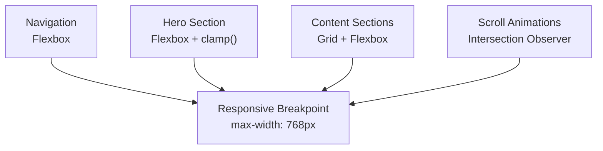

**Diagram sources**
- [index.html:84-159](file://index.html#L84-L159)
- [index.html:161-169](file://index.html#L161-L169)
- [index.html:389-396](file://index.html#L389-L396)
- [index.html:606-612](file://index.html#L606-L612)
- [index.html:742-748](file://index.html#L742-L748)
- [index.html:1102-1151](file://index.html#L1102-L1151)
- [index.html:1613-1630](file://index.html#L1613-L1630)

## Detailed Component Analysis

### Navigation Layout (Flexbox)
- Fixed positioning with space-between alignment and centered items.
- Dynamic background and padding changes on scroll.
- Links use Flexbox with gap spacing and hover effects.

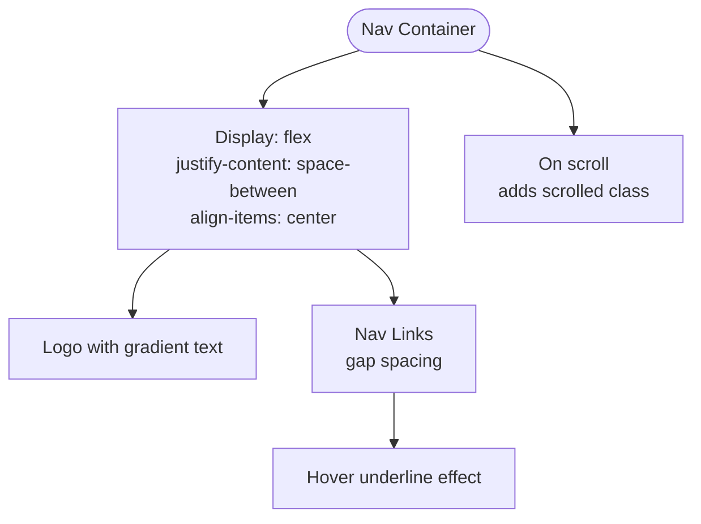

**Diagram sources**
- [index.html:84-103](file://index.html#L84-L103)
- [index.html:118-158](file://index.html#L118-L158)

**Section sources**
- [index.html:84-103](file://index.html#L84-L103)
- [index.html:118-158](file://index.html#L118-L158)

### Hero Section (Fluid Typography + Flexbox)
- Full-viewport flex container for centering content.
- Fluid heading sizing using clamp() to scale between min and max values.
- Animated character reveals and floating gradient orbs with parallax scroll.

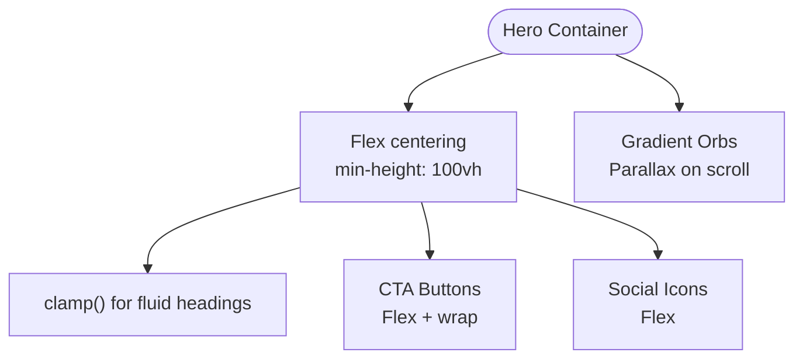

**Diagram sources**
- [index.html:161-169](file://index.html#L161-L169)
- [index.html:237-243](file://index.html#L237-L243)
- [index.html:272-279](file://index.html#L272-L279)
- [index.html:320-348](file://index.html#L320-L348)
- [index.html:1665-1674](file://index.html#L1665-L1674)

**Section sources**
- [index.html:161-169](file://index.html#L161-L169)
- [index.html:237-243](file://index.html#L237-L243)
- [index.html:272-279](file://index.html#L272-L279)
- [index.html:320-348](file://index.html#L320-L348)
- [index.html:1665-1674](file://index.html#L1665-L1674)

### About Section (Grid + Flexbox)
- Two-column grid layout for image and text content.
- Stats cards arranged in a three-column grid with responsive adjustments at the breakpoint.
- Aspect-ratio-based image wrapper with gradient glow.

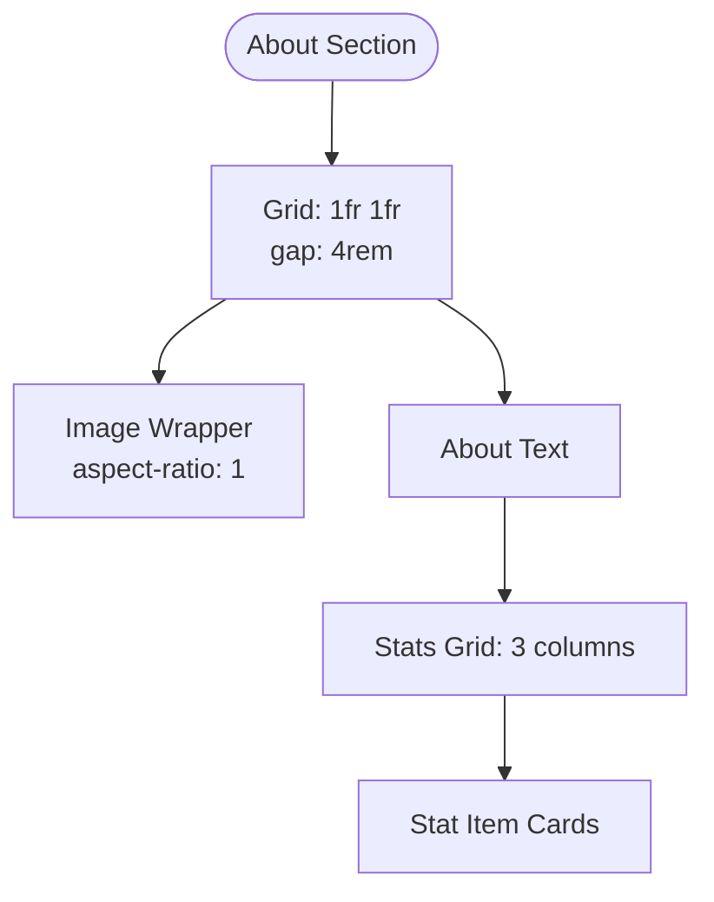

**Diagram sources**
- [index.html:389-396](file://index.html#L389-L396)
- [index.html:452-457](file://index.html#L452-L457)
- [index.html:459-488](file://index.html#L459-L488)

**Section sources**
- [index.html:389-396](file://index.html#L389-L396)
- [index.html:452-457](file://index.html#L452-L457)
- [index.html:459-488](file://index.html#L459-L488)

### Projects Section (CSS Grid)
- Projects grid uses repeat(auto-fit, minmax()) to create flexible columns.
- Card-based layout with hover and visibility transitions.
- Tech tags and feature lists inside cards.

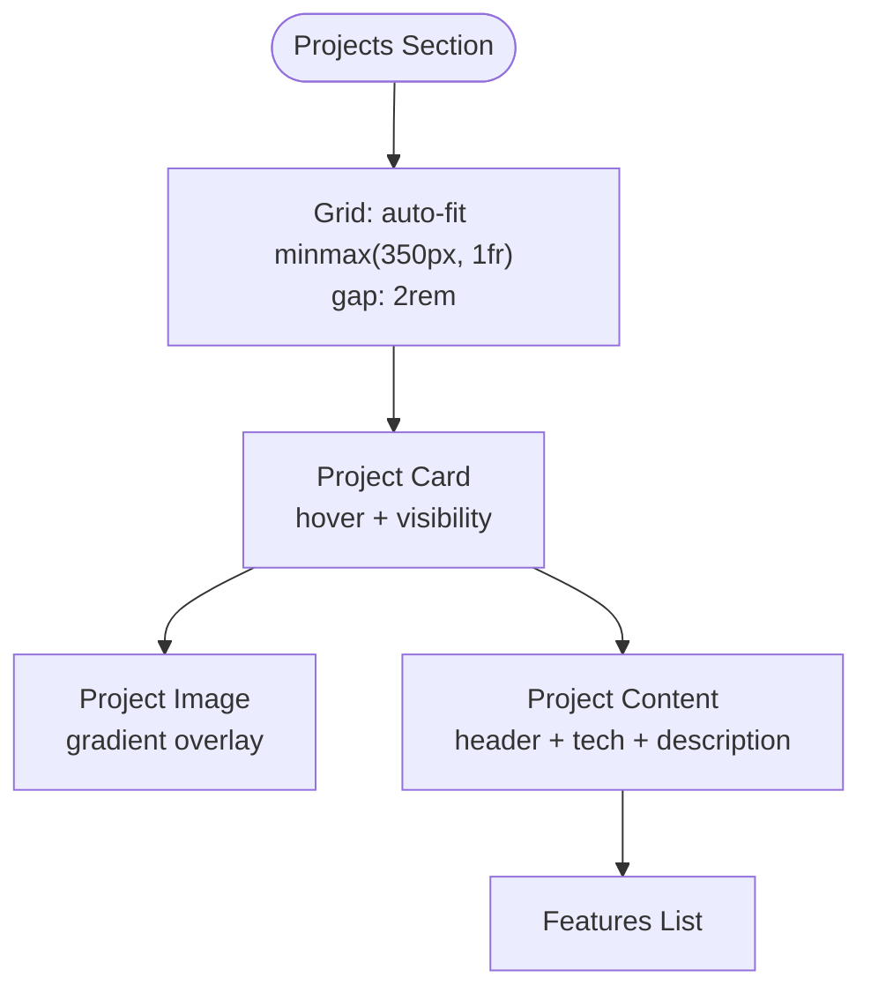

**Diagram sources**
- [index.html:606-612](file://index.html#L606-L612)
- [index.html:614-633](file://index.html#L614-L633)
- [index.html:635-663](file://index.html#L635-L663)
- [index.html:665-735](file://index.html#L665-L735)

**Section sources**
- [index.html:606-612](file://index.html#L606-L612)
- [index.html:614-633](file://index.html#L614-L633)
- [index.html:635-663](file://index.html#L635-L663)
- [index.html:665-735](file://index.html#L665-L735)

### Skills Section (CSS Grid + Flexbox)
- Skills grid adapts columns with min-width constraints.
- Category cards use Flexbox for icon and header alignment.
- Skill items are wrapped Flex elements with hover transforms.

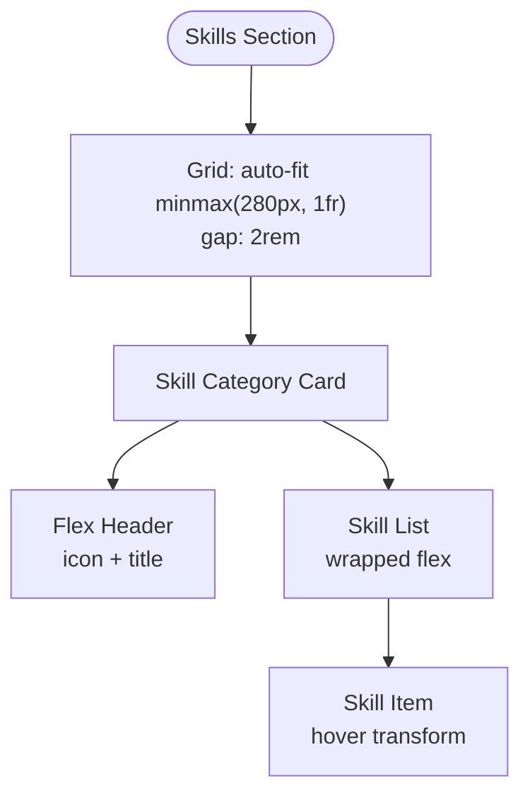

**Diagram sources**
- [index.html:742-748](file://index.html#L742-L748)
- [index.html:750-768](file://index.html#L750-L768)
- [index.html:770-799](file://index.html#L770-L799)
- [index.html:801-816](file://index.html#L801-L816)

**Section sources**
- [index.html:742-748](file://index.html#L742-L748)
- [index.html:750-768](file://index.html#L750-L768)
- [index.html:770-799](file://index.html#L770-L799)
- [index.html:801-816](file://index.html#L801-L816)

### Education Section (CSS Grid)
- Education grid uses repeat(auto-fit, minmax()) for responsive cards.
- Cards include date, degree, school, and language tags.

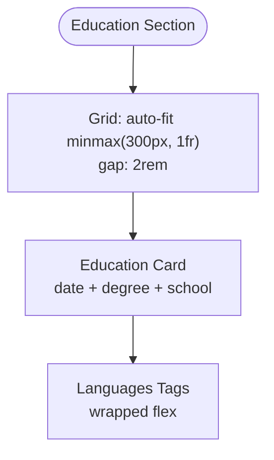

**Diagram sources**
- [index.html:823-829](file://index.html#L823-L829)
- [index.html:831-851](file://index.html#L831-L851)
- [index.html:882-896](file://index.html#L882-L896)

**Section sources**
- [index.html:823-829](file://index.html#L823-L829)
- [index.html:831-851](file://index.html#L831-L851)
- [index.html:882-896](file://index.html#L882-L896)

### Contact Section (Grid + Forms)
- Contact grid uses repeat(auto-fit, minmax(200px, 1fr)) for contact items.
- Form rows use CSS Grid for two-column layout on larger screens.
- Form inputs and focus states follow the design system.

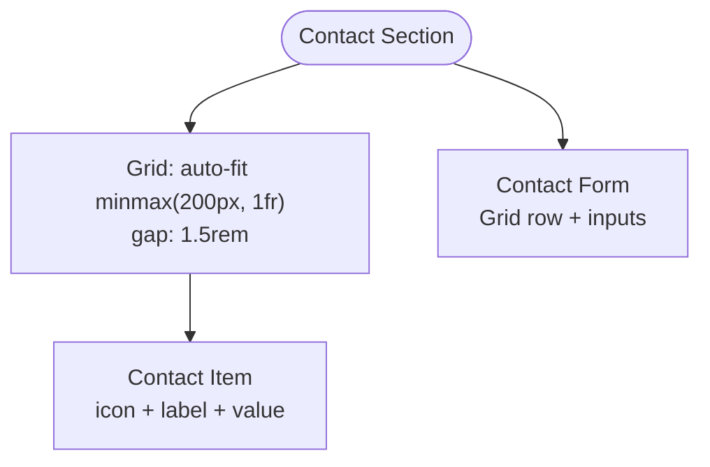

**Diagram sources**
- [index.html:910-915](file://index.html#L910-L915)
- [index.html:917-939](file://index.html#L917-L939)
- [index.html:1011-1015](file://index.html#L1011-L1015)
- [index.html:965-1009](file://index.html#L965-L1009)

**Section sources**
- [index.html:910-915](file://index.html#L910-L915)
- [index.html:917-939](file://index.html#L917-L939)
- [index.html:1011-1015](file://index.html#L1011-L1015)
- [index.html:965-1009](file://index.html#L965-L1009)

### Footer (Flexbox)
- Footer uses Flexbox for centered social links and consistent spacing.

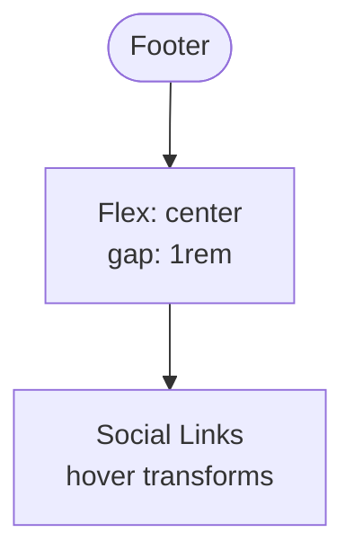

**Diagram sources**
- [index.html:1047-1072](file://index.html#L1047-L1072)

**Section sources**
- [index.html:1047-1072](file://index.html#L1047-L1072)

### Responsive Strategy and Breakpoints
- Mobile-first approach with a single breakpoint at 768px.
- Adjustments include hiding navigation links, switching to single-column grids, reflowing CTA buttons, and reducing form spacing.

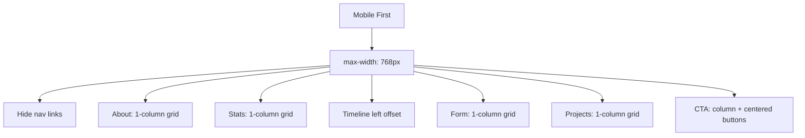

**Diagram sources**
- [index.html:1102-1151](file://index.html#L1102-L1151)

**Section sources**
- [index.html:1102-1151](file://index.html#L1102-L1151)

### Fluid Typography with clamp()
- clamp() ensures headings scale smoothly between a minimum and maximum size based on viewport width.
- Applied to hero title and section titles.

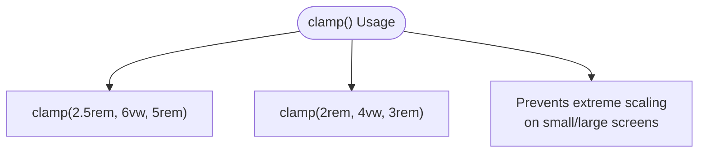

**Diagram sources**
- [index.html:237-243](file://index.html#L237-L243)
- [index.html:370-382](file://index.html#L370-L382)

**Section sources**
- [index.html:237-243](file://index.html#L237-L243)
- [index.html:370-382](file://index.html#L370-L382)

### Scroll-Driven Animations and Interactions
- Intersection Observer triggers fade-in and slide-up animations for content sections.
- Smooth scrolling for anchor navigation.
- Parallax effect on hero gradient orbs.

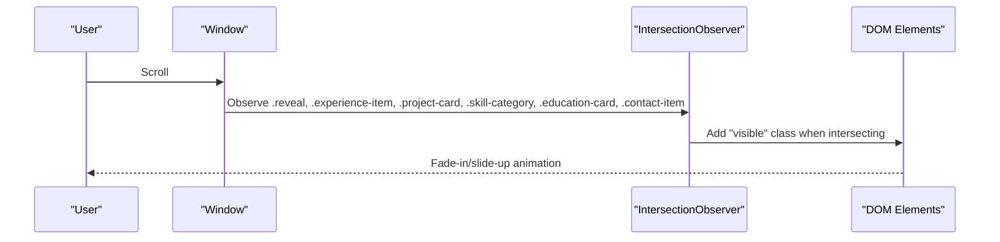

**Diagram sources**
- [index.html:1613-1630](file://index.html#L1613-L1630)

**Section sources**
- [index.html:1613-1630](file://index.html#L1613-L1630)
- [index.html:1632-1644](file://index.html#L1632-L1644)
- [index.html:1665-1674](file://index.html#L1665-L1674)

### Touch-Friendly Interactive Elements
- Pointer-aware cursor behavior: hides custom cursor on coarse-pointer devices.
- Magnetic hover effect on interactive buttons and links.
- Large tap targets for buttons and social links.

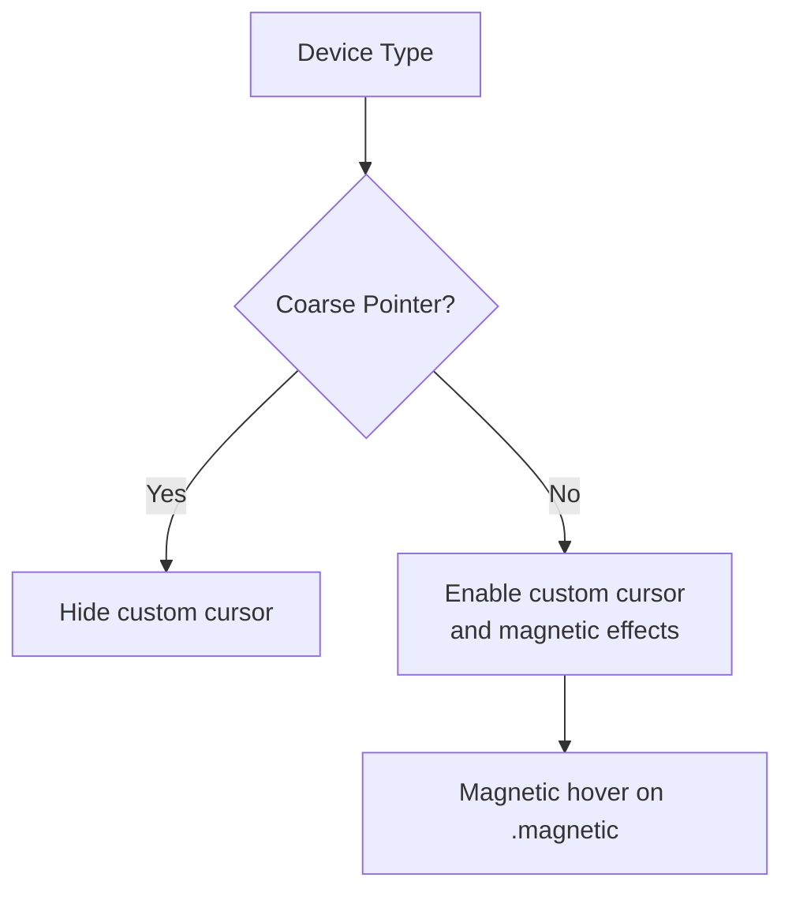

**Diagram sources**
- [index.html:78-81](file://index.html#L78-L81)
- [index.html:1551-1589](file://index.html#L1551-L1589)

**Section sources**
- [index.html:78-81](file://index.html#L78-L81)
- [index.html:1551-1589](file://index.html#L1551-L1589)

### Flutter Web Module
- Minimal Flutter web shell with base href placeholder and bootstrap script.
- Flutter app entry point is present but unrelated to the portfolio’s layout system.

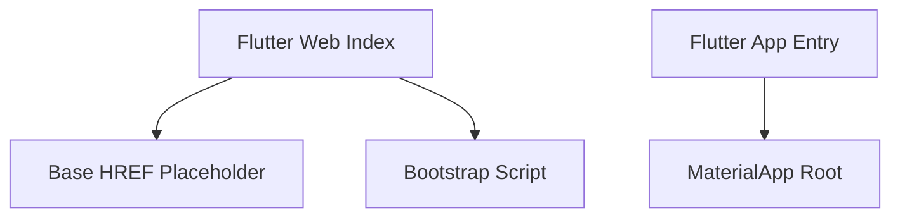

**Diagram sources**
- [portfolio_flutter/web/index.html:17](file://portfolio_flutter/web/index.html#L17)
- [portfolio_flutter/web/index.html:36](file://portfolio_flutter/web/index.html#L36)
- [portfolio_flutter/lib/main.dart:13-35](file://portfolio_flutter/lib/main.dart#L13-L35)

**Section sources**
- [portfolio_flutter/web/index.html:1-39](file://portfolio_flutter/web/index.html#L1-L39)
- [portfolio_flutter/lib/main.dart:1-123](file://portfolio_flutter/lib/main.dart#L1-L123)

## Dependency Analysis
- The layout system depends on CSS custom properties for consistent theming.
- Flexbox and Grid are used across multiple sections with shared patterns.
- JavaScript enhances UX with animations and interactions but does not alter core layout logic.
- The Flutter web module is separate and does not influence the CSS Grid/Flexbox layout.

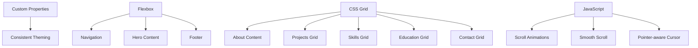

**Diagram sources**
- [index.html:11-25](file://index.html#L11-L25)
- [index.html:84-159](file://index.html#L84-L159)
- [index.html:161-169](file://index.html#L161-L169)
- [index.html:389-396](file://index.html#L389-L396)
- [index.html:606-612](file://index.html#L606-L612)
- [index.html:742-748](file://index.html#L742-L748)
- [index.html:823-829](file://index.html#L823-L829)
- [index.html:910-915](file://index.html#L910-L915)
- [index.html:1613-1630](file://index.html#L1613-L1630)
- [index.html:1632-1644](file://index.html#L1632-L1644)
- [index.html:1551-1589](file://index.html#L1551-L1589)

**Section sources**
- [index.html:11-25](file://index.html#L11-L25)
- [index.html:84-159](file://index.html#L84-L159)
- [index.html:161-169](file://index.html#L161-L169)
- [index.html:389-396](file://index.html#L389-L396)
- [index.html:606-612](file://index.html#L606-L612)
- [index.html:742-748](file://index.html#L742-L748)
- [index.html:823-829](file://index.html#L823-L829)
- [index.html:910-915](file://index.html#L910-L915)
- [index.html:1613-1630](file://index.html#L1613-L1630)
- [index.html:1632-1644](file://index.html#L1632-L1644)
- [index.html:1551-1589](file://index.html#L1551-L1589)

## Performance Considerations
- Prefer CSS Grid and Flexbox for layout to minimize reflows and leverage GPU acceleration.
- Use clamp() for fluid typography to reduce the need for multiple media queries.
- Limit heavy animations to visible content and disable on coarse-pointer devices.
- Keep grid gaps and paddings consistent with custom properties to simplify maintenance.
- Use Intersection Observer for scroll animations to avoid layout thrashing.

[No sources needed since this section provides general guidance]

## Troubleshooting Guide
- If content overlaps on small screens, verify the 768px breakpoint adjustments for grid and flex containers.
- If buttons do not align as expected, confirm Flexbox direction and wrap properties.
- If animations do not trigger, ensure Intersection Observer is initialized and elements have the correct classes.
- If custom cursor appears on touch devices, confirm pointer media query logic is functioning.

**Section sources**
- [index.html:1102-1151](file://index.html#L1102-L1151)
- [index.html:1613-1630](file://index.html#L1613-L1630)
- [index.html:78-81](file://index.html#L78-L81)

## Conclusion
The portfolio website employs a robust, mobile-first responsive layout system built on CSS Grid and Flexbox. Fluid typography with clamp() ensures readable headings across devices, while a single breakpoint at 768px streamlines responsive adjustments. JavaScript enhances the experience with scroll-driven animations, smooth navigation, and device-aware interactions. The design system’s custom properties and consistent spacing patterns support maintainability and scalability across screen sizes and densities.