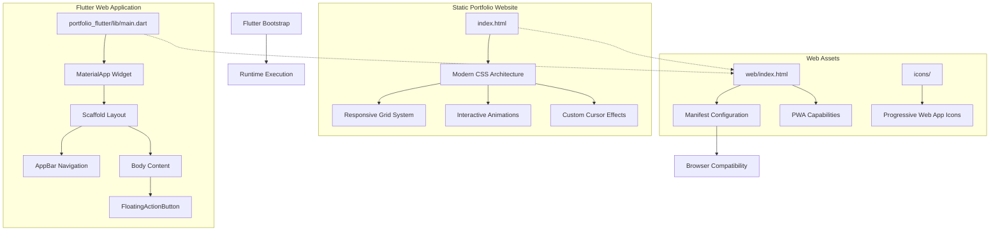
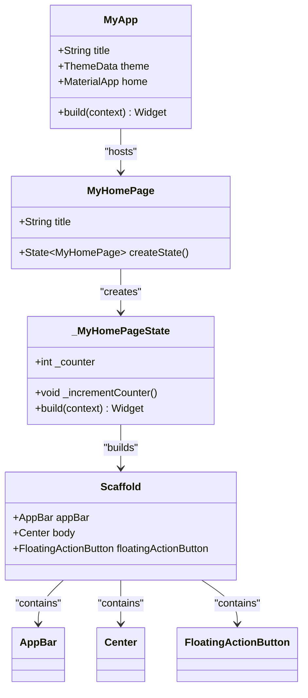
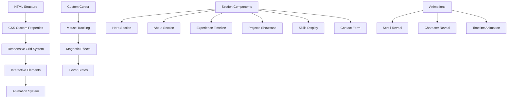
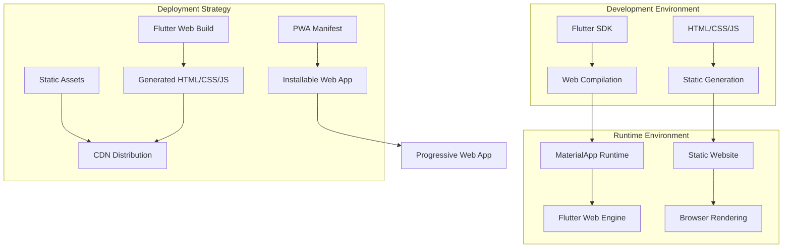
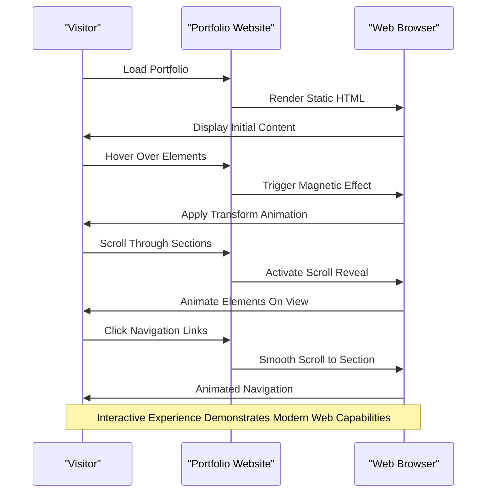

# Project Overview

<cite>
**Referenced Files in This Document**
- [main.dart](file://portfolio_flutter/lib/main.dart)
- [pubspec.yaml](file://portfolio_flutter/pubspec.yaml)
- [index.html](file://portfolio_flutter/web/index.html)
- [manifest.json](file://portfolio_flutter/web/manifest.json)
- [index.html](file://index.html)
- [README.md](file://portfolio_flutter/README.md)
</cite>

## Table of Contents
1. [Introduction](#introduction)
2. [Project Structure](#project-structure)
3. [Core Components](#core-components)
4. [Architecture Overview](#architecture-overview)
5. [Dual-Purpose Portfolio Design](#dual-purpose-portfolio-design)
6. [Target Audience and Use Cases](#target-audience-and-use-cases)
7. [Design Philosophy](#design-philosophy)
8. [Technical Implementation Details](#technical-implementation-details)
9. [Practical Examples](#practical-examples)
10. [Conclusion](#conclusion)

## Introduction

This project represents a sophisticated dual-purpose portfolio solution that seamlessly combines Flutter web development with modern static portfolio design. The portfolio serves as both a professional showcase for a Flutter developer and a demonstration of contemporary web technologies, creating a comprehensive digital presence that appeals to both technical recruiters and potential clients.

The project embodies the philosophy of "showcasing code through code" - using Flutter's Material Design principles to create a polished, interactive web experience that demonstrates proficiency in modern development practices. This approach allows the portfolio to serve multiple audiences: technical professionals seeking to evaluate development skills, hiring managers looking for candidate qualifications, and potential clients interested in the developer's capabilities.

## Project Structure

The portfolio follows a hybrid architecture that leverages both Flutter's web compilation capabilities and traditional HTML/CSS/JavaScript approaches:

**Diagram sources**
- [main.dart:1-123](file://portfolio_flutter/lib/main.dart#L1-L123)
- [index.html:1-39](file://portfolio_flutter/web/index.html#L1-L39)
- [index.html:1166-1541](file://index.html#L1166-L1541)

The structure demonstrates a deliberate separation of concerns: the Flutter application provides a modern, Material Design interface with reactive state management, while the static portfolio website offers rich visual effects, custom animations, and interactive elements that showcase contemporary web development practices.

**Section sources**
- [main.dart:1-123](file://portfolio_flutter/lib/main.dart#L1-L123)
- [pubspec.yaml:1-90](file://portfolio_flutter/pubspec.yaml#L1-L90)
- [index.html:1-1678](file://index.html#L1-L1678)

## Core Components

### Flutter Web Application Foundation

The Flutter application component establishes the technical foundation with Material Design principles and responsive architecture:

**Diagram sources**
- [main.dart:7-36](file://portfolio_flutter/lib/main.dart#L7-L36)
- [main.dart:38-54](file://portfolio_flutter/lib/main.dart#L38-L54)
- [main.dart:56-122](file://portfolio_flutter/lib/main.dart#L56-L122)

The application utilizes Flutter's Material Design system with a deep purple color scheme, establishing visual consistency and professional appearance. The stateful home page demonstrates fundamental Flutter concepts including reactive UI updates, state management, and Material Design components.

### Static Portfolio Website Architecture

The static portfolio website provides a modern, visually stunning presentation layer with advanced CSS capabilities:

**Diagram sources**
- [index.html:11-1164](file://index.html#L11-L1164)
- [index.html:1543-1600](file://index.html#L1543-L1600)

The portfolio website implements advanced CSS features including custom properties for theming, responsive grid layouts, and sophisticated animations that demonstrate modern web development capabilities.

**Section sources**
- [main.dart:1-123](file://portfolio_flutter/lib/main.dart#L1-L123)
- [index.html:1166-1541](file://index.html#L1166-L1541)

## Architecture Overview

The dual-architecture approach creates a comprehensive portfolio that leverages the strengths of both technologies:

**Diagram sources**
- [index.html:1-39](file://portfolio_flutter/web/index.html#L1-L39)
- [manifest.json:1-36](file://portfolio_flutter/web/manifest.json#L1-L36)

This architecture enables the portfolio to function as both a traditional web application and a Progressive Web App, providing offline capabilities and native-like experiences while maintaining the flexibility of static hosting.

**Section sources**
- [index.html:1-39](file://portfolio_flutter/web/index.html#L1-L39)
- [manifest.json:1-36](file://portfolio_flutter/web/manifest.json#L1-L36)

## Dual-Purpose Portfolio Design

### Professional Showcase Integration

The portfolio design philosophy centers on demonstrating technical competency through practical implementation:

**Beginner-Friendly Concepts:**
- Clean, intuitive navigation with smooth scrolling
- Responsive design principles for all device sizes
- Modern typography and visual hierarchy
- Accessible color schemes and contrast ratios

**Advanced Technical Features:**
- Custom cursor implementation with magnetic hover effects
- Scroll-triggered animations and transitions
- CSS Grid and Flexbox for responsive layouts
- CSS custom properties for maintainable theming
- Progressive Web App capabilities

### Interactive Elements Demonstration

The portfolio showcases several interactive features that highlight modern web development practices:

**Diagram sources**
- [index.html:1543-1590](file://index.html#L1543-L1590)
- [index.html:1153-1164](file://index.html#L1153-L1164)

**Section sources**
- [index.html:1543-1590](file://index.html#L1543-L1590)
- [index.html:1153-1164](file://index.html#L1153-L1164)

## Target Audience and Use Cases

### Primary Target Audience

The portfolio serves multiple distinct audiences with tailored messaging approaches:

**Technical Recruiters and Hiring Managers:**
- Demonstrates Flutter expertise through Material Design implementation
- Shows modern web development capabilities with HTML/CSS/JavaScript
- Highlights responsive design and cross-platform development skills
- Provides evidence of contemporary development practices

**Potential Clients and Employers:**
- Visual showcase of design sensibilities and user experience focus
- Evidence of attention to detail in interactive elements and animations
- Demonstration of modern web technologies and best practices
- Professional presentation of technical capabilities

**Peer Developers and Industry Professionals:**
- Code architecture and design pattern examples
- Material Design implementation excellence
- Progressive Web App development capabilities
- Responsive design and accessibility considerations

### Use Case Scenarios

**Job Application Process:**
- Standout portfolio that differentiates candidates
- Evidence of technical skills beyond traditional resumes
- Demonstration of modern development practices
- Professional online presence that reflects competence

**Freelance Opportunities:**
- Comprehensive showcase of capabilities and past work
- Evidence of responsive design and cross-platform development
- Demonstration of modern web technologies and frameworks
- Professional presentation that builds client confidence

**Networking and Professional Development:**
- Modern digital business card for industry events
- Evidence of continuous learning and skill development
- Showcase of contemporary design and development practices
- Professional online presence that attracts opportunities

## Design Philosophy

### Material Design Integration

The portfolio embraces Google's Material Design principles while adapting them for web presentation:

**Visual Consistency:**
- Unified color scheme with deep purple accents
- Consistent typography hierarchy and spacing
- Standardized component styling and interactions
- Responsive design that maintains fidelity across devices

**User Experience Excellence:**
- Intuitive navigation with clear visual feedback
- Smooth transitions and animations that enhance usability
- Accessible color contrasts and readable typography
- Consistent interaction patterns throughout the interface

### Modern Web Development Practices

The static portfolio component demonstrates contemporary web development approaches:

**Performance Optimization:**
- Efficient CSS architecture with minimal specificity
- Optimized JavaScript for smooth interactions
- Responsive images and assets for fast loading
- Progressive enhancement for graceful degradation

**Accessibility and Inclusivity:**
- Semantic HTML structure for screen readers
- Keyboard navigation support for all interactive elements
- Color contrast ratios meeting WCAG guidelines
- Focus management for interactive components

**Cross-Browser Compatibility:**
- Vendor prefixes for modern CSS features
- Graceful fallbacks for unsupported features
- Mobile-first responsive design approach
- Progressive enhancement for feature detection

## Technical Implementation Details

### Flutter Web Configuration

The Flutter application is configured specifically for web deployment with Material Design enabled:

**Build Configuration:**
- Material Design font inclusion for consistent iconography
- Web-specific asset handling and optimization
- Progressive Web App manifest integration
- Base href configuration for proper routing

**Runtime Environment:**
- Flutter Web engine bootstrapping
- Material Design component rendering
- Responsive layout adaptation
- State management for interactive elements

### Static Website Architecture

The portfolio website implements advanced CSS and JavaScript techniques:

**CSS Architecture:**
- Custom properties for maintainable theming
- CSS Grid and Flexbox for responsive layouts
- Advanced animations with keyframe timing
- Custom cursor implementation with physics simulation

**JavaScript Interactions:**
- Event-driven animations and effects
- Scroll-based element activation
- Magnetic hover effects with mouse tracking
- Form validation and submission handling

**Section sources**
- [pubspec.yaml:53-90](file://portfolio_flutter/pubspec.yaml#L53-L90)
- [index.html:11-1164](file://index.html#L11-L1164)

## Practical Examples

### Example 1: Interactive Navigation Demonstration

The portfolio showcases modern navigation techniques through animated hover effects and smooth scrolling:

**Implementation Approach:**
- CSS transitions for hover state changes
- JavaScript event listeners for interactive elements
- Magnetic effect implementation with mouse tracking
- Scroll position calculation for navigation highlighting

**Technical Benefits:**
- Enhanced user engagement through micro-interactions
- Improved navigation experience with visual feedback
- Demonstrates understanding of modern web interaction patterns
- Professional polish that elevates the overall presentation

### Example 2: Responsive Design Implementation

The portfolio demonstrates responsive design principles across multiple breakpoints:

**Mobile-First Approach:**
- Flexible grid systems that adapt to screen size
- Typography scaling using clamp() function
- Touch-friendly interactive elements
- Optimized loading performance for mobile devices

**Desktop Enhancements:**
- Advanced animations and parallax effects
- Complex grid layouts that maximize screen real estate
- Rich visual effects that enhance the desktop experience
- Performance optimizations for high-resolution displays

### Example 3: Progressive Web App Capabilities

The portfolio includes Progressive Web App features that demonstrate modern web application development:

**Installation Features:**
- Web App Manifest for installable applications
- Custom icons for home screen representation
- Offline capability demonstration
- Native app-like experience on mobile devices

**Performance Benefits:**
- Fast loading times through caching strategies
- Reliable performance across network conditions
- Enhanced user experience through service workers
- Cross-platform compatibility and consistency

**Section sources**
- [manifest.json:1-36](file://portfolio_flutter/web/manifest.json#L1-L36)
- [index.html:1543-1590](file://index.html#L1543-L1590)

## Conclusion

This dual-purpose portfolio project represents a comprehensive demonstration of modern web development capabilities, successfully combining Flutter's Material Design principles with contemporary HTML/CSS/JavaScript techniques. The architecture provides a professional showcase that appeals to multiple audiences while demonstrating technical competency in both mobile-first development and modern web practices.

The project's strength lies in its cohesive design philosophy that treats the portfolio as both a functional application and a creative showcase. By leveraging Flutter's web compilation capabilities alongside advanced static website techniques, the portfolio delivers a polished, professional presentation that effectively communicates technical abilities and design sensibilities.

This approach serves as an excellent model for developers seeking to create comprehensive digital portfolios that demonstrate both technical skills and creative design capabilities, positioning candidates favorably in competitive job markets and professional networking scenarios.